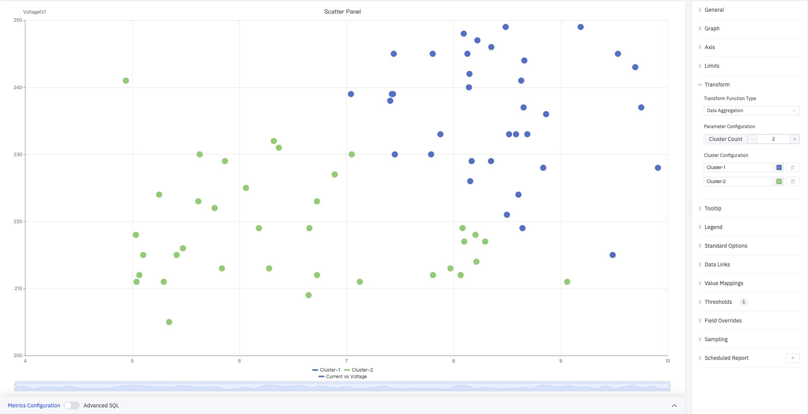

# 4.2.11 Scatter Chart

## 4.2.11.1 Overview

The Scatter Chart plots individual data points as dots in a two-dimensional space. The X axis represents one variable (e.g., current) and the Y axis represents another (e.g., voltage). Each point reflects the combined sampled values of both variables. The distribution pattern of the points reveals whether a relationship exists between them.

The screenshot shows a "Current vs Voltage" scatter chart: X axis is Current (4–10 A) and Y axis is Voltage (200–250 V). The right panel lists all configuration sections: Graph, Axis, Limits, Transform, Tooltip, Legend, Standard Options, Data Links, Value Mappings, Thresholds, Field Overrides, Sampling, and Scheduled Report.

## 4.2.11.2 When to Use

Use the Scatter Chart when:

- You want to explore the relationship between two process variables (e.g., current vs. voltage, power vs. temperature)
- You need to identify clusters or outliers in a dataset
- You want to fit a regression curve to quantify a relationship
- You want to visualize the distribution shape of raw data points

For continuous line-based trend analysis, use the Trend Chart. For discrete state patterns, use the State Timeline.

## 4.2.11.3 Configuration

### Graph Settings

Graph settings control the visual appearance of data points:

The screenshot sets the symbol style to **×** and increases Symbol Size to 16, making it easier to distinguish individual points in dense areas.

| Setting             | Description                                                                                                   |
| ------------------- | ------------------------------------------------------------------------------------------------------------- |
| **Style**           | Symbol shape for data points (circle, ×, star, and others)                                                    |
| **Symbol Size**     | Size of each point. Default is 8                                                                              |
| **Scatter Opacity** | Fill transparency of each point, 0–1. Default is 1.0                                                          |
| **Special Point**   | Highlight the maximum or minimum of a selected metric with a distinct marker and custom color. Off by default |

### Axis

Axis settings control how the X and Y axes are displayed:

The screenshot shows the Axis panel expanded. The left Y axis title is set to "Voltage(V)", label interval is Auto, and grid lines are set to Auto. The tooltip shows the hovered point's coordinates (Current 9.1863, Voltage 249).

**X Axis settings:**

| Setting                | Description                                                           |
| ---------------------- | --------------------------------------------------------------------- |
| **X Axis**             | Show or hide the X axis                                               |
| **X Axis Time Format** | Display format for X axis timestamps (available when X axis is shown) |
| **Rotate Labels**      | Rotation angle for X axis labels (-90° to +90°)                       |
| **Label Interval**     | Density of X axis labels: Auto, Small, Medium, Large                  |
| **Show Grid Lines**    | X axis grid line visibility: Auto, On, Off                            |

**Y Axis settings:**

| Setting               | Description                                                                             |
| --------------------- | --------------------------------------------------------------------------------------- |
| **Left Y Axis Title** | Display name and units for the left Y axis                                              |
| **Value Range**       | Minimum and maximum for the left Y axis (leave blank to auto-calculate)                 |
| **Right Y Axis**      | Enable a second independent Y axis on the right, for metrics with very different scales |

### Limits and Transform

Limits overlay reference lines on the scatter plot to mark operating boundaries. Transform applies statistical analysis to the scatter data.

**Cluster analysis** automatically groups data points and colors them by cluster — the screenshot below divides "Current vs Voltage" data into two clusters:

The Transform panel shows: Transform Function Type set to **Data Aggregation**, Parameter Configuration with Cluster Count set to 2, and Cluster Configuration assigning a name and color to each cluster.

**Regression analysis** fits a trend line over the scatter data — the screenshot below shows a linear regression with the formula displayed in the upper right:

The Limits panel is also visible in this screenshot, showing the **Add limit** option and the **Show as** option.

**Limits settings:**

| Setting       | Description                                                                                      |
| ------------- | ------------------------------------------------------------------------------------------------ |
| **Add Limit** | Add a reference line. Off by default. Types include Maximum, HiHi, Hi, Target, Lo, LoLo, Minimum |
| **Show As**   | How to render the limit: As dashed lines, Area, or Lines and Area                                |

**Transform settings:**

| Setting                     | Description                                                                                       |
| --------------------------- | ------------------------------------------------------------------------------------------------- |
| **Transform Function Type** | Off (no transform), Data Aggregation (clustering), or Regression Analysis                         |
| **Parameter Configuration** | For Data Aggregation: set Cluster Count                                                           |
| **Cluster Configuration**   | Assign a name and color to each cluster (Data Aggregation only)                                   |
| **Method**                  | Regression method (Regression Analysis only): Linear Regression, Exponential, or Polynomial       |
| **Show Function**           | Whether to display the regression formula on the chart (Regression Analysis only). Off by default |

### Tooltip and Legend

Tooltip and Legend work together to provide supplementary information for scatter data points:

The screenshot shows Tooltip mode set to **All**, displaying a crosshair and the data point coordinates on hover (8.844, Voltage 225). Legend is in List mode, placed at the bottom.

**Tooltip settings:**

| Setting               | Description                                                                 |
| --------------------- | --------------------------------------------------------------------------- |
| **Tooltip Mode**      | Hover display mode: Single, All, or Hidden                                  |
| **Values Sort Order** | Sort order for multiple metrics in the tooltip: None, Ascending, Descending |
| **Hide Zeros**        | When enabled, metrics with a value of 0 are hidden in the tooltip           |
| **Max Width**         | Maximum tooltip width in pixels                                             |
| **Max Height**        | Maximum tooltip height in pixels                                            |

**Legend settings:**

| Setting           | Description                                                                                    |
| ----------------- | ---------------------------------------------------------------------------------------------- |
| **Show**          | Display mode: List, Table, or Hidden                                                           |
| **Placement**     | Position: Bottom or Right                                                                      |
| **Legend Values** | Statistics shown in Table mode. Multiple selections supported: Max, Min, Mean, Sum, and others |

### Standard Options

| Setting          | Description                                                                                                                                                                 |
| ---------------- | --------------------------------------------------------------------------------------------------------------------------------------------------------------------------- |
| **Min**          | Lower bound for values (leave blank to auto-calculate from data)                                                                                                            |
| **Max**          | Upper bound for values (leave blank to auto-calculate from data)                                                                                                            |
| **Decimals**     | Number of decimal places to display (leave blank for auto)                                                                                                                  |
| **Color Scheme** | How series colors are assigned: Single Color, Shades of Color (by series), From Thresholds (by value), Classic Palette, Classic Palette (by series name), or Custom Palette |

### Data Links

Data Links attach clickable URLs to data points:

| Setting             | Description                                                                                                         |
| ------------------- | ------------------------------------------------------------------------------------------------------------------- |
| **Title**           | Display name for the link                                                                                           |
| **URL**             | Target URL, supports variable interpolation                                                                         |
| **Open in New Tab** | Whether to open the link in a new browser tab                                                                       |
| **One-Click**       | When enabled, clicking a data point immediately navigates to the URL. Only one link per panel can have this enabled |

### Value Mappings

Value Mappings translate raw data values into display text and colors:

| Mapping Type | Description                                                       |
| ------------ | ----------------------------------------------------------------- |
| **Value**    | Exact match for a specific number or text                         |
| **Range**    | Match a numeric range                                             |
| **Regex**    | Match using a regular expression and replace display text         |
| **Special**  | Match null, NaN, booleans, empty strings, and other special cases |
| **Other**    | Catch-all for any value not matched by earlier rules              |

### Color Thresholds

Color Thresholds define value ranges and their associated colors:

| Setting           | Description                                                       |
| ----------------- | ----------------------------------------------------------------- |
| **Add Threshold** | Add a threshold rule consisting of a numeric boundary and a color |

Color thresholds take effect when the **Color Scheme** in Standard Options is set to **From Thresholds (by value)**.

### Overrides

Overrides let you apply style settings to individual series, overriding global graph settings for that metric only. Select a metric by name, then add the properties to override. Supported properties include: Series Style, Line Width, Fill Opacity, Line Opacity, Line Color, Point Size, Show Points, Connect Nulls, Stack, Gradient Mode, Show Values.

### Downsampling

When query results contain too many data points, downsampling reduces the number of rendered points to improve display performance:

| Setting                  | Description                                                              |
| ------------------------ | ------------------------------------------------------------------------ |
| **Enable Downsampling**  | Toggle. Disabled by default                                              |
| **Max Data Points**      | Maximum number of data points retained after downsampling                |
| **Aggregation Function** | Aggregation method applied during downsampling, such as AVG, MAX, or MIN |

### Scheduled Report

The Scatter Chart panel supports scheduled reports, which periodically deliver the chart as an image to a specified email or Feishu group. Access the configuration from the panel's top-right menu.

## 4.2.11.4 Example Scenarios

**Current vs. voltage correlation.** A process engineer plots current (X axis) against voltage (Y axis) for multiple devices and enables Linear Regression. The regression line and formula are displayed directly on the chart, revealing the positive relationship and its slope.

**Operating state clustering.** A quality engineer plots two process variables for a set of devices and enables Data Aggregation with 2 clusters. Once points are colored by cluster, the normal operating group (green) and anomalous group (blue) are immediately distinguishable.

**Outlier detection.** A data engineer plots all raw readings for a sensor and enables Special Point to mark the maximum value. A point clearly outside the main distribution is highlighted with a distinct color, making it easy to locate and investigate further.

Beyond basic plotting, the Scatter Chart supports data aggregation and regression analysis, making it the primary panel type for statistical and correlation-based analysis in TDengine IDMP.
