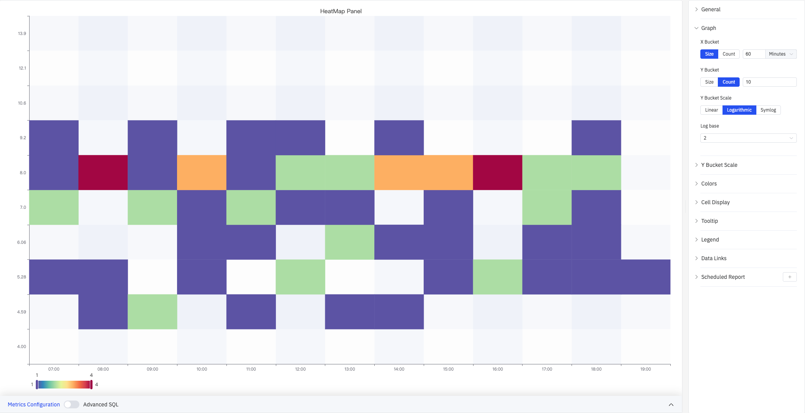
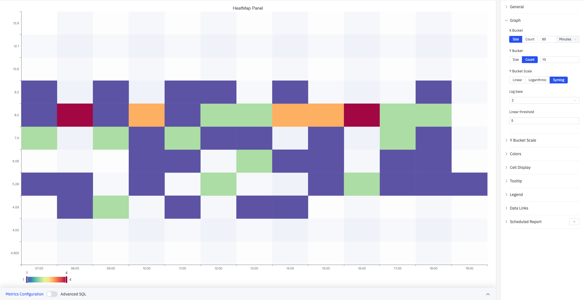
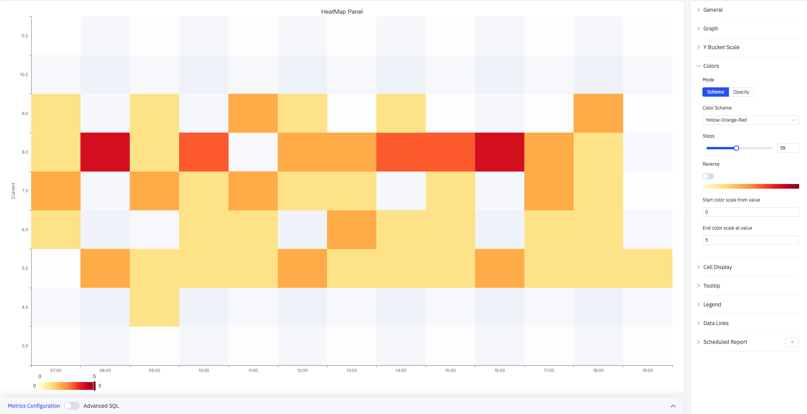

# 4.2.12 Heatmap

## 4.2.12.1 Overview

The Heatmap aggregates time-series data into a two-dimensional grid where the X axis represents time, the Y axis represents value ranges, and the color intensity of each cell indicates the density (count) of data points in that range. It is an effective tool for analyzing how a value distribution evolves over time, revealing distribution drift, periodic patterns, and periods of abnormal volatility. The Heatmap supports only a single metric.

The screenshot shows the HeatMap Panel with time range 07:00–19:00 on the X axis and values 4.5–9.5 on the Y axis. Colors range from blue (low density) to red (high density), with a scale of 1–3. The right panel shows the Graph section expanded with X Bucket (Size, 60 Minutes), Y Bucket (Count, 10), and Y Bucket Scale (Linear). The remaining configuration sections are listed collapsed: Y Bucket Scale, Colors, Cell Display, Tooltip, Legend, Data Links, Scheduled Report.

## 4.2.12.2 When to Use

Use the Heatmap when:

- You want to observe how the distribution of a process variable changes over time (distribution drift)
- You need to find recurring patterns, such as which time periods concentrate values in certain ranges
- You want to see the overall distribution of a large number of data points without being overwhelmed by individual point details

## 4.2.12.3 Configuration

### Graph Settings

Graph settings control how data is bucketed along both axes and how the Y axis is scaled.

X Bucket and Y Bucket can each use one of two modes:

| Setting | Description |
|---|---|
| **X Bucket mode** | Size (each column spans a fixed time width) or Count (divide the time range into a set number of columns) |
| **X Bucket size / count** | For Size mode: enter the width and unit (e.g., 60 Minutes). For Count mode: enter the number of columns (1–500) |
| **Y Bucket mode** | Size (each row spans a fixed value width) or Count (divide the value range into a set number of rows) |
| **Y Bucket size / count** | For Size mode: enter the numeric width. For Count mode: enter the number of rows (1–500) |

**Y Bucket Scale** controls the type of Y axis scale:

| Option | Description |
|---|---|
| **Linear** | Uniform linear scale (default), suitable when values do not span multiple orders of magnitude |
| **Logarithmic** | Logarithmic scale. The screenshot below shows Log base=2 with non-uniform Y axis spacing (4.00–13.9) |
| **Symlog** | Symmetric log scale: linear within the Linear threshold, then logarithmic beyond it |

Symlog maintains uniform spacing within the linear threshold range, which is useful for datasets that have both a dense small-value region and a sparse large-value region. When Logarithmic or Symlog is selected, additional settings appear:

| Setting | Description |
|---|---|
| **Log base** | Base for the logarithmic scale: 2 or 10 |
| **Linear threshold** | The boundary below which the scale stays linear (Symlog only) |

### Y Bucket Scale

The Y Bucket Scale section controls the visual appearance of the Y axis:

The screenshot shows the Y Bucket Scale panel expanded with the Y axis label set to "Current", Min value 3, Max value 12, and Axis width 60. The left side of the chart displays the "Current" axis label.

| Setting | Description |
|---|---|
| **Placement** | Where to display the Y axis: Left, Right, or Hidden |
| **Decimals** | Decimal places for Y axis tick labels (leave blank for auto) |
| **Min value** | Lower bound of the Y axis display range (leave blank to auto-calculate) |
| **Max value** | Upper bound of the Y axis display range (leave blank to auto-calculate) |
| **Axis width** | Width of the Y axis area in pixels (leave blank for auto) |
| **Axis label** | Custom label text for the Y axis |
| **Reverse** | Whether to reverse the Y axis direction (large values at the bottom). Off by default |

### Colors

Colors settings control how cell density is mapped to color:

The screenshot sets the color scheme to **Yellow-Orange-Red** with 59 steps and a fixed scale range of 0–5. The legend bar at the bottom shows the gradient from yellow (0) to red (5).

| Setting | Description |
|---|---|
| **Mode** | Color mapping method: Scheme (use a preset gradient palette) or Opacity (single color with varying transparency) |
| **Color Scheme** | Built-in color palette such as Yellow-Orange-Red, Spectral, and others. Available in Scheme mode only |
| **Steps** | Number of discrete color steps in the gradient (2–128) |
| **Reverse** | Whether to reverse the gradient direction (swap low-value and high-value colors) |
| **Start color scale from value** | Minimum value for the color scale mapping (leave blank to auto-calculate from data) |
| **End color scale at value** | Maximum value for the color scale mapping (leave blank to auto-calculate from data) |

### Cell Display

Cell Display settings control cell gap and visibility filtering:

The screenshot sets Cell gap to 3 (a small gap between cells) and Hide cells with values ≤ to 1. Cells with a count of 1 are not colored and appear blank, making high-density areas stand out more clearly.

| Setting | Description |
|---|---|
| **Decimals** | Decimal places for cell count values shown in tooltips (leave blank for auto) |
| **Cell gap** | Gap in pixels between adjacent cells (0–25) |
| **Hide cells with values ≤** | Cells with a count at or below this value are not colored. Near-zero counts are hidden by default |
| **Hide cells with values ≥** | Cells with a count at or above this value are not colored (leave blank for no upper limit) |

### Tooltip

The screenshot shows Tooltip mode set to **All**. When hovering over 2026-05-28 18:00:00, the tooltip shows: Bucket 8-9 count 2, Bucket 7-8 count 2, Duration 1 h.

| Setting | Description |
|---|---|
| **Tooltip mode** | Hover display mode: Single (only the hovered row's bucket), All (all buckets in the hovered time column), Hidden |
| **Max width** | Maximum tooltip width in pixels |
| **Max height** | Maximum tooltip height in pixels |

### Legend

| Setting | Description |
|---|---|
| **Show** | Display mode: List, Table, or Hidden |
| **Placement** | Position: Bottom or Right |
| **Width** | Legend panel width in pixels. Available when placement is Right |
| **Legend Values** | Statistics shown in Table mode. Multiple selections supported: Max, Min, Mean, Sum, and others |

### Data Links

Data Links attach clickable URLs to cells:

| Setting | Description |
|---|---|
| **Title** | Display name for the link |
| **URL** | Target URL, supports variable interpolation |
| **Open in New Tab** | Whether to open the link in a new browser tab |
| **One-Click** | When enabled, clicking a cell immediately navigates to the URL. Only one link per panel can have this enabled |

### Scheduled Report

The Heatmap panel supports scheduled reports, which periodically deliver the chart as an image to a specified email or Feishu group. Access the configuration from the panel's top-right menu.

## 4.2.12.4 Example Scenarios

**Sensor distribution drift detection.** A process engineer reviews a quarter of current data as a heatmap (X axis bucketed by day, Y Bucket Count=20 rows). For the first two months, color concentrates in the middle-to-lower rows. Entering the third month, the distribution shifts noticeably upward, suggesting the circuit may have drifted and needs recalibration.

**Current daily pattern analysis.** An operations analyst views 30 days of current data as a heatmap (X axis bucketed by hour, Y Bucket in Size mode). The map shows that current concentrates in lower ranges every day from 2–4 AM and in higher ranges from 11 AM–1 PM, revealing a recurring pattern tied to production load cycles.

**Wide-range data analysis.** A maintenance engineer is working with sensor values that span multiple orders of magnitude. Switching Y Bucket Scale to Logarithmic (Log base=2) distributes bucket resolution more evenly across the full value range, making it easier to identify where anomalous values cluster.

Use the Heatmap when:

- You want to observe how the distribution of a process variable changes over time (distribution drift)
- You need to find recurring patterns, such as which shifts or seasons concentrate values in certain ranges
