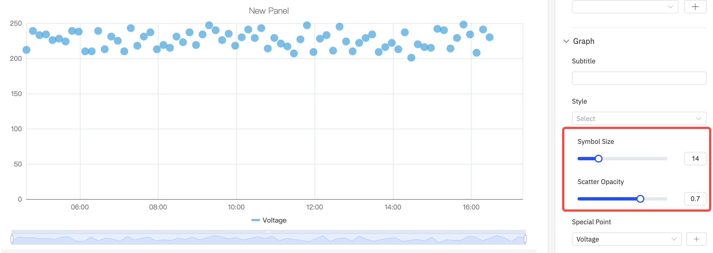
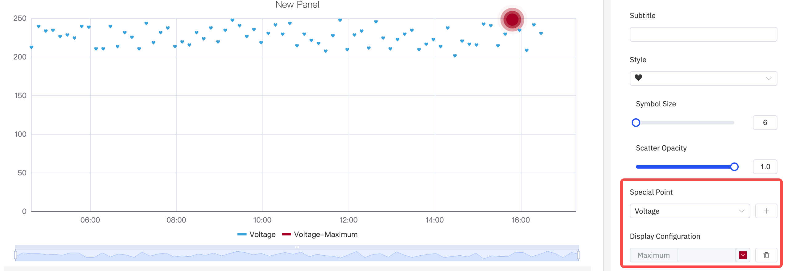
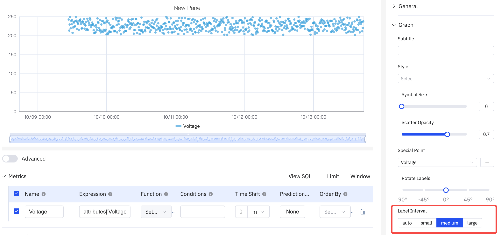
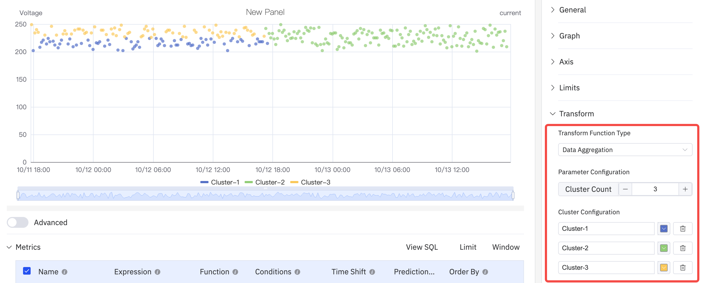
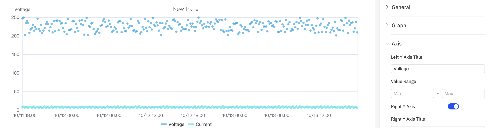
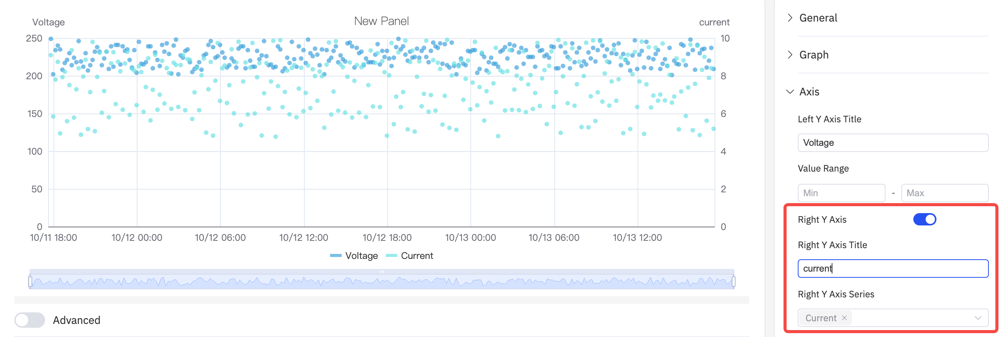
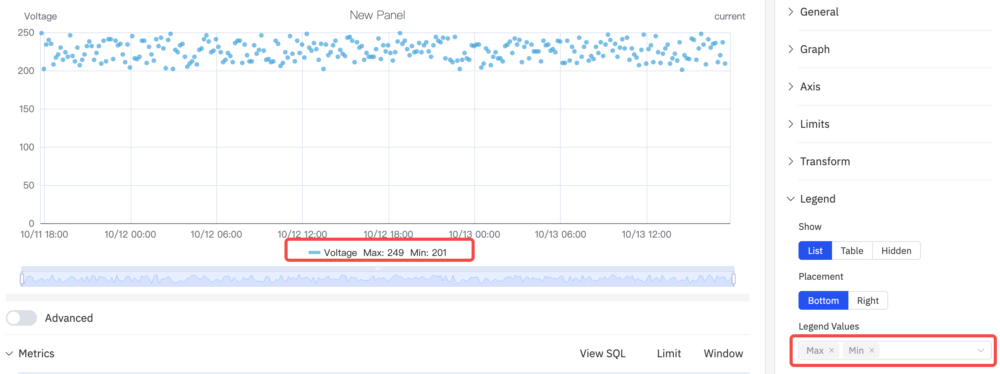

# 4.2.12 Scatter Chart

## Overview

The Scatter Chart plots individual data points as dots in a two-dimensional space. In the default mode each point's X position is the timestamp and its Y position is the metric value — a time-scatter view. For correlation analysis, two attributes are plotted against each other (Y vs. X), revealing the relationship between the two variables.

Beyond basic plotting, the Scatter Chart supports data aggregation and regression analysis, making it the primary panel type for statistical and correlation-based analysis in TDengine IDMP.

## When to Use

Use the Scatter Chart when:

- You want to explore the relationship between two process variables (e.g., power vs. temperature, flow rate vs. pressure drop)
- You need to identify clusters or outliers in a dataset
- You want to fit a regression curve to quantify a relationship
- You want to plot raw, unsampled data points without aggregation

For continuous line-based trend analysis, use the Trend Chart. For discrete state patterns, use the State Timeline.

## Configuration

### View Mode Toolbar

In addition to the [common view mode controls](../01-panels.md#413-panel-view-mode), the Scatter Chart adds:

| Control | Description |
|---|---|
| **Disable Sampling** | Fetch raw data without downsampling to ensure all individual data points are plotted |

### Edit Mode Toolbar

In addition to the [common edit mode controls](../01-panels.md#414-panel-edit-mode), the Scatter Chart adds:

| Control | Description |
|---|---|
| **Disable Sampling** | Toggle raw data mode for the preview |
| **Save as Image** | Download the current preview as a PNG image |
| **Full Screen** | Expand the editor preview to fill the browser window |
| **Panel Insights** | Run AI analysis on the current preview data |

### Graph Settings

#### Point Style

The symbol shape, size, and opacity of each data point are configurable:

#### Special Points

The **Special Point** setting highlights specific data points — such as the maximum or minimum value — with a distinct marker and custom color:

#### Labels

When data is dense, axis labels can overlap. Use **Rotate Labels** and **Label Interval** to improve readability:

| Setting | Description |
|---|---|
| **Style** | Symbol shape for data points (circle, heart, smiley, and others) |
| **Symbol Size** | Size of each dot (slider, default 6) |
| **Scatter Opacity** | Transparency of dots, 0–1 |
| **Special Point** | Highlight max/min or other specific points with a distinct marker |
| **Rotate Labels** | Rotation angle for X-axis labels |
| **Label Interval** | Density of X-axis labels |

### Transform Settings

The Scatter Chart has a unique Transform section for analytical functions:

**Data Aggregation** groups points into clusters, displayed with distinct colors to enable visual clustering analysis:

**Regression Analysis** fits a curve to the data and overlays it on the scatter plot. Supported functions include linear regression, exponential regression, and polynomial regression (with configurable degree):

| Transform Function Type | Description |
|---|---|
| **Off** | No transform; raw data points are plotted |
| **Data Aggregation** | Groups data points and displays aggregated clusters |
| **Regression Analysis** | Fits a regression curve (linear, exponential, or polynomial) to the data |

### Axis Settings

#### Axis Title

Configure Y-axis labels with names and units:

#### Dual Y Axis

When two metrics have very different scales, a shared Y axis compresses the smaller signal. Enabling the **Right Y Axis** assigns each to its own scale:

### Limits Settings

Limit lines can be overlaid on the scatter plot to mark operating boundaries:

### Legend Settings

In Table mode, the legend shows summary statistics. When placed on the Right with Table mode, the legend table width is also adjustable:

| Setting | Description |
|---|---|
| **Show** | Display mode: List, Table, or Hidden |
| **Placement** | Position: Bottom or Right |
| **Legend Values** | Statistics shown in Table mode: Last, Min, Max, Mean, Sum, etc. |

## Example Scenarios

**Power vs. temperature correlation.** A process engineer plots active power (X dimension) against motor temperature (Y metric) over a month of data. The scatter plot reveals a clear positive correlation — the regression curve quantifies the relationship and the R² value indicates its strength.

**Quality clustering.** A quality engineer plots two process variables (pressure and temperature) for all batches in a quarter. Data Aggregation colors the clusters — most batches cluster tightly in the green zone, but a handful of outliers in a separate cluster correlate with the failed batches.

**Outlier detection.** A data engineer enables Disable Sampling to plot every raw reading of a sensor. The Special Point setting highlights the maximum value with a red marker. A clear outlier point significantly above the cluster is identified for investigation.
