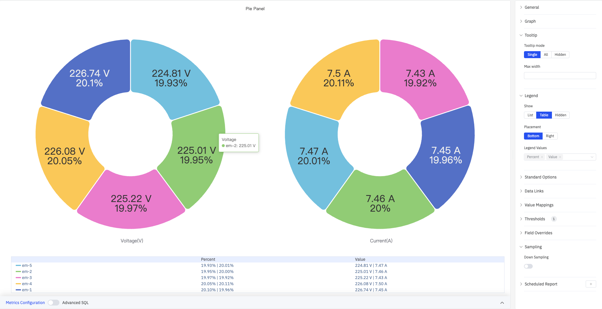

# 4.2.13 Pie Chart

## 4.2.13.1 Overview

The Pie Chart divides a circle into slices proportional to each value's share of the total. Each slice represents one category or metric group, making the relative contribution of each part immediately visible.

The chart supports two rendering styles — **Pie** (solid circle) and **Donut** (center hollow). Multiple metrics (e.g., Voltage and Current) are rendered as separate charts side by side. Slice labels showing value and percentage are displayed directly on the chart.

## 4.2.13.2 When to Use

Use the Pie Chart when:

- You want to show how a total is distributed across a small number of categories (seven or fewer)
- The relative proportion between parts matters more than absolute values
- You need a compact composition chart for reports or dashboards

Avoid the Pie Chart when:

- Categories are numerous or values are close in magnitude (differences are hard to judge by arc size)
- You need to track change over time — use the Trend Chart instead
- You need precise comparison across many categories — use the Bar Chart instead

## 4.2.13.3 Configuration

### Graph Settings

Graph settings control the chart type, layout, and slice label content:

The screenshot shows **Pie** (solid circle) type with **Slice Sort** set to Ascending — the smallest slice starts first and the largest ends last. The tooltip shows all series values on hover.

| Setting            | Description                                                                                             |
| ------------------ | ------------------------------------------------------------------------------------------------------- |
| **Pie Chart Type** | Rendering style: Pie (solid circle) or Donut (center hollow). Default is Donut                          |
| **Orientation**    | Overall layout direction: Horizontal or Vertical                                                        |
| **Slice Sort**     | Order of slices: Descending (largest first), Ascending (smallest first), or None (preserve data order)  |
| **Label Fields**   | Content shown directly on each slice. Multi-select: Name, Value, Percent. Defaults to Value and Percent |

### Tooltip and Legend

Tooltip and Legend work together to provide supplementary information for slice data:

The screenshot shows **Table** mode legend below the chart, with Percent and Value columns for each series. The tooltip shows the specific value for a hovered slice (em-2: 225.01 V).

**Tooltip settings:**

| Setting          | Description                                |
| ---------------- | ------------------------------------------ |
| **Tooltip Mode** | Hover display mode: Single, All, or Hidden |
| **Max Width**    | Maximum tooltip width in pixels            |

**Legend settings:**

| Setting           | Description                                                                                             |
| ----------------- | ------------------------------------------------------------------------------------------------------- |
| **Show**          | Display mode: List, Table, or Hidden                                                                    |
| **Placement**     | Position: Bottom or Right                                                                               |
| **Width**         | Legend panel width in pixels. Available when placement is Right                                         |
| **Legend Values** | Statistics shown in table mode. Multiple selections supported: Max, Min, Mean, Sum, Percent, and others |

### Value Mappings

Value Mappings replace raw data values with custom display text and colors. In the screenshot below, the range [200–226] is mapped to a green "GOOD" label:

Click **Edit Value Mappings** to add multiple mapping rules.

| Mapping Type | Description                                                        |
| ------------ | ------------------------------------------------------------------ |
| **Value**    | Exact match on a specific value or text string                     |
| **Range**    | Match a numeric range                                              |
| **Regex**    | Match using a regular expression and replace with substituted text |
| **Special**  | Match null, NaN, booleans, empty strings, and other special cases  |
| **Other**    | Match all values not covered by the preceding rules                |

### Standard Options and Color Thresholds

Color Thresholds dynamically change slice color based on value. In the screenshot below, voltage is divided into three color zones at boundaries 200 and 226; current is divided at boundaries 5 and 7.5:

**Standard Options:**

| Setting          | Description                                                                                                                                                                 |
| ---------------- | --------------------------------------------------------------------------------------------------------------------------------------------------------------------------- |
| **Min**          | Reference minimum value for display scaling. Leave blank for auto-calculation from data                                                                                     |
| **Max**          | Reference maximum value for display scaling. Leave blank for auto-calculation from data                                                                                     |
| **Decimals**     | Number of decimal places for value display. Leave blank for automatic precision                                                                                             |
| **Color Scheme** | How series colors are assigned: Single Color, Shades of Color (by series), From Thresholds (by value), Classic Palette, Classic Palette (by series name), or Custom Palette |

**Color Threshold settings:**

| Setting           | Description                                                       |
| ----------------- | ----------------------------------------------------------------- |
| **Add Threshold** | Add a threshold rule consisting of a numeric boundary and a color |

Color thresholds take effect when the **Color Scheme** in Standard Options is set to **From Thresholds (by value)**.

### Data Links

Data Links attach clickable URLs to data points, allowing navigation from the chart to related detail pages:

| Setting             | Description                                                                                                         |
| ------------------- | ------------------------------------------------------------------------------------------------------------------- |
| **Title**           | Display name for the link                                                                                           |
| **URL**             | Target URL, supports variable interpolation                                                                         |
| **Open in New Tab** | Whether to open the link in a new browser tab                                                                       |
| **One-Click**       | When enabled, clicking a data point immediately navigates to the URL. Only one link per panel can have this enabled |

### Overrides

Overrides let you apply style settings to individual series, overriding the global graph configuration for that metric only. Select a metric by name, then add the properties to override. Supported properties include: Series Style, Line Width, Fill Opacity, Line Opacity, Line Color, Point Size, Show Points, Connect Nulls, Stack, Gradient Mode, Show Values.

### Downsampling

When query results contain too many data points, downsampling reduces the number of rendered points to improve display performance:

| Setting                  | Description                                                              |
| ------------------------ | ------------------------------------------------------------------------ |
| **Enable Downsampling**  | Toggle. Disabled by default                                              |
| **Max Data Points**      | Maximum number of data points retained after downsampling                |
| **Aggregation Function** | Aggregation method applied during downsampling, such as AVG, MAX, or MIN |

### Scheduled Report

The Pie Chart panel supports scheduled reports, which periodically deliver the chart as an image to a specified email or Feishu group. Access the configuration from the panel's top-right menu.

## 4.2.13.4 Example Scenarios

**Voltage distribution across devices.** Five devices (em-1 through em-5) are shown as two side-by-side donut charts for Voltage and Current. Slice sizes reflect each device's share. With threshold coloring enabled, devices outside the normal range are highlighted immediately.

**Production share by site.** An operations manager groups by site name with total production as the metric. The donut chart shows each site's contribution to overall output, and the table legend lists exact values and percentages alongside each site.

**Event distribution by severity.** An operations team groups by alarm severity category. The pie chart shows what fraction of events were critical, warning, or informational — useful for shift summary reports.
