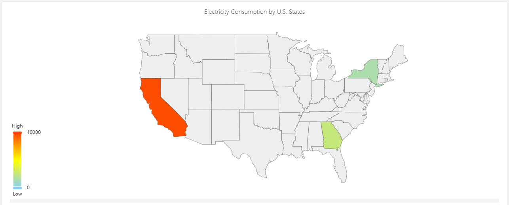

# 4.2.14 Map Chart

## 4.2.14.1 Overview

The Map Chart displays geographic data as a choropleth map — regions filled with colors proportional to their associated metric values. It is used for spatial analysis when data is organized by geographic area: countries, provinces, cities, districts, or custom regions defined by a GeoJSON file.

The color intensity of each region reflects the metric value — darker or more saturated regions indicate higher values. A color scale legend shows the mapping from color to value.

## 4.2.14.2 When to Use

Use the Map Chart when:

- Your elements are organized by geographic area and you want to visualize a metric across those areas
- You need to answer questions like "which region has the highest energy consumption?" or "which sites are underperforming?"
- You have a custom geographic boundary definition (GeoJSON) matching your operational territories

For time-series trend analysis, use the Trend Chart. For non-geographic comparisons across categories, use the Bar Chart.

## 4.2.14.3 Configuration

### Edit Mode Toolbar

In addition to the [common edit mode controls](../01-panels.md#414-panel-edit-mode), the Map Chart adds:

| Control | Description |
|---|---|
| **Save as Image** | Download the current preview as a PNG image |
| **Full Screen** | Expand the editor preview to fill the browser window |
| **Panel Insights** | Run AI analysis on the current preview data |

### Graph Settings

#### Map GeoJSON

The map requires a GeoJSON file that defines the geographic region boundaries. Upload your GeoJSON file using the **Map GeoJSON** setting:

The GeoJSON `properties` for each feature must include a key that matches the geographic identifier attribute on your elements. This is how the map connects each region polygon to its corresponding data value.

#### Map Display

The color gradient for the choropleth is configured through the **Map Display** setting, which defines three anchor points:

| Setting | Description |
|---|---|
| **Map GeoJSON** | Upload or edit the GeoJSON file defining region boundaries |
| **Map Display** | Color scale: **Min** (value and color for the low end), **Middle** (color at midpoint), **Max** (value and color for the high end). Click color swatches to change them. |
| **Display Labels** | Toggle: show region name labels on the map |

## 4.2.14.4 Example Scenarios

**Energy consumption by province.** An energy utility has elements organized by province. A map chart with a province-level GeoJSON file shows total monthly energy consumption per province. Darker blue regions consumed more; lighter regions consumed less. The operations team immediately identifies which provinces are above forecast.

**Site performance by country.** A multinational company has sites in 20 countries. A country-level GeoJSON with a green-to-red color scale shows OEE (Overall Equipment Effectiveness) per country. The map highlights underperforming regions that need management attention.

**City-level sensor coverage.** A smart metering company has meters deployed across a city's districts. A district-level GeoJSON shows the number of active meters per district, revealing coverage gaps where fewer meters are reporting data.
