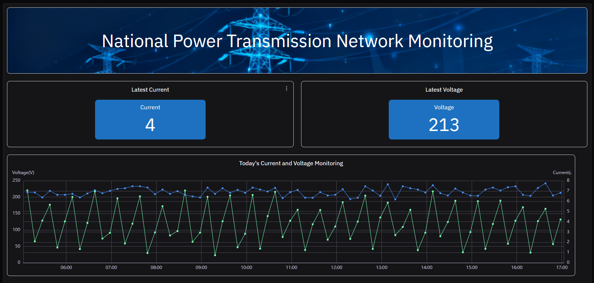
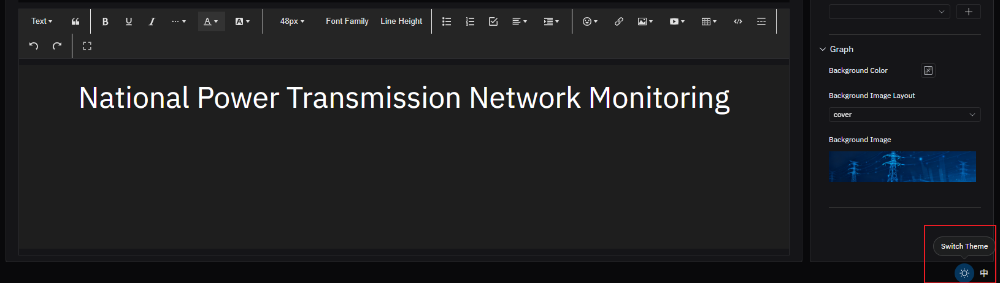

# 4.2.15 Rich Text Panel

## 4.2.15.1 Overview

The Rich Text panel replaces the chart area with a full WYSIWYG text editor. It does not display data — instead, it provides a free-form space for documentation, instructions, reference material, or annotated diagrams that you want to embed alongside your data panels.

The Rich Text panel has no data configuration, Metrics table, Dimensions table, Axis, Limits, or Legend sections. It does not support Panel Insights since it contains no chart data.

## 4.2.15.2 When to Use

Use the Rich Text panel when:

- You want to embed standard operating procedure (SOP) text directly on an element's panel list
- You need to add context, instructions, or explanations alongside data panels on a dashboard
- You want to include reference images, annotated P&ID diagrams, or links to external documents
- You are building an operator guide that lives next to the live data

## 4.2.15.3 Configuration

### Edit Mode Toolbar

In addition to the [common edit mode controls](../01-panels.md#414-panel-edit-mode), the Rich Text panel adds:

<table>
<colgroup><col style="width:10em"/><col/></colgroup>
<thead><tr><th>Control</th><th>Description</th></tr></thead>
<tbody>
<tr><td><strong>Save as Image</strong></td><td>Download the current panel content as a PNG image</td></tr>
<tr><td><strong>Full Screen</strong></td><td>Expand the editor to fill the browser window</td></tr>
</tbody>
</table>

### Content Editor

The center panel becomes a full WYSIWYG editor:

The editor supports:

- Text formatting: bold, italic, underline, strikethrough
- Headings (H1–H6)
- Font size and font family
- Text color and background color
- Ordered and unordered lists
- Tables
- Hyperlinks
- Inline images (uploaded or from URL)
- Video embeds

### Graph Settings

<table>
<colgroup><col style="width:15em"/><col/></colgroup>
<thead><tr><th>Setting</th><th>Description</th></tr></thead>
<tbody>
<tr><td><strong>Background Color</strong></td><td>Background color of the panel</td></tr>
<tr><td><strong>Background Image Layout</strong></td><td>How a background image is positioned: None, Cover, Contain, or Tile</td></tr>
<tr><td><strong>Background Image</strong></td><td>Upload an image file to use as the panel background</td></tr>
</tbody>
</table>

## 4.2.15.4 Example Scenarios

**SOP on an element panel.** A pump element's panel list includes a Rich Text panel containing the startup and shutdown procedure. Operators navigating to the pump's panels see the SOP immediately alongside the trend charts, without switching to a separate document system.

**Annotated P&ID on a dashboard.** A process dashboard includes a Rich Text panel containing an uploaded P&ID drawing with annotations marking the key measurement points. Operators get spatial context for the data panels displayed alongside it.

**Shift handover notes template.** A Rich Text panel on a production line dashboard provides a structured template for shift handover notes — safety observations, equipment status, outstanding issues — embedded directly in the operational view that both shifts use.
