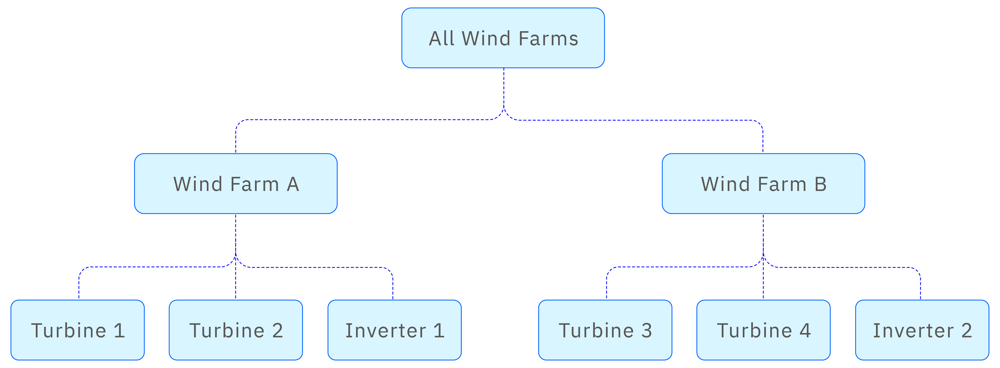

The first step in using TDengine IDMP to manage data is to build an asset model for your data. When your data is stored in a database consisting of two-dimensional tables, the relationships between these tables are not always perceivable. The purpose of data modeling is to help you define and visualize the relationships among these tables, making it easier to manage, locate, and analyze your data.

## Data Catalog

TDengine IDMP uses a tree hierarchy to manage data assets and build a data catalog. Each node in this tree corresponds to an [element](../03-concepts.md#elements). With this tree-structured data catalog, you can easily browse your data assets.

The modeling process involves continuously creating elements and building out the data catalog into a structure that reflects your real-world scenario. Imagine you work at a power company that operates multiple wind farms, each of which contains wind turbines and inverters. You could take a top-down modeling approach, starting by creating an element called `All Wind Farms`, and under that, creating elements for each wind farm, such as `Wind Farm A`, `Wind Farm B`, and so on. Under each wind farm, you could then add multiple wind turbines and inverters. In this way, the data model is built level by level, as illustrated in the following figure:

If the organizational structure is not yet clear, you could also use a bottom-up approach. For instance, you might start by creating a wind turbine element, configure it fully, and ensure it is operating correctly. Then, you could create a wind farm element and move the turbine element under the wind farm.

Enterprise asset management often involves multiple organizational models, and different roles may require different data perspectives. For example, operations personnel may prefer to organize the tree structure by site or plant, as shown above, while equipment maintenance teams may prefer to organize it by equipment type, like the following figure:

In TDengine IDMP, an element can belong to multiple hierarchies through element referencing, making it easier to manage from different perspectives. In the case of wind power, you could construct a tree containing both perspectives:

Although elements such as turbines are repeated in the tree, element references are used to reduce duplicate data and ensure consistency. For more information, see [Element References](../06-advanced/07-element-reference.md).

## Creating Elements

To create a child element, hover over an existing element in the sidebar and click the three-dot menu on the right. From the drop-down menu, choose **New Child Element**.

You can choose whether to use an element template and specify the reference type. If you are not sure, retain the default strong reference type. After clicking **Confirm**, you can configure the name, category, location, and description of the element.

If you need to create multiple elements that represent the same type of device, create an element template first. This allows for batch creation and management of elements while ensuring data standardization. To create an element template, click **Libraries** in the main menu, select **Element Template** in the sidebar, and then click the New Element Template (+) icon in the action bar.

You can also copy existing elements and paste them to create similar elements quickly.

After you create an element, you can modify or delete it. In the sidebar, you can also drag and drop an element to another node, which creates an element reference. These operations are designed to help you flexibly build and adjust the tree structure.

## Defining Attributes

An element can have many static and dynamic attributes. Creating your tree hierarchy and configuring appropriate attributes lets you map the physical world to the digital world and form a digital twin.

To define an attribute, hover over an existing element in the sidebar and click the three-dot menu on the right. From the drop-down menu, choose **Attributes**. You can also select the desired element and choose **Attributes** in the drop-down menu at the end of the path bar. The list of attributes for the selected element is then displayed.

Click the New Attribute (+) icon at the top right of the main area to create an attribute for the selected element. You can specify the name, categories, data type, default value, and description of the attribute, as well as custom properties. For numeric data types, you can also set limits and time-series forecasting options. All attributes can be set as constants, hidden, or excluded as needed.

Most importantly, attributes can be configured with a data reference. The reference can point to a TDengine metric or TDengine tag, indicating that the attribute is mapped to a specific column or tag value in a table within TDengine TSDB. The value of the attribute is then retrieved from the data source at access time.

After you create an attribute, you can modify, delete, copy, and paste it.
