# Trend Chart

A trend chart is a type of graph where individual data points are connected by line segments. It is used to illustrate the changing trend of data and is particularly suitable for trend analysis of time-series data.

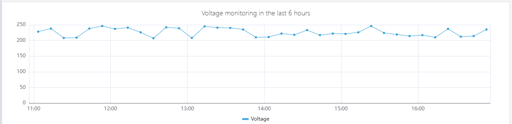

## Configuration

### Graph Configuration

#### Style

The line styles support options such as `lines`, `smooth`, and `step`. Among them, the step line chart is suitable for business scenarios where "data changes are phased and discontinuous", such as monitoring price changes.

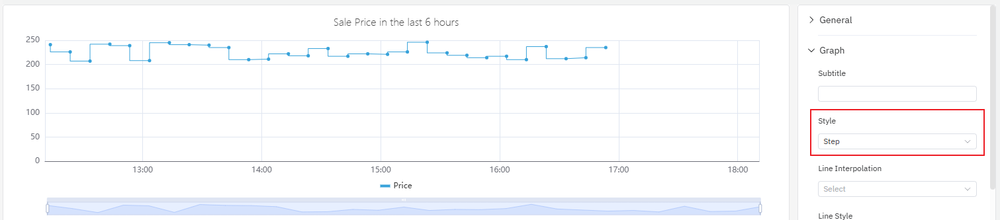

#### Line Style

As shown in the figure below, you can adjust the line style, line width, transparency and fill of the trend chart. Among these settings, the line style supports `solid`, `dashed` and `dotted`, with the default being `solid`. For the changing trend of cumulative data, using fill is appropriate — the filled area can better reflect the cumulative effect.

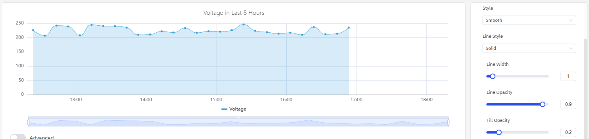

#### Stack Seriesline

When dealing with multi-series indicators, you can stack data to analyze certain cumulative quantities (enabling the fill option in line styles will enhance the effect). Take the analysis of electricity consumption in the following example: there are two series of values, namely residential electricity consumption and industrial electricity consumption. After enabling stacking, you can observe the changing trend of total electricity consumption.

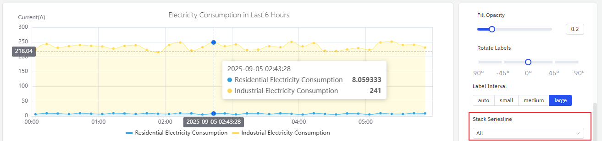

#### Labels

As shown in the figure below, if labels are too dense and overlap with each other, it will impair the visual effect. In such cases, this issue can be resolved by adjusting **label rotation** or **label interval**.

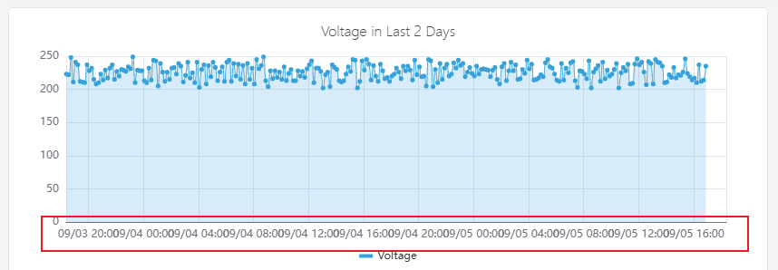

1. Configure the label rotation angle to avoid label overlap

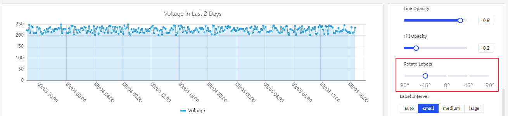

2. Adjust the label interval to reduce label density

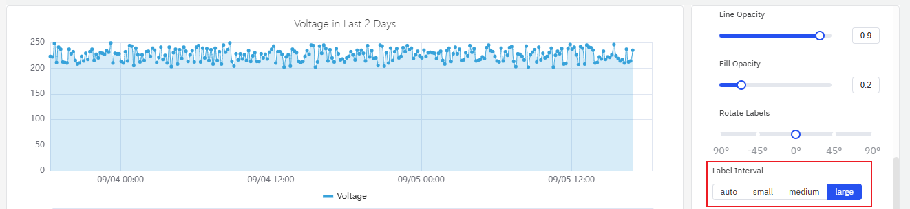

### Axis

The coordinate axis can be configured to display the axis name and its unit of measurement.

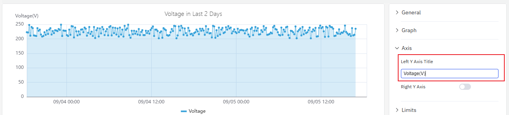

When displaying two metrics in a single chart, if there is an order-of-magnitude difference in the measurement ranges of the two metrics, it will affect the analysis effect of one of the metrics. For example, as shown in the figure below, when two metrics (voltage and current) are added, the obvious changing trend of current cannot be observed because the current values are too small.

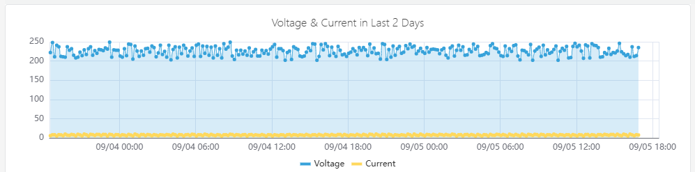

In such cases, you can enable the `right axis` and use the dual Y-axis mode to display the metrics.

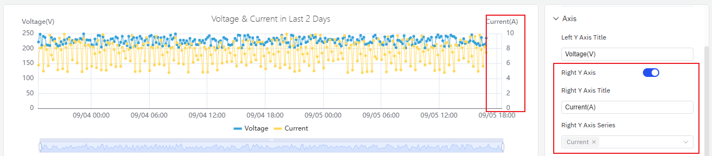

### Limits

You can configure boundary values to mark the safe area and warning area of a metric, which makes analysis and observation easier.

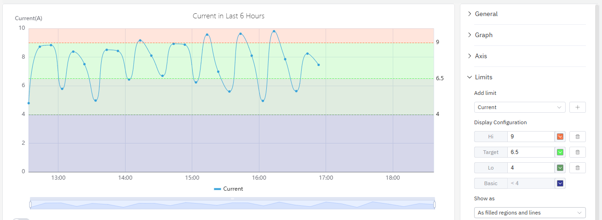

### Legend

You can enable the display of statistical values such as maximum and minimum values in the legend.

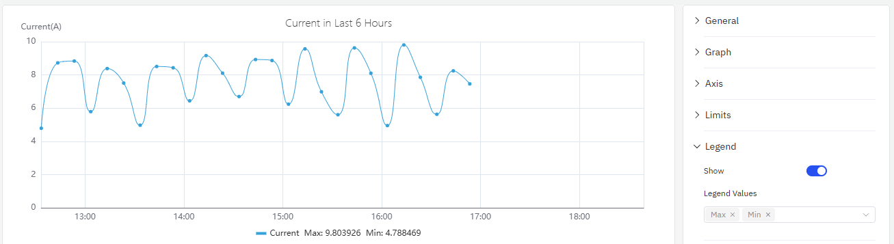

## roadmap

To continuously enhance your user experience, we will keep adding practical configurations in subsequent product updates, allowing you to enjoy richer and more user-friendly analysis features.

| Configuration  | Description                                                         |
|------------|--------------------------------------------------------------|
| Axis Scale  | The axis can be set to an exponential scale, allowing for linear observation of exponentially growing metrics.  |
| Unit  | Select the display unit to unify the unit for showing metrics; for example, use "milliamperes" to display current.   |
| Max/Min | Set the maximum and minimum values displayed on the Y-axis.    |
| Color Scheme  | Currently, the color of each indicator is fixed; in subsequent updates, we will provide color schemes, allowing you to decide which colors to use for display. |
| Legend Placement  | Set the position of the legend. |
