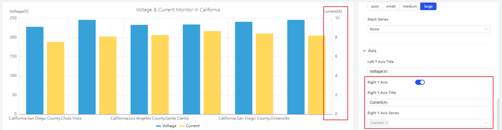

# Bar Chart

A bar chart is a commonly used chart type that represents data magnitude through the height of bars (or the width in the case of horizontal bars). It is typically used in analysis scenarios involving aggregation by labels or time windows.

## Configuration

### Graph Configuration

#### Orientation

The layout of a bar chart includes `horizontal` and `vertical` options, with the `vertical` layout as the default. When set to the horizontal layout, the display is as follows.

#### Bar Style

As shown in the figure below, you can adjust the **width** and **transparency** of the bars in the bar chart. If the bar width is not set, it will be automatically calculated based on the overall width of the current chart and the number of bars, providing good adaptability. Manual adjustment of this width is only recommended when displaying the chart on a fixed-width screen to achieve the optimal display effect; otherwise, it is not advised.

#### Labels

Configure the label rotation angle to avoid label overlap

Adjust the label interval to reduce label density avoid label overlap

### Axis

The coordinate axis can be configured to display the axis name and its unit of measurement.

When displaying two indicators in one chart, if there is an order-of-magnitude difference in their measurement ranges, the analysis of one of the indicators will be affected. In such cases, you can enable the right Y-axis and use the dual Y-axis mode to display the indicators.

### Limits

You can configure limits to identify the safe zone and warning zone of the indicator, which facilitates better analysis and observation.

### Legend

You can enable the display of statistical values such as maximum and minimum values in the legend.

## roadmap

To continuously enhance your user experience, we will keep adding practical configurations in subsequent product updates, allowing you to enjoy richer and more user-friendly analysis features.

| Configuation  | Description                                                         |
|------------|--------------------------------------------------------------|
| Axis Scale  | The axis can be set to an exponential scale, allowing for linear observation of exponentially growing metrics.  |
| Unit  | Select the display unit to unify the unit for showing metrics; for example, use "milliamperes" to display current.   |
| Max/Min | Set the maximum and minimum values displayed on the Y-axis.    |
| Color Scheme  | Currently, the color of each indicator is fixed; in subsequent updates, we will provide color schemes, allowing you to decide which colors to use for display. |
| Legend Placement  | Set the position of the legend. |
| Gradient Color | You can configure the bar gradient color, where the larger the value, the darker the color. |
