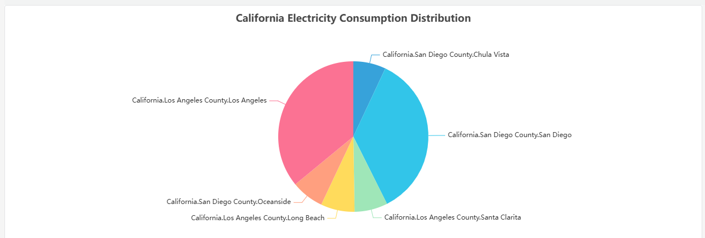

# Pie

A pie chart is mainly used to show the proportion of data in different categories relative to the total, where each arc represents the proportion of the data quantity.

## Roadmap

To continuously enhance your user experience, we will keep adding practical configurations in subsequent product updates, allowing you to enjoy richer and more user-friendly analysis features.

| Configuration  | Description                                                         |
|------------|--------------------------------------------------------------|
| Label Format  | Currently, the labels only display aggregated category names. You can configure them to show richer content, such as values, proportions, and more. |
| Legend Placement  | Set the position of the legend. |
| Pie Theme  | You can configure richer styles, such as displaying it as a donut chart or a pie chart.   |
