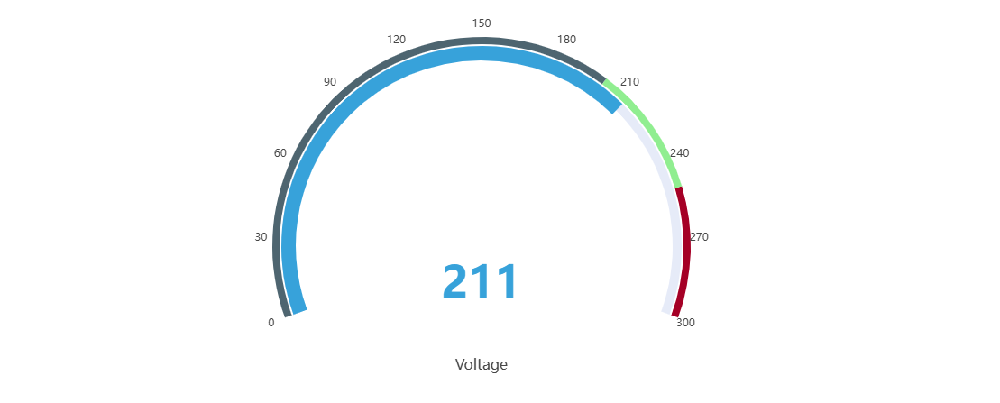
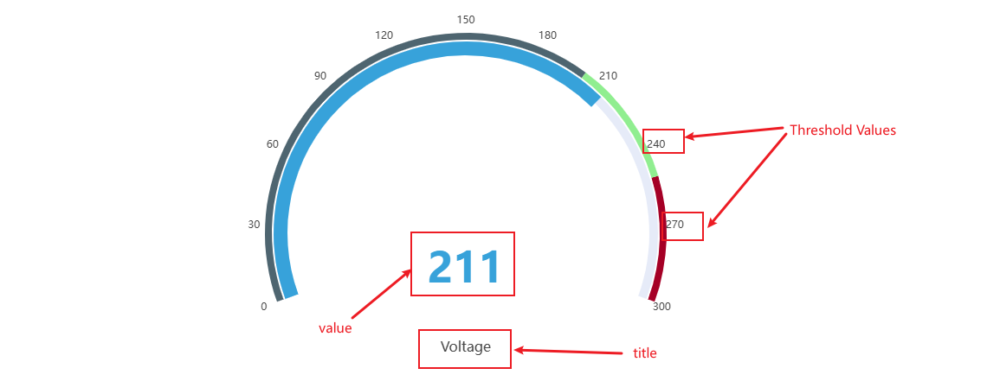
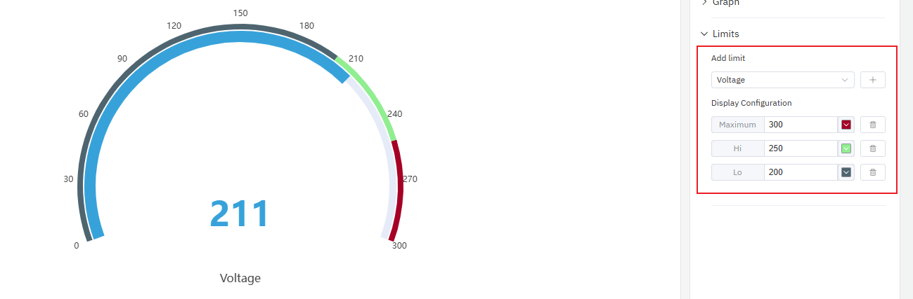

# Gauge Chart

A gauge chart is used for real-time data monitoring. It can display different warning zones on the panel, facilitating quick judgment of the current status.

## Configuration

### Graph Configuration

#### Orientation

When there are multiple gauges in a single panel, you can specify the priority direction for the gauges to be sorted and displayed. Both `vertical` and `horizontal` sorting directions are supported, with `horizontal` as the default.

#### Threshold Label

You can configure whether to display the threshold label, which is not shown by default.

#### Title and Font Size

You can configure whether to display the title and its font size.

#### Value Text Size

You can configure the value font size.

### Limits

By configuring boundary values, different zones can be divided on the dashboard, allowing for quick visual distinction of the current monitoring status.

## Roadmap

To continuously enhance your user experience, we will keep adding practical configurations in subsequent product updates, allowing you to enjoy richer and more user-friendly analysis features.

| Configuation  | Description                                                         |
|------------|--------------------------------------------------------------|
| Guage Theme  | You can configure richer styles, such as displaying it as a donut chart or a pie chart.   |
| Max/Min | Set the maximum and minimum values    |
