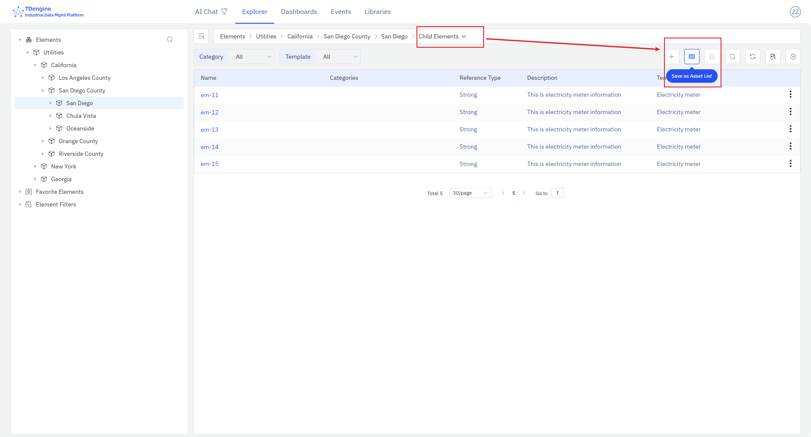
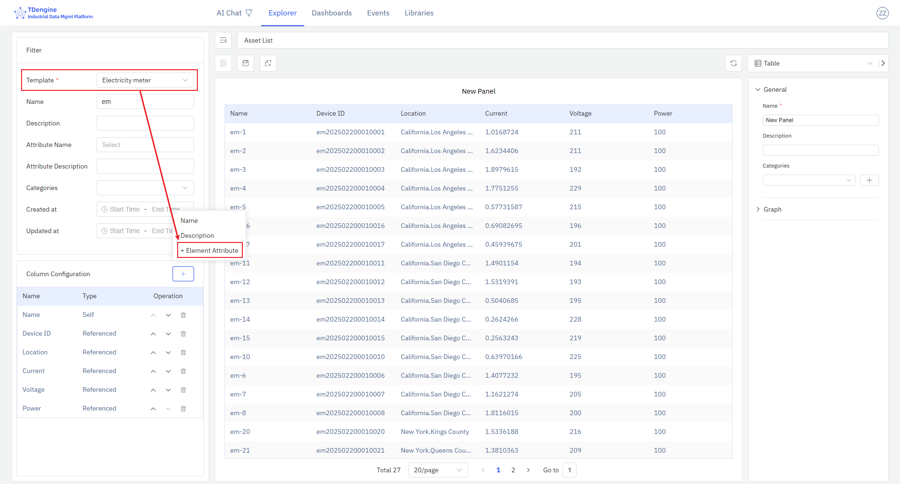
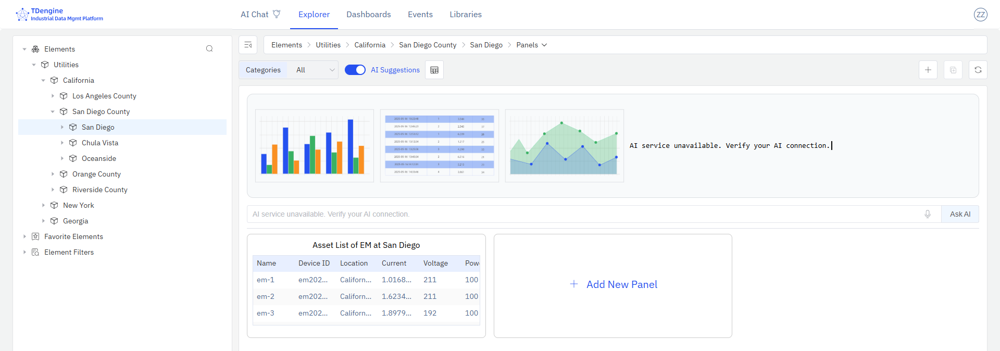

# Asset List

The asset list uses a table to display an enterprise's asset information, along with its latest status and collected values. As a type of panel, the asset list can be saved independently as an asset list panel under a specific element, or added to a dashboard.

## Saving Asset List Panels

### Saving Element Query Results as Asset Lists

If the retrieved elements come from the same element template, you can add element attributes to the list; you can also click on existing column names to remove unwanted columns.

After configuring the query conditions and selecting the columns to display, you can click the "Save as Asset List" button to save the current query results as an asset list panel.

After clicking, a dialog box for saving the asset list will pop up, allowing you to choose the save location.

### Saving Child Element Lists as Asset Lists

After selecting an element on the left, click the "Child Element List" icon in the action area to enter the child element list page. If all child elements come from the same element template, you can add element attributes to the list; you can also click on existing column names to remove unwanted columns.

After selecting the columns to display, you can click the "Save as Asset List" button to save the current child element list as an asset list panel for the current element. Switch to the "Panels" tab to see the newly saved asset list panel.

## Modifying Asset List Panels

As shown in the figure, you can make the following modifications to the asset list:

* **Query Conditions**: The asset type (template) is required. Only by specifying the asset type can you select the corresponding attribute fields.
* **Display Fields**: You can configure the fields to display and their order. The fields include the IDMP asset's own management attributes, as well as reference attributes (TDengine Tags and TDengine Metrics).

## Asset List Panels

After successfully saving the asset list, you can see the display effect of the asset list in the panel, as shown in the figure:

