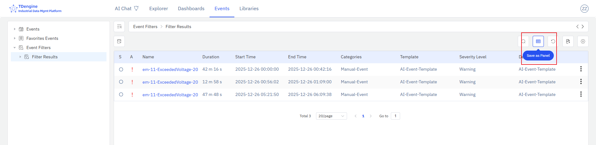

# Event List

The event list uses a table to display an enterprise's event information. As a type of panel, the event list can be saved independently as an event list panel under a specific element, or added to a dashboard.

## Saving Event List Panels

Click the "Events" main menu, then click the "Event Filters" on the left to enter the event query page. Enter filter conditions to query the events of interest. As shown in the figure, click the "Save as Event List" button to save the current query results as an event list panel.

After configuring the query conditions and selecting the columns to display, you can click the "Save as Panel" button to save the current query results as an event list panel. After successfully saving the event list, the panel preview page will open automatically. You can also go to the "Panels" tab of the saved element to view the newly saved event list panel.
