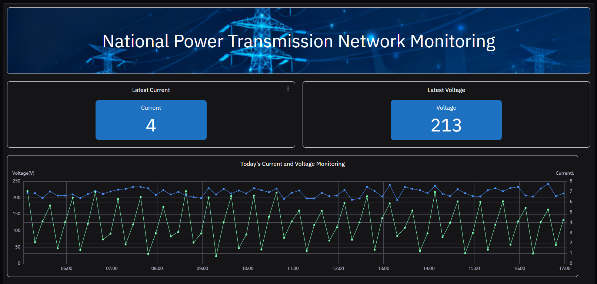
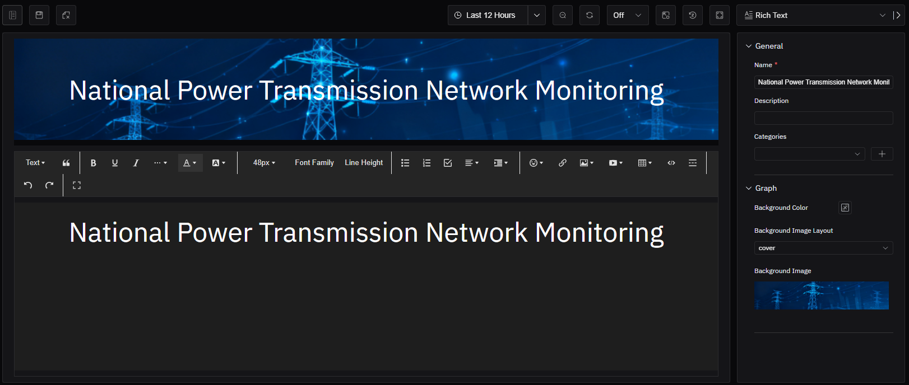
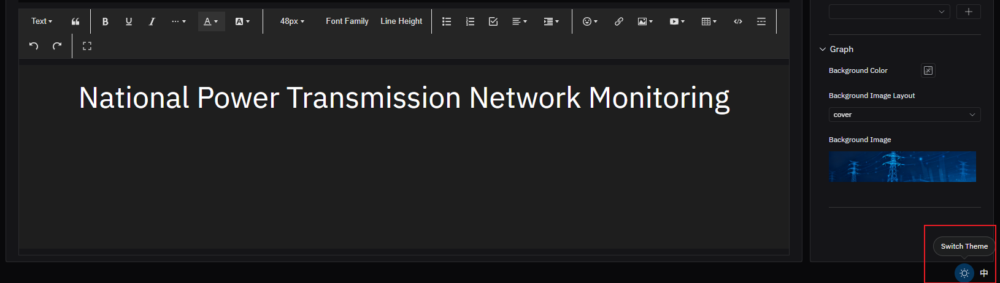

# Richtext

Rich text allows customization of text, background, and more, and is often used to decorate the title of a Dashboard. As shown in the figure, here are examples of multi-text used in Dashboard titles.

## Configuration

### Graph Configuration

#### Background Color

Configure the background color of the rich text panel.

#### Background Image And Layout

A background image can be uploaded, and the layout allows setting the background image to fit the panel size by scaling or repeating tiling.

### Text Editing Tips

If the background color or background image is in a dark color scheme, the text color must be specially set when editing text; otherwise, the default black font color will have very low readability on a dark background. If the font is set to white, the text in the editing area will be invisible when the system theme is in a light color scheme, and you can switch the system theme to the dark color scheme for editing.

