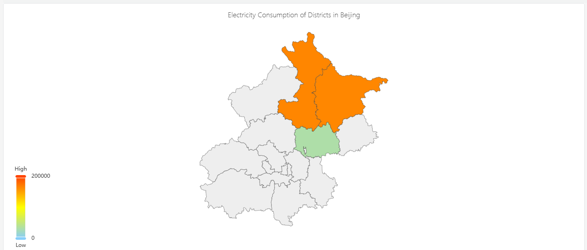

# Map

Maps are mainly used for visualizing geographical regional data and displaying statistical data of different regions, such as electricity consumption.

## Configuration

### Graph Configuration

#### Map GeoJSON

Upload the map file, which must be in GeoJSON format.

#### Map Display

You can configure the minimum value and its corresponding color, the maximum value and its corresponding color, as well as the gradient colors. The color of each region on the map will be rendered based on the color corresponding to the position of its statistical value within this color band.

#### Display Labels

When enabled, the place names and statistical values will be directly displayed on the map.

## Roadmap

To continuously enhance your user experience, we will keep adding practical configurations in subsequent product updates, allowing you to enjoy richer and more user-friendly analysis features.

| Configuration  | Description                                              |
|------------|-------------------------------------------------------------|
| Map Controls | The map can be zoomed in/out, moved, and more.          |
| Map Layers  | Multiple map layers can be overlaid          |
| Map Online | It is possible to access online maps.          |
