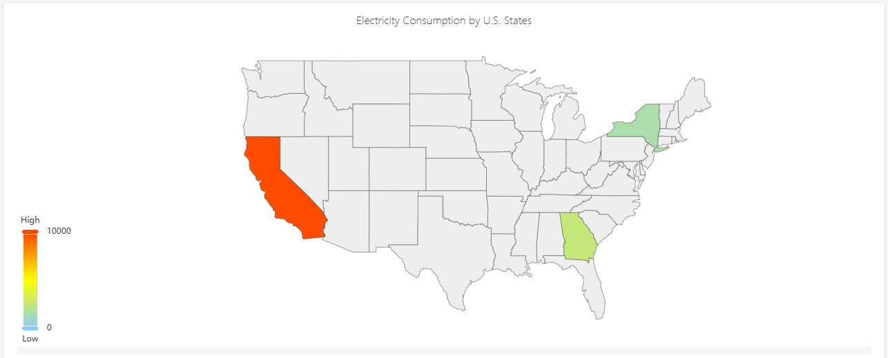
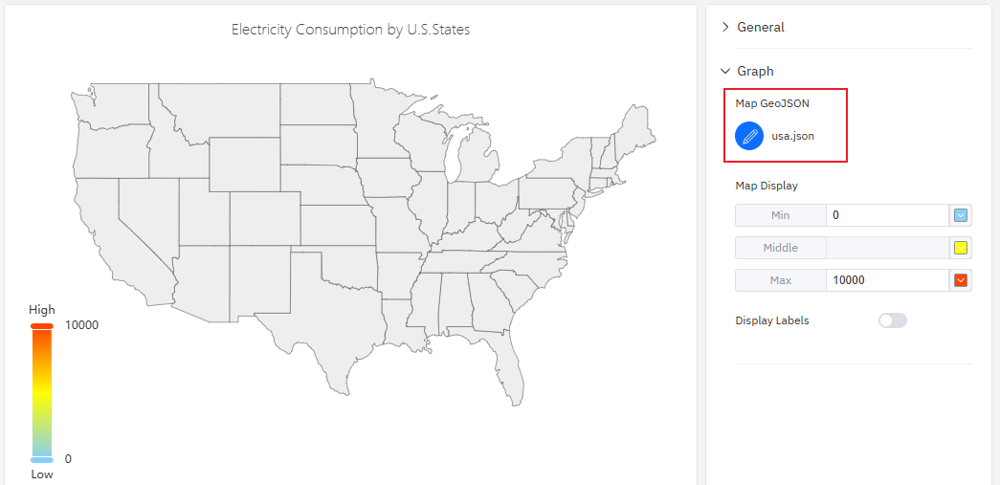
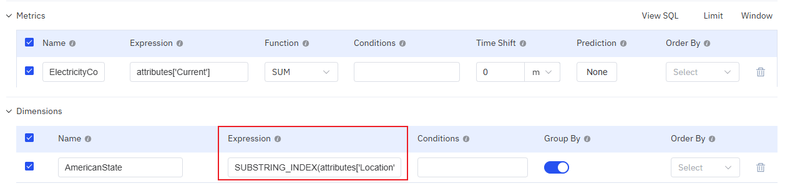

# Map

Maps are mainly used for visualizing geographical regional data and displaying statistical data of different regions, such as electricity consumption.

## Configuration

### Graph Configuration

#### Map GeoJSON

Upload a map file, which must be in GeoJSON format. Expand "Graphic Configuration", click the map upload button, select and upload a map file in JSON format. The map will then be displayed in the central main area, and it supports zooming and panning.

Map data needs to be aggregated based on the region names in the map. The commonly used data configuration method is shown in the figure below: data is aggregated by address. If the address data cannot be directly matched with the region names in the map, an expression is required to process the address data.

#### Map Display

You can configure the minimum value and its corresponding color, the maximum value and its corresponding color, as well as the gradient colors. The color of each region on the map will be rendered based on the color corresponding to the position of its statistical value within this color band.

#### Display Labels

When enabled, the place names and statistical values will be directly displayed on the map.

## Roadmap

To continuously enhance your user experience, we will keep adding practical configurations in subsequent product updates, allowing you to enjoy richer and more user-friendly analysis features.

| Configuration  | Description                                              |
|------------|-------------------------------------------------------------|
| Track Playback | Supports replaying the running trajectory within a specified time period.          |
| Map Layers  | Multiple map layers can be overlaid          |
| Map Online | It is possible to access online maps.          |
