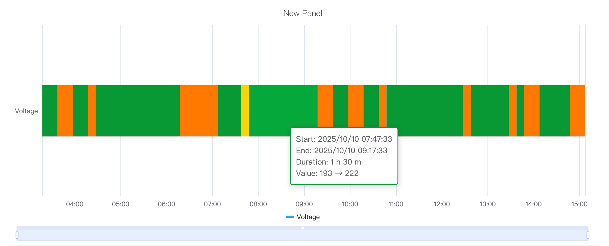
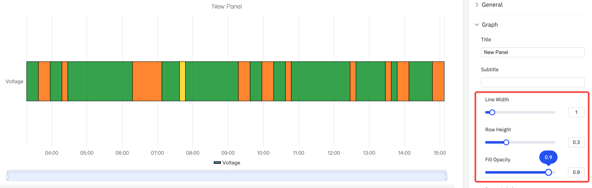
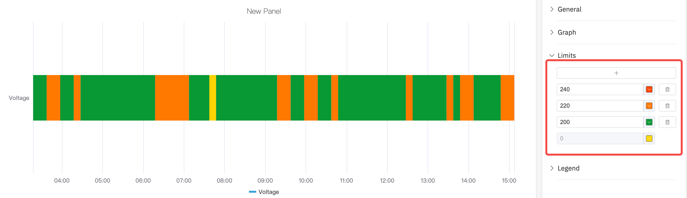
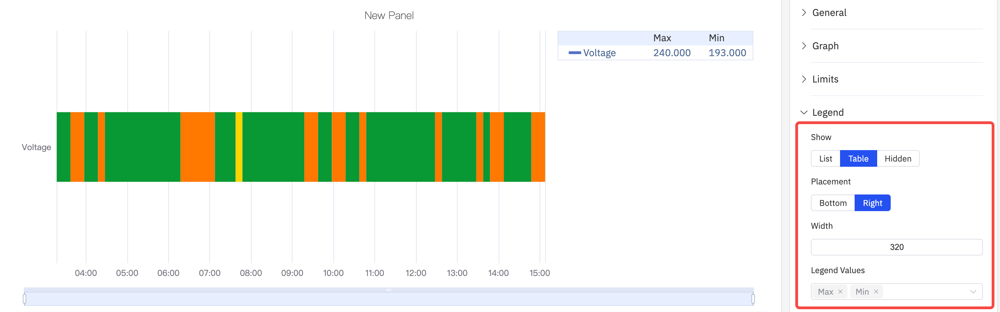

# State Timeline

A state timeline graph is a type of chart used to visualize how discrete states (or categories) change over time. It emphasizes the persistence and transition of states within a specific period of time.

## Configuration

### Graph Configuration

#### Style

As shown in the following figure, the line width, row height, fill transparency and label rotation of the time status line graph can be adjusted. By default, the row height takes up one-third of the chart, with a maximum of 100%, filling the entire chart.

### Limits

Boundary values can be configured. The range of values in custom indicators is marked with different colors as a state, which is more conducive to analysis and observation.

### Legend

The display style, position, maximum value, minimum value and other statistical values can be configured. When the position is in Right and in Table mode, the width of the Table can also be adjusted.

## Roadmap

To continuously enhance your user experience, we will keep adding practical configurations in subsequent product updates, allowing you to enjoy richer and more user-friendly analysis features.

| Configuration  | Description                                                       |
|------------|--------------------------------------------------------------|
| Color Scheme  | Currently, the color of each indicator is fixed; in subsequent updates, we will provide color schemes, allowing you to decide which colors to use for display. |
