# Scatter Chart

The core value of a scatter plot lies in exploring and demonstrating the relationship between two variables. The main functions of a scatter plot include determining whether there is a correlation between two variables, the direction and intensity of the correlation, discovering outliers, and observing the distribution of data by observing the distribution pattern of points,conduct cluster analysis and regression analysis (linear regression, exponential regression, polynomial regression).

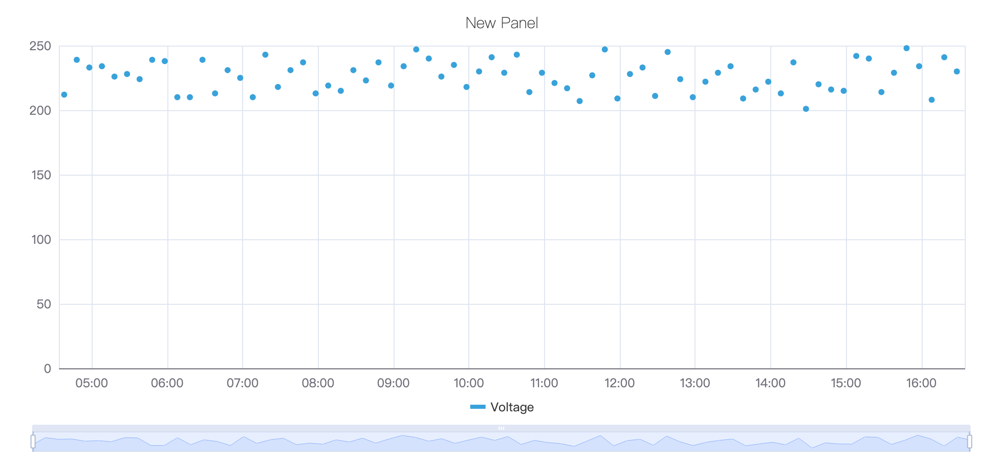

## Configuration

### Graph Configuration

#### Style

The scattered dot style is defaulted to dots. It supports drop-down selection of eight pattern styles such as `Heart`、`Happy`、and `Evil`.

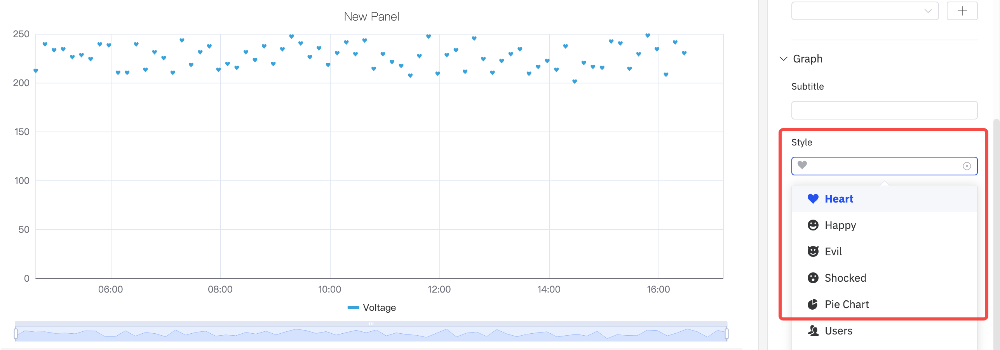

#### Symbol Size And Opacity

As shown in the following figure, the size and transparency of the points in the scatter plot can be adjusted to adjust the display of the graph.

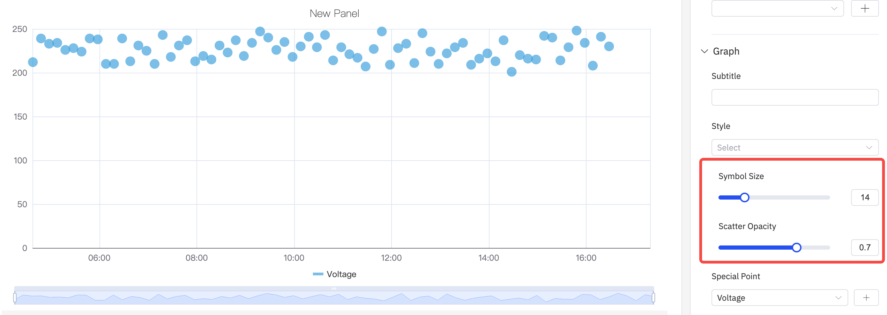

#### Special Point

As shown in the following figure, you can select an indicator to display a special mark for the maximum and minimum values, and mark it with a custom color.

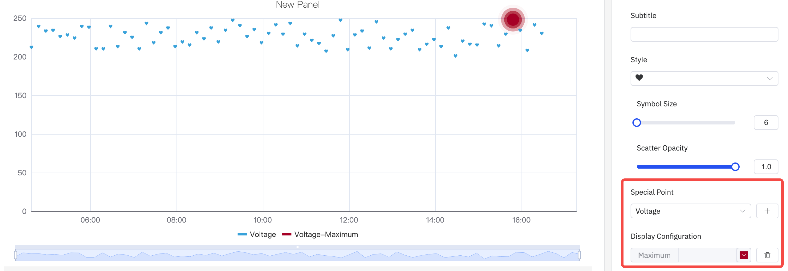

#### Labels

As shown in the figure below, if labels are too dense and overlap with each other, it will impair the visual effect. In such cases, this issue can be resolved by adjusting **label rotation** or **label interval**.

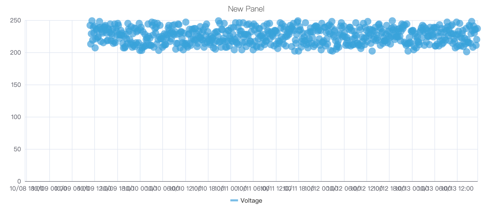

1. Configure the label rotation angle to avoid label overlap

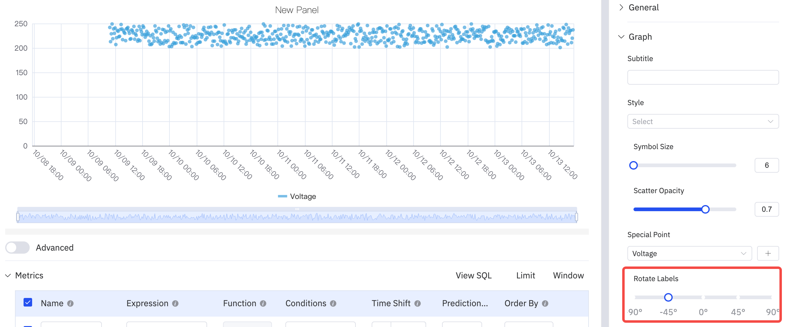

2. Adjust the label interval to reduce label density

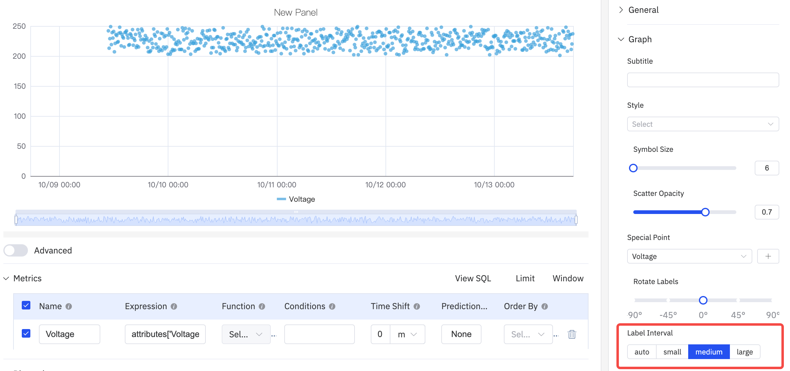

### Axis

The coordinate axis can be configured to display the axis name and its unit of measurement.

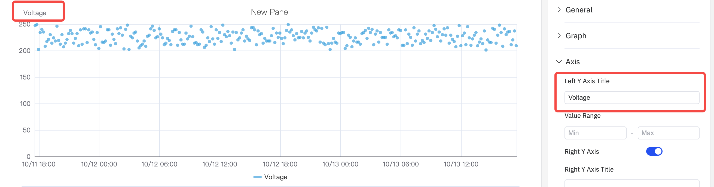

When displaying two metrics in a single chart, if there is an order-of-magnitude difference in the measurement ranges of the two metrics, it will affect the analysis effect of one of the metrics. For example, as shown in the figure below, when two metrics (voltage and current) are added, the obvious changing trend of current cannot be observed because the current values are too small.

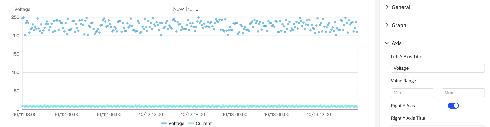

In such cases, you can enable the `right axis` and use the dual Y-axis mode to display the metrics.

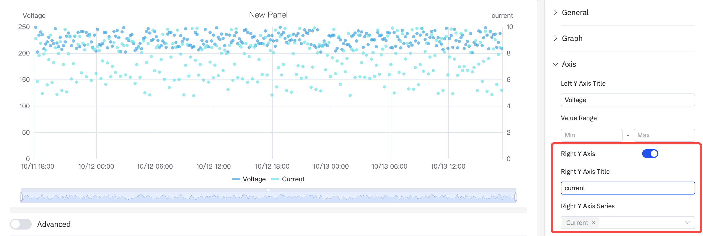

### Limits

You can configure boundary values to mark the safe area and warning area of a metric, which makes analysis and observation easier.

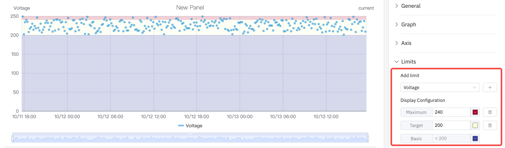

### Data Aggregation

Select data aggregation in data transformation and use dots of different colors to distinguish different categories or groups to achieve the effect of cluster analysis
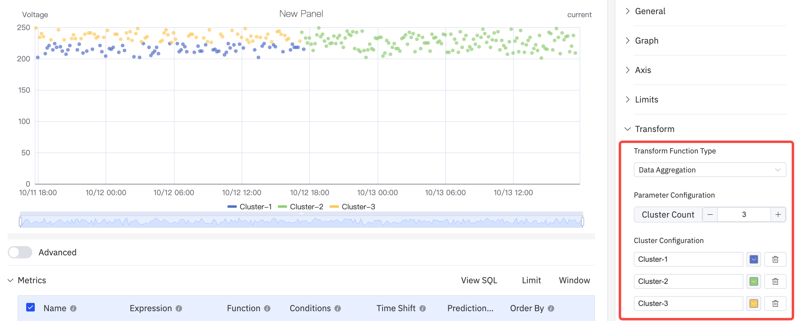

### Regression Anallysis

Add a straight line or curve (such as a linear regression line) that best conforms to the trend of the data points in the graph to help more clearly display the overall trend of the variable relationship. Configurable functions include `Linear Regression`, `Exponential Regression`, and `Polynomial Regression`, among which the polynomial regression can be customized with the order of the polynomial.

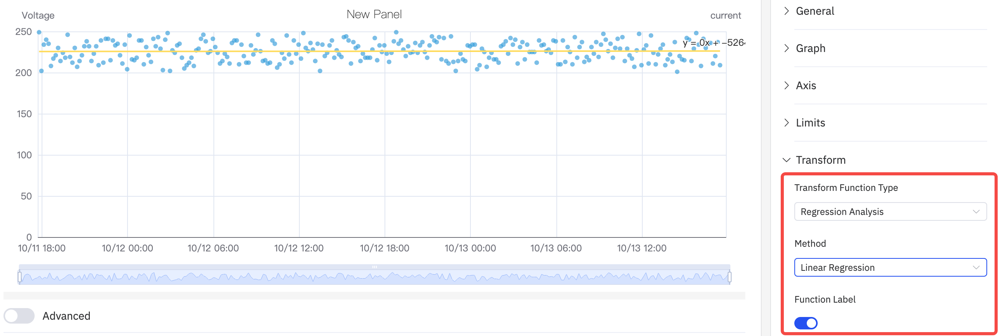

### Legend

The display style, position, maximum value, minimum value and other statistical values can be configured. When the position is in Right and in Table mode, the width of the Table can also be adjusted.

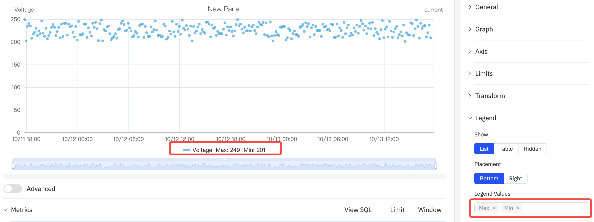

## Roadmap

To continuously enhance your user experience, we will keep adding practical configurations in subsequent product updates, allowing you to enjoy richer and more user-friendly analysis features.

| Configuration  | Description                                                         |
|------------|--------------------------------------------------------------|
| Regression Analysis Function  | Support more fitting functions.  |
| Unit  | Select the display unit to unify the unit for showing metrics; for example, use "milliamperes" to display current.   |
| Max/Min | Set the maximum and minimum values displayed on the Y-axis.    |
| Color Scheme  | Currently, the color of each indicator is fixed; in subsequent updates, we will provide color schemes, allowing you to decide which colors to use for display. |
