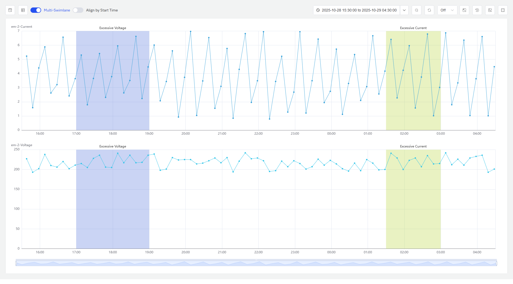
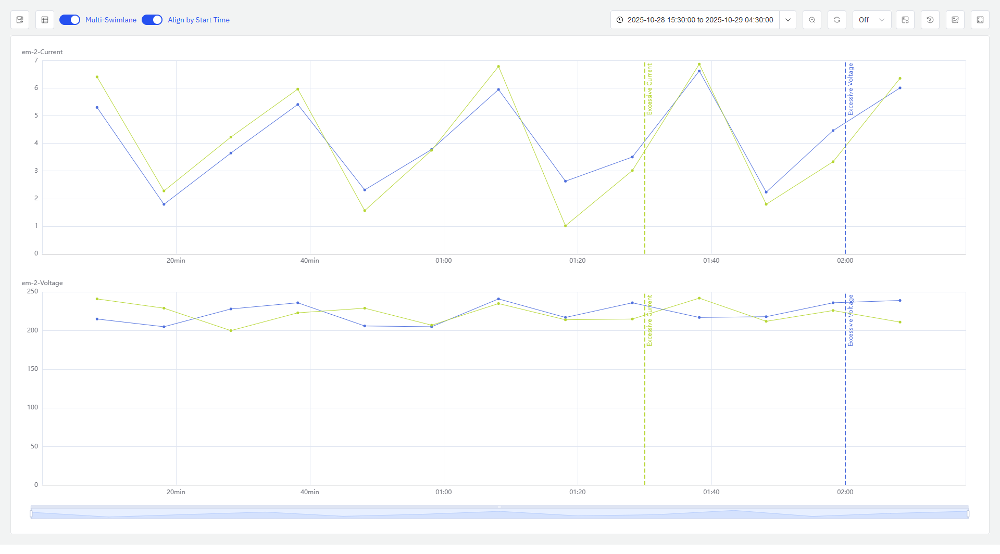
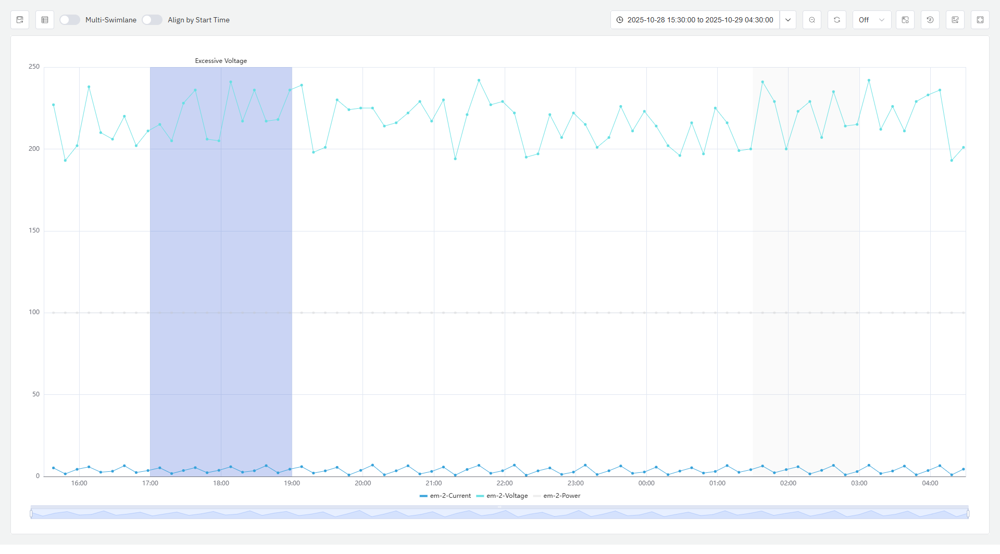
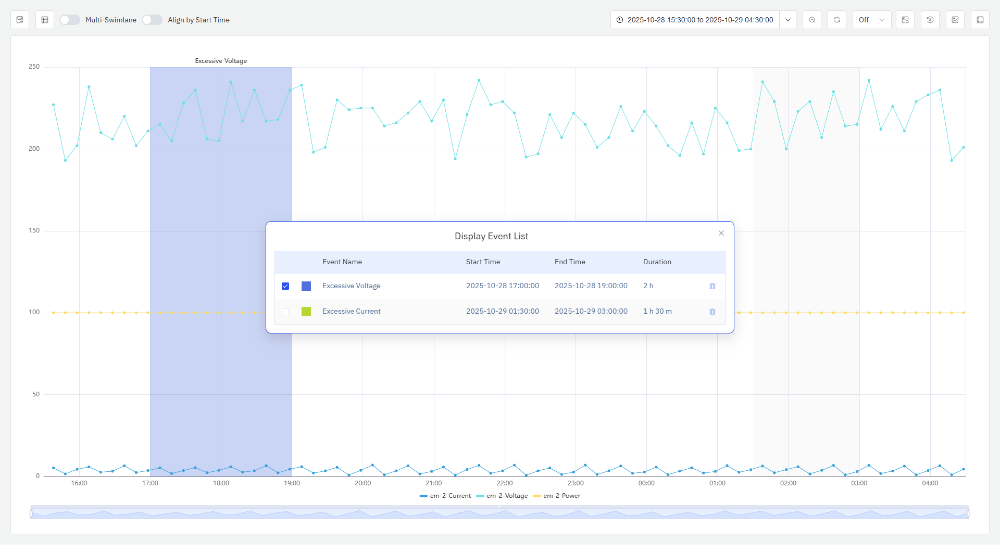

# Event Trend Chart

The Event Trend Chart displays event-related metrics through a trend graph and highlights the time range when the event occurred. Users can add any device monitoring metrics and events to the analysis view to intuitively present the fluctuation trend of data over time.

## Data Source

You can add the `Properties`, `Events`, and `Analysis` of any element to the Event Trend Chart. When adding an `Event`, the properties related to triggering the event will be added to the Event Trend Chart, and the time range during which the event lasts will be highlighted. When adding `Analysis`, all element properties referenced in the analysis will be added to the chart; in addition, all events generated by this analysis will be added to the chart.

## Analysis Tool

### Multi-Swimlane

Multi-swimlane is enabled by default. In multi-swimlane mode, one metric occupies one swimlane.

### Align by Start Time

It is disabled by default. When enabled, it aligns multiple metric segments by their start times, truncates them, and compares the metric patterns during the same period, allowing observation of whether they share the same change trends or patterns.

### Highlight event-related metrics

When the mouse hovers over a specific event area, the metrics related to triggering that event will be highlighted, while other events and metrics will be grayed out.

### Event List

Click the Event List button in the top-left corner to open the event list pop-up window; as shown in the figure, it displays the event name, start time, end time, duration, and other information, and the pop-up window can be freely dragged.

Events are checked by default in the event list. Checked events are highlighted, while unchecked events are grayed out. Events can be deleted.

## Save As Panel

 Click the "Save" button in the top-left corner to permanently save the analysis view as a panel. When saving, you can select which element to save it under; you can choose the element tree nodes related to the current view and their ancestor nodes.

