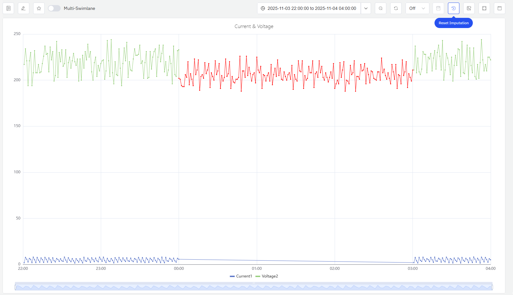

# TDgpt Forecasting and Imputation

IDMP can fully leverage the capabilities of TDgpt to append forecasted data to trend charts or perform imputation on missing data.

## Forecasting

Time series data forecasting and analysis takes time series data spanning a specific time period as input, predicts the trend of time series data in the subsequent continuous time interval, and allows users to specify the number of output time series data points. In the IDMP panel, users can enable this function by turning on the forecasting for a specific metric.

### Enabling Forecasting

Each metric can have prediction enabled independently, as shown in the figure below. For indicators with prediction enabled, other configuration items need to remain at their default values; if complex expressions or functions are used, correct prediction cannot be performed.


As shown in the figure below, after clicking the button in the Prediction column, an algorithm configuration form will pop up. For more detailed explanations, please refer to [Time-Series Forecasting](https://docs.taosdata.com/advanced/TDgpt/forecast).

1. Algorithm: Forecasting algorithm. Please select an available algorithm deployed on the anode.
2. Sampling Interval: Sampling Interval of Predicted Data.
3. Future Data Duration: It determines the number of records in the prediction results (future data duration / sampling interval).
4. Historical Data Duration: It determines the number of sample records used by the algorithm.
5. Confidence Level: Confidence interval range of predicted data, with the value range adjusted to (0, 1].
6. Covariates: Optional. Allows you to select other metrics in the current panel to be used as covariates in the prediction calculation. Currently, this is only supported by the moirai prediction algorithm.


### Forecasting Results

As shown in the figure, each sampling time point will have three values, corresponding to the upper bound (_low), mean (_mean), and lower bound (_high) of the confidence interval.


## Imputation

TDengine TSDB (starting from version v3.3.7.7) provides a missing data imputation function based on a time-series foundation model. In the IDMP trend chart, data imputation can be implemented on the chart through simple operations.

### Data Missing Identification

As shown in the figure, if a curve like this appears in the trend chart, it indicates that there may be a certain data loss issue.


### Data Imputation Operations and Algorithm Parameter Configuration

After clicking the `Imputation` button, you can press and hold the mouse on the trend chart to select the imputation area. The selected area must include a certain range of existing data before and after the missing part. This is to reflect the trend changes, enabling the imputation algorithm to fill in the missing data with more reliable basis.


After selecting the imputation area, an imputation algorithm configuration form will pop up. Once filled out, the form can be submitted to obtain the imputed data. The imputation algorithm parameters include:

1. Metrics to Impute: Select from the current metric; multiple selections are supported.
2. Algorithm: Currently, only the Moment algorithm is supported.
3. Sampling Interval: When the interval between two consecutive data sampling points is greater than 2 sampling intervals, data loss is considered to have occurred, and data imputation will be performed.
4. White Noise Check: After enabling this function, a white noise check will be performed. If the number of selected existing data points is too small and the algorithm fails to fit valid patterns, the data will be regarded as random values, and an error will be reported directly.


### Data Imputation Results

As shown in the figure, the imputed data will be displayed in red highlight on the same curve. If you are not satisfied with the imputation result, you can click the `Reset Imputation` button to discard the current imputation result. You can perform the imputation operation again and appropriately expand the selected data range to obtain a better imputation result.



``` text
tip: Future versions will support writing the imputed results back to the TDengine database. Stay tuned.
```

## Common Errors

1. TDengine ERROR (0x445): Analysis failed since anode return error. This error indicates that the Moment service has not been deployed correctly or has failed to execute, resulting in an error in data imputation. Please check whether the moment-server is running properly on the anode node; if the moment-server is working normally, you can appropriately adjust the selected time range and re-perform the data imputation.
2. TDengine ERROR (0x441): Analysis service can't access. This error indicates that the TDgpt anode node has not been started, resulting in an error in data imputation.
3. TDengine ERROR (0x443): Analysis algorithm/model not loaded. This error indicates that the TDgpt-related forecasting algorithm service has not been deployed.
