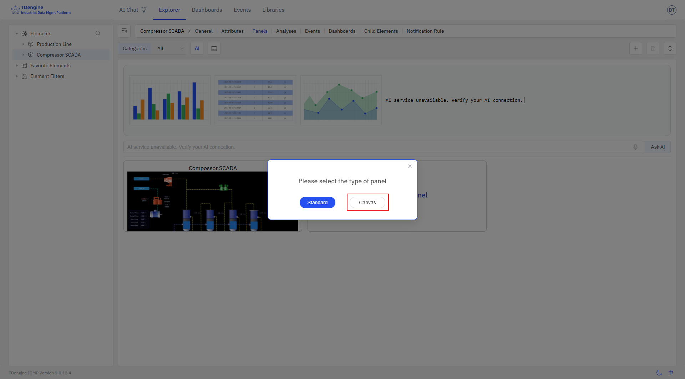
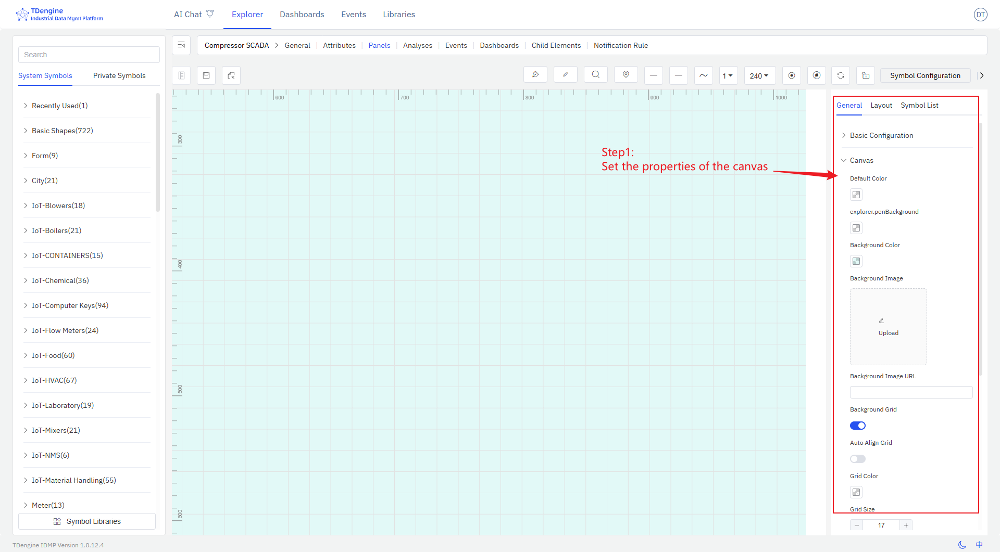
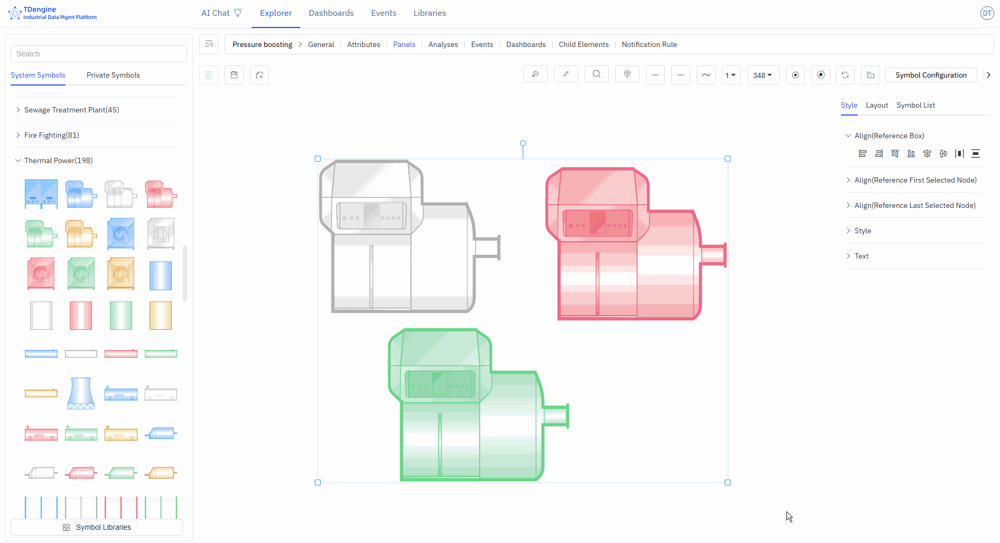
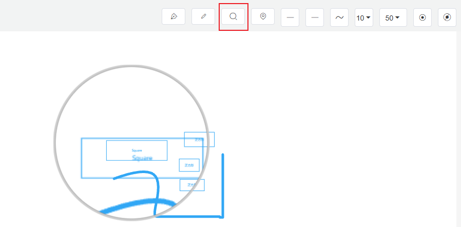
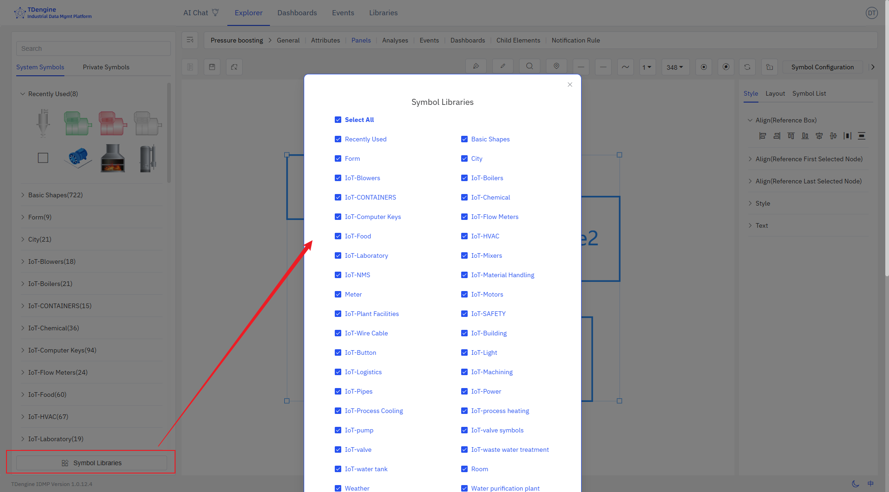

# Canvas Panel

## Overview

TDengine IDMP supports not only Grafana-style panels but also configuration panels popular in industrial scenarios. It allows business personnel to achieve Web configuration, SCADA, and other solutions through "drag and drop" with "zero code," visually presenting the current operating status of devices and processes. Currently, it supports 2D and 2.5D, with plans to support 3D in the future. It seamlessly integrates with IDMP's asset model, enabling rapid solution delivery and reducing development costs. It has the following features:

1. **Intuitive and easy-to-use drag-and-drop editing**: No technical background required, easily create monitoring screens like building blocks
2. **Intelligent data-driven**: Configure once to automatically update the screen with real-time data, reducing repetitive operations
3. **Rich animation effects**: Built-in multiple animations, support customization, making the monitoring screen vivid and intuitive
4. **Flexible state management**: Automatically switch device states such as running/stopped/alarm based on data changes
5. **Expandable graphic library**: Support uploading custom graphics (JS, SVG, images, etc.) to meet special needs
6. **Powerful performance**: A single screen can support tens of thousands of symbols, meeting the needs of large industrial scenarios

Below is a typical configuration editing interface:

The entire editing screen consists of several major parts:

1. **Canvas**: The canvas is the central drawing area where symbols are dragged and dropped for editing and drawing. The canvas has various properties, such as background color, grid, ruler, etc., all of which can be personalized.
2. **Symbols**: These are the basic units of the canvas, the fundamental elements of graphical expression. Various devices and components on the diagram are symbols. Symbols have various properties, such as color, background color, size, displayed text, progress, value, state, etc.
3. **Toolbox**: The top toolbox provides drawing tools such as pen, pencil, magnifier, eagle eye map (thumbnail), line start point, line end point, line width, view scale, auto anchor point, disable anchor point, etc.
4. **Symbol Library**: There are basic graphic libraries and industry graphic libraries, and users are allowed to upload their own drawn graphics.
5. **Configuration**: Configure the canvas and each symbol on the canvas, such as color, background color, font, events, animations, etc., to modify their display and interactive behavior.

This document only provides a brief introduction to the basic concepts and basic operations. More details need to be discovered through extensive use.

## Creating Canvas Panel

Select the element, then select the panel, click `New Panel`, and then select `Canvas` to enter the canvas editing interface.

Designing the canvas involves the following steps:

1. Set the properties of the canvas, including layout, color, background color, grid, etc.
   
2. Select symbols from the symbol library and drag them onto the canvas.
3. Edit and configure symbols, including:
   - Configure text, color, background color, etc. for symbols
   - Configure events for symbols, setting event types (such as click, symbol value change), event actions (such as setting symbol properties, playing animations), and trigger conditions (such as threshold judgments) to enable data-driven display effects of symbols
   - Add animation effects to symbols. The system has built-in animations such as up and down jumping, left and right jumping, heartbeat, rotation, etc., and you can customize animations.
   - Configure symbol properties, including value, progress, progress color, state, etc., and bind them to IDMP element properties so that collected data can drive the display of symbols in real time.

4. Connect related symbols with lines, and configure line types and line animations.
5. During the editing process, you can preview, and after editing, save it.

These steps do not need to be performed in a fixed order and can be rearranged.

## Symbol

Symbols are the basic units that make up the monitoring screen, just like Lego blocks. Each device icon and closed shape is a symbol. By combining different symbols, you can build a complete industrial monitoring system.

### Appearance Settings

#### Symbol Style

Angle: Set the sharpness or roundness of corners, value range: 0~1

Rotation: Set the rotation angle of the symbol

Progress: Any closed shape can be used as a progress bar: rectangle, circle, SVG, closed polyline, or any other closed shape. The value range is 0~1.

#### Image Appearance Style

You can upload images as the appearance or background image of the symbol.

#### Font Icon Appearance Style

You can set the font, size, color, style, weight, line height, position, etc. of the text displayed on the symbol.

### Event

Creating configurations involves defining events, including event types, event actions, and trigger conditions. Event types include mouse enter, mouse leave, selection, etc., but the most important is "symbol attribute value change." The attributes of a symbol can be bound to an IDMP element's attribute, and when a trigger condition for this value is met, a specified event action can be triggered. Event actions include starting animations, stopping animations, etc., but the most important action is "setting symbol attributes," which can change the display of the symbol, such as its color, background color, displayed text, etc. The following sections provide detailed explanations.

#### Adding Events

Add the corresponding events to achieve the corresponding event behaviors. Tip: Some event behaviors only show effects when viewing and cannot be displayed during editing.

Event types: mouse enter, mouse leave, selection, deselection, mouse down, mouse up, click, double click, symbol attribute value change.

Event actions: open link, set symbol attributes, execute animation, pause animation, stop animation, execute JavaScript, execute Window function, custom message.

The following figure shows two events set for the symbols on the canvas: when the mouse enters, the background color is set to green, and when the mouse leaves, the background color is restored.

#### Conditional Triggers

You can add trigger conditions to events. The most commonly used trigger condition is "relational operation," which allows logical judgments on the attributes of symbols, including value, progress, status, and text (other attributes do not support logical judgments).

The following figure shows that the event is triggered only when the symbol text is greater than 30 upon mouse enter. In the figure, the symbol with text 40 meets the condition and triggers the background to turn green, while the symbol with text 20 does not meet the condition and does not trigger the background to turn green upon mouse enter.

### Animation Effects

IDMP has many built-in symbol animation effects and also allows frame-by-frame custom animations.

#### Symbol Animation

Add animations and mouse tips to symbols, set animation duration, animation effects, number of loops, next animation tag, whether to play automatically, and whether to maintain animation state.

#### Built-in Animation

None, bounce up and down, bounce left and right, heartbeat, success, warning, error, show off, rotate, custom.

#### Custom Animation

Create frame-by-frame custom animations by adding animation frames.

#### Mouse Tips

Display mouse tip information when the mouse hovers over a symbol. Two methods are supported:

1. Write mouse tips using Markdown syntax
2. Write Mark functions to display the return value of the function

### Symbol Grouping and States

You can select multiple shapes on the canvas, then right-click and choose Group/Group as State. You can splice and combine them in any way you want, and perform symbol processing operations on any sub-symbols within the grouped symbols, which is conducive to symbol reuse.

Two or more symbols grouped as a state is a very effective way of representation. For example, on and off, the rotation and stop of a fan can be combined into one state. Alarm lights of different colors, such as red, yellow, and green, can be combined into one state. The modification of states can be driven by events or by binding IDMP element attributes to achieve animation effects.

### Symbol Attributes

Symbols have many attributes, including color, text font, font color, progress, etc. These common attributes can be directly set manually in the appearance settings. However, you can automatically control the following symbol attributes through configuration: background color, color, text color, text, X, Y, height, width, visibility, progress value, progress color, value, state, rotation, disabled, etc.

The four attributes of text, progress value, state, and value can also be used for logical judgment in the event trigger conditions of events.

In event configuration, you can automatically control symbol attributes by selecting the "set symbol attributes" event action. Another way is to bind these attributes to IDMP element attributes.

Binding variables allows for quick real-time dynamic data display. As shown in the figure below, add attribute binding to bind the "text" of the symbol to the voltage of the element "em-1". When the element voltage acquisition value changes, the text of the symbol will also change in real time when the data is refreshed.

TIPS: Before binding variables, it is recommended to choose the appropriate input method, manually enter attribute values, and test the desired effects, such as progress bar changes, state changes, event triggers, etc. After testing achieves the desired effect, bind the attributes to the attributes of an IDMP element. In production operation configurations, the attributes of symbols must be bound to the attributes of elements.

## Line

Lines are used to represent the flow of materials, signal transmission, or logical relationships between devices. For example:

1. Pipeline connections represent material transportation
2. Dashed lines represent signal transmission
3. Lines of different colors represent different media

Through line animations, you can visually display the real-time flow status of materials.

### Drawing Lines

#### Pen Drawing Lines

Select a line type, then click the pen to activate drawing with that line type.

Start: Left-click;

Pause: Right-click or enter;

End: esc.

##### Curves, line segments, straight lines, mind map curves

You can use the pen to draw different types of curves, or select a line and modify its line type.

##### Horizontal Line

Press the shortcut key shift, click the left mouse button to draw, right-click to end drawing (line type selected as straight line).

##### Vertical Line

Press the shortcut key ctrl, click the left mouse button to draw, right-click to end drawing (line type selected as straight line).

##### Diagonal Line

Line type selected as straight line, select the pen, left-click to draw the starting point, hold down the shortcut keys ctrl+shift, move the mouse angle
(in increments of 15°), left-click to draw the second point, right-click to end drawing.

#### Pencil Drawing Lines

You can use the pencil to draw any type of line. Click "Pencil" to activate the pencil tool, press the left mouse button on the canvas to start drawing, and the line will be drawn according to the mouse movement trajectory. Release the mouse button to end drawing.

#### Connecting Symbols with Lines

When the mouse hovers over a symbol, anchor points are activated. Press the mouse on an anchor point and drag it to the anchor point of another symbol. Release the mouse to draw a curve between the two symbol anchor points.

#### Convert Line to Symbol

Right-click on the line and select "Convert to Node".

### Cutting/Merging Lines

Cutting lines: Select the line, move the mouse to the anchor point where you want to break the line, click, and press the S key.

Merging lines: When connecting lines, drag the connection end of the currently selected line to align with the connection end of another line, press the alt key, release the mouse, and then release the alt key.

### Line Styles

After selecting a line, you can set the appearance style of the line in the property configuration area on the right:

- Line style: solid, dashed
- Line type: curve, polyline, straight line
- Connection style: bevel, round, default
- Line gradient: none, linear gradient
- Line color, hover color, selected color
- Line width
- Background: solid color background, linear gradient, radial gradient
- Background color, hover background color, selected background color
- Opacity: 0-1
- Anchor point color, anchor point radius (≥0)
- Shadow color, shadow blur, shadow X offset, shadow Y offset
- Border color, border width (≥0)

### Line Animations

IDMP has built-in three animation effects for lines, making the visuals more dynamic.

- Animation effects: water flow, water droplet flow, dots.
- Animation line width (≥0), animation color, animation speed, reverse flow, number of loops.
- Next animation: tag, autoplay, maintain animation state, linear playback: yes/no.

## Anchor Points

Anchor points are the "magic buckles" that keep device connections intact, ensuring that when you move device elements, the connected pipelines automatically adjust to maintain a tidy layout.

### Adding/Removing Anchor Points (A)

Anchor points can be added/removed on both symbols and lines.

Press the keyboard shortcut "A", hover the mouse over a symbol, and click the left mouse button to add an anchor point.

Press the keyboard shortcut "A", hover the mouse over an anchor point, and click the left mouse button to delete the anchor point.

### Moving Anchor Points (G)

Move the cursor over an anchor point, press the shortcut key G, and drag the mouse to move the anchor point.

### Handles

#### Function of Handles

Handles allow precise adjustment of local shapes without damaging the shape of other sections of the curve, supporting fine-tuning of curve details.

1. **Control the curve bending direction**: The direction of the handle determines the entry and exit direction of the curve at the anchor point. The curve naturally transitions along the extended line of the handle, avoiding sharp corners.
2. **Adjust the curve arc and curvature**: Dragging the handle changes its length and angle, directly adjusting the degree of curve bending: the longer the handle, the gentler the curvature; the shorter the handle, the steeper the curvature.
3. **Achieve smooth transitions and sharp corner switching**: Symmetrical handles on both sides can create continuous, smooth curves; independently adjustable handles on one side can achieve a mix of polyline + curve at the same anchor point, meeting complex shape requirements.

#### Adding Handles (H) / Deleting Handles (D)

Click on the anchor point on the line, press the shortcut key H to add a handle to adjust the line.

In the handle activation state, press the shortcut key D to delete the handle.

In the handle activation state, press the Shift key to switch between three different handle types:

1. Both ends of the handle are completely symmetrical
2. One end of the handle can freely stretch in length
3. One end of the handle can freely stretch in length and change angle

### Automatic Anchor Points

Click the "Automatic Anchor Points" button in the toolbox to activate automatic anchor points. When drawing lines on the canvas, if there are no anchor points at both ends of the line, the nearest anchor points will be automatically connected.

### Disabling Anchor Points

Disabling anchor points means that anchor points are not displayed.

## Canvas

### Setting Canvas Properties

1. **Default Color**: Pre-set the default color, so that elements dragged onto the canvas (basic shapes, text, icons) automatically unify to the default color.
2. **Background**: Background image, background color
3. **Grid**: Background grid, grid color, grid size, grid angle
4. **Ruler**: Enable ruler, ruler color

### Setting Canvas Layout

When multiple elements are selected, you can set the canvas layout and perform alignment operations: align left, align right, align top, align bottom, vertical center, horizontal center, distribute evenly left-right, distribute evenly top-bottom, same size, format painter.

### Viewing Element List

This lists all elements on the entire canvas. If you click on one, that element will be selected and centered on the canvas.

1. **Editable**: Can edit properties and events
2. **Locked**: Can execute events and interactions
3. **Disabled**: Cannot be selected, does not trigger any events, can be used as a background image.

## Toolbox

### Pen

1. Start: Left click
2. Pause: Right click or enter
3. End: esc
4. Close/Unclose: enter

### Pencil

1. Start: Continuous left drag
2. Pause: Release left button
3. End: esc
4. Close/Unclose: enter

### Magnifier

Used to observe details in the image

### Overview Map (Thumbnail)

The global view of the configuration diagram. Clicking on the overview map allows you to quickly switch the center position on the canvas.

## Symbol Library

The IDMP system already includes a basic symbol library and some industry-specific symbol libraries. If you have more requirements during use, you can create and upload your own symbols, or contact the IDMP team for design support.

### System Symbol Library

IDMP's built-in symbol library meets the basic needs of most industries, offering symbols in three formats: native code (JS), Alibaba font (iconfont), and images (svg, gif). Additionally, the canvas supports video playback for MP4, WebM, and Ogg formats.

### Private Symbol Library

IDMP symbol library is an extensible and open graphic library that can customize various cool component effects and scenes according to different needs. Supports creating symbol libraries, uploading symbols, etc.

### Symbol Library Management

Symbol library management can configure whether to display the symbol library, and you can choose to display only the symbol libraries you need.

## Excellent Cases

