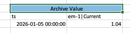
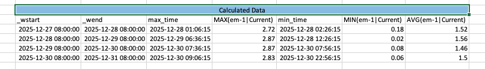
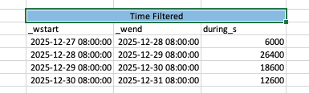
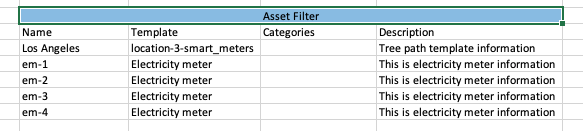

# Excel Add-in

TDengine Excel Add-in is a Microsoft Excel add-in that enables you to retrieve information from TDengine servers directly into worksheets. Combined with Microsoft Excel's calculation, charting, and formatting capabilities, TDengine Excel Add-in provides powerful tools for collecting, monitoring, analyzing, and reporting TDengine data.

## Before You Start

### Cell Reference
Click on the input type component in the add-in, then click on an Excel Cell. The component will display the Cell address and retrieve the actual content in the Cell as a query parameter for data. Whether Cell range is supported is consistent with the component parameters; see the "Operation" column in the table under the feature description.

## Features Overview

### 1. Single Value Query

#### 1.1 Current Value

**Description**: Get the latest real-time value of a data point.

| Item | Description | Operation |
|------|------|------|
| Data Items | Attributes of elements, one or more can be selected | 1. Enter keywords in the input box to search and select the required data item 2. Click the search icon to open advanced search conditions, fill in and confirm  3. Address reference: Click on the data item first, then select an Excel cell. Supports address range. The component will display the cell address and parse the content in the cell. Valid content is element path `/Utilities/California/Los Angeles County/Los Angeles/em-1`, which gets all attributes under the element path; attribute path `/Utilities/California/Los Angeles County/Los Angeles/em-1 \| Current` gets an individual attribute |
| Output Cell | The starting cell in Excel where data will be output | 1. Click a cell in Excel to auto-bind 2. Manually enter the Excel cell position, e.g., `Sheet1!A1` |
| Time Position | Configuration for the time column in output data | 1. Do not display time 2. Time at left 3. Time on top (click to switch) |

##### Current Value Example

To view the current value of a Current data point, set the following inputs for the current value function:

| Input | Value |
|------|------|
| Data Items | Current |
| Time at left | Selected |

Current function output result:

#### 1.2 Archive Value

**Description**: Get historical data at a specified point in time.

| Item | Description | Operation |
|------|------|------|
| Data Items | Attributes of elements, one or more can be selected | 1. Enter keywords in the input box to search and select the required data item 2. Click the search icon to open advanced search conditions, fill in and confirm  3. Address reference: Click on the data item first, then select an Excel cell. Supports address range. The component will display the cell address and parse the content in the cell. Valid content is element path `/Utilities/California/Los Angeles County/Los Angeles/em-1`, which gets all attributes under the element path; attribute path `/Utilities/California/Los Angeles County/Los Angeles/em-1 \| Current` gets an individual attribute |
| Fill Type | Query interpolation, TDengine fill clause fill type (default previous non-null value) | Supported types (dropdown selection): 1. Previous non-null value 2. Fill with custom value 3. Fill with null 4. Linear fill 5. Next non-null value  Supports single Cell reference |
| Fill Custom Value | The specific value to fill | Only displayed when fill type is selected as "Fill with custom value"  Supports single Cell reference |
| Time Stamp | The specific time to query data | Time selection box: 1. Yesterday at midnight 2. Today at midnight 3. Current time Or select a specific point in time  Supports single Cell reference |
| Output Cell | The starting cell in Excel where data will be output | 1. Click a cell in Excel to auto-bind 2. Manually enter the Excel cell position, e.g., `Sheet1!A1` |
| Time Position | Configuration for the time column in output data | 1. Do not display time 2. Time at left 3. Time on top (click to switch) |

##### Archive Value Example

To view the archive value of a Current data point, set the following inputs for the archive value function:

| Input | Value |
|------|------|
| Data Items | Current |
| Fill Type | Previous non-null value |
| Time Stamp | 2026-1-5 00:00:00 |
| Time at left | Selected |

Current function output result:

### 2. Multiple Value Query

#### 2.1 Raw Data

**Description**: Get the original time series data.

| Item | Description | Operation |
|------|------|------|
| Data Items | Attributes of elements, one or more can be selected | 1. Enter keywords in the input box to search and select the required data item 2. Click the search icon to open advanced search conditions, fill in and confirm  3. Address reference: Click on the data item first, then select an Excel cell. Supports address range. The component will display the cell address and parse the content in the cell. Valid content is element path `/Utilities/California/Los Angeles County/Los Angeles/em-1`, which gets all attributes under the element path; attribute path `/Utilities/California/Los Angeles County/Los Angeles/em-1 \| Current` gets an individual attribute |
| Start Time/End Time | The specific time to query data | Time selection box: 1. Yesterday's data 2. Today's data 3. Past one day's data Or select a specific time range  Supports single Cell reference |
| Output Cell | The starting cell in Excel where data will be output | 1. Click a cell in Excel to auto-bind 2. Manually enter the Excel cell position, e.g., `Sheet1!A1` |
| Time Position | Configuration for the time column in output data | 1. Do not display time 2. Time at left 3. Time on top (click to switch) |

##### Raw Data Example

To view the raw data value of a Current data point, set the following inputs for the raw data function:

| Input | Value |
|------|------|
| Data Items | Current |
| Time Range | 2025-12-30 00:00:00 - 2025-12-31 00:00:00|
| Time at left | Selected |

Current function output result:

#### 2.2 Sampled Data

**Description**: Time series data sampled at fixed intervals.

| Item | Description | Operation |
|------|------|------|
| Data Items | Attributes of elements, one or more can be selected | 1. Enter keywords in the input box to search and select the required data item 2. Click the search icon to open advanced search conditions, fill in and confirm  3. Address reference: Click on the data item first, then select an Excel cell. Supports address range. The component will display the cell address and parse the content in the cell. Valid content is element path `/Utilities/California/Los Angeles County/Los Angeles/em-1`, which gets all attributes under the element path; attribute path `/Utilities/California/Los Angeles County/Los Angeles/em-1 \| Current` gets an individual attribute |
| Time Interval | The time interval for fetching data | Default value is hour  Supports single Cell reference |
| Filter Expression | Filter conditions for the data | Input box (attribute names require backticks, e.g., `` `current` > 5 ``)  Supports single Cell reference |
|  Start Time/End Time  | The specific time to query data | Time selection box: 1. Yesterday hourly data 2. Today hourly data 3. Last 24 hours data 4. Last week data 5. Current month hourly data Or select a specific time range  Supports single Cell reference |
| Output Cell | The starting cell in Excel where data will be output | 1. Click a cell in Excel to auto-bind 2. Manually enter the Excel cell position, e.g., `Sheet1!A1` |
| Time Position | Configuration for the time column in output data | 1. Do not display time 2. Time at left 3. Time on top (click to switch) |

##### Sampled Data Example

To view the sampled data value of a Current data point, set the following inputs for the sampled data function:

| Input | Value |
|------|------|
| Data Items | Current |
| Time Range | 2025-12-30 00:00:00 - 2025-12-31 00:00:00 |
| Time Interval | 1h |
| Time at left | Selected |

Current function output result:

#### 2.3 Timed Data

**Description**: Get time series data at multiple specified points in time.

| Item | Description | Operation |
|------|------|------|
| Data Items | Attributes of elements, one or more can be selected | 1. Enter keywords in the input box to search and select the required data item 2. Click the search icon to open advanced search conditions, fill in and confirm  3. Address reference: Click on the data item first, then select an Excel cell. Supports address range. The component will display the cell address and parse the content in the cell. Valid content is element path `/Utilities/California/Los Angeles County/Los Angeles/em-1`, which gets all attributes under the element path; attribute path `/Utilities/California/Los Angeles County/Los Angeles/em-1 \| Current` gets an individual attribute |
| Fill Type | Query interpolation, TDengine fill clause fill type (default previous non-null value) | Supported types (dropdown selection): 1. Previous non-null value 2. Fill with custom value 3. Fill with null 4. Linear fill 5. Next non-null value  Supports single Cell reference |
| Fill Custom Value | The specific value to fill | Only displayed when fill type is selected as "Fill with custom value"  Supports single Cell reference |
| Time Stamp | The specific time to query data | Input box: can enter multiple time points  Supports single Cell reference |
| Output Cell | The starting cell in Excel where data will be output | 1. Click a cell in Excel to auto-bind 2. Manually enter the Excel cell position, e.g., `Sheet1!A1` |
| Time Position | Configuration for the time column in output data | 1. Do not display time 2. Time at left 3. Time on top (click to switch) |

##### Timed Data Example

To view the timed data value of a Current data point, set the following inputs for the timed data function:

| Input | Value |
|------|------|
| Data Items | Current |
| Fill Type | Previous |
| Time Stamp | 2025-12-31 09:00:00, 2025-12-30 08:00:00 |
| Time at left | Selected |

Current function output result:

### 3. Calculation Functions

#### 3.1 Calculated Data

**Description**: Get time series data processed with TDengine aggregate functions.

| Item | Description | Operation |
|------|------|------|
| Data Items | Attributes of elements, one or more can be selected | 1. Enter keywords in the input box to search and select the required data item 2. Click the search icon to open advanced search conditions, fill in and confirm  3. Address reference: Click on the data item first, then select an Excel cell. Supports address range. The component will display the cell address and parse the content in the cell. Valid content is element path `/Utilities/California/Los Angeles County/Los Angeles/em-1`, which gets all attributes under the element path; attribute path `/Utilities/California/Los Angeles County/Los Angeles/em-1 \| Current` gets an individual attribute |
| Time Interval | The time interval for fetching data | Default value is hour  Supports single Cell reference |
| Filter Expression | Filter conditions for the data | Input box (attribute names require backticks, e.g., `` `current` > 5 ``)  Supports single Cell reference |
|  Start Time/End Time | The specific time to query data | Time selection box: 1. Yesterday hourly data 2. Today hourly data 3. Last 24 hours data 4. Last week data 5. Current month hourly data Or select a specific time range  Supports single Cell reference |
| Aggregate Function | Aggregate processing of data | Dropdown select the specific TDengine aggregate function name  Supports single Cell reference |
| Output Cell | The starting cell in Excel where data will be output | 1. Click a cell in Excel to auto-bind 2. Manually enter the Excel cell position, e.g., `Sheet1!A1` |
| Time Options | Configuration for time options in output data | Checkboxes: 1. Display start time 2. Display end time 3. Display max/min time |

##### Calculated Data Example

To view the calculated data value of a Current data point, set the following inputs for the calculated data function:

| Input | Value |
|------|------|
| Data Items | Current |
| Time Interval | 1d |
| Time Stamp | 2025-12-28 00:00:00-2025-12-31 00:00:00 |
| Aggregate Function | AVG |
| Display start time, Display end time, Display max/min time | Selected |

Current function output result:

#### 3.2 Time Filtered

**Description**: Return the total duration within a specified time range that meets the condition (specified by expression).

| Item | Description | Operation |
|------|------|------|
| Data Items | Attributes of elements, one or more can be selected | 1. Enter keywords in the input box to search and select the required data item 2. Click the search icon to open advanced search conditions, fill in and confirm  3. Address reference: Click on the data item first, then select an Excel cell. Supports address range. The component will display the cell address and parse the content in the cell. Valid content is element path `/Utilities/California/Los Angeles County/Los Angeles/em-1`, which gets all attributes under the element path; attribute path `/Utilities/California/Los Angeles County/Los Angeles/em-1 \| Current` gets an individual attribute |
| Time Interval | The time interval for fetching data | Default value is hour  Supports single Cell reference |
| Expression | Start condition START WITH, end condition END WITH | Input box (attribute names require backticks, e.g., `` `current` > 5 ``)  Supports single Cell reference |
|  Start Time/End Time | The specific time to query data | Time selection box: 1. Yesterday hourly data 2. Today hourly data 3. Last 24 hours data 4. Last week data 5. Current month hourly data Or select a specific time range  Supports single Cell reference |
| Time Unit | Time unit conversion for output | Default is seconds, dropdown select  Supports single Cell reference |
| Output Cell | The starting cell in Excel where data will be output | 1. Click a cell in Excel to auto-bind 2. Manually enter the Excel cell position, e.g., `Sheet1!A1` |
| Time Position | Configuration for the time column in output data | 1. Do not display time 2. Time at left 3. Time on top (click to switch) |

##### Time Filtered Example

To view the time filtered value of a Current data point, set the following inputs for the time filtered function:

| Input | Value |
|------|------|
| Data Items | Current |
| START WITH | \`Current\` > 0 |
| END WITH | \`Current\` < 2 |
| Time Interval | 1d |
| Time Range | 2025-12-28 00:00:00-2025-12-31 00:00:00 |
| Time Unit | Seconds |
| Display start time, Display end time | Selected |

Current function output result:

### 4. Event Analysis

#### 4.1 Explore Events

**Description**: Return events matching the specified search conditions.

##### Event Explorer Example

To view events, set the following inputs for the event explorer function:

| Input | Value |
|------|------|
| Name | Voltage High Warning |
| Columns to Display | All |

Current function output result:

### 5. Search

#### 5.1 Attribute Filter

**Description**: Return attributes matching the specified search conditions.

##### Attribute Filter Example

To view attribute filters, set the following inputs for the attribute filter function:

| Input | Value |
|------|------|
| Name | Current |
| Max Results | 5 |
| Columns to Display | All |

Current function output result:

#### 5.2 Asset Filter

**Description**: Return elements matching the specified search conditions.

##### Asset Filter Example

To view assets, set the following inputs for the asset filter function:

| Input | Value |
|------|------|
| Root Path | /Elements/Utilities/California/Los Angeles County/Los Angeles |
| Max Results | 5 |
| Columns to Display | All |

Current function output result:

### 6. Properties

**Description**: Query the attributes of a specific attribute.

##### Properties Example

To view the properties of an attribute, set the following inputs for the properties function:

| Input | Value |
|------|------|
| Data Items | Current |
| Property | Description |

Current function output result:

### 7. Update

**Description**: Trigger data updates in the worksheet.

**Operation Buttons**:

- **OK**: Execute data query and update current add-in data once
- **Apply**: Update current add-in data according to the selected refresh frequency
- **Update**: Update all data in the Excel workspace

### 8. Settings

**Description**: Configure data output to Excel.

| Item | Description |
|------|------|
| Time Format | Time column format in Excel output. Default `YYYY-MM-DD HH:mm:ss` |
| Number Format | Number column format in Excel output. Format string can be any valid number format code in Excel format window |
| Max Event Explorer Search Results | Maximum number of results returned by event explorer |
| Max Attribute/Asset Filter Results | Maximum number of results returned by attribute/asset filter |
| Auto Update - Interval | Data refresh frequency when "Apply" function is enabled |
