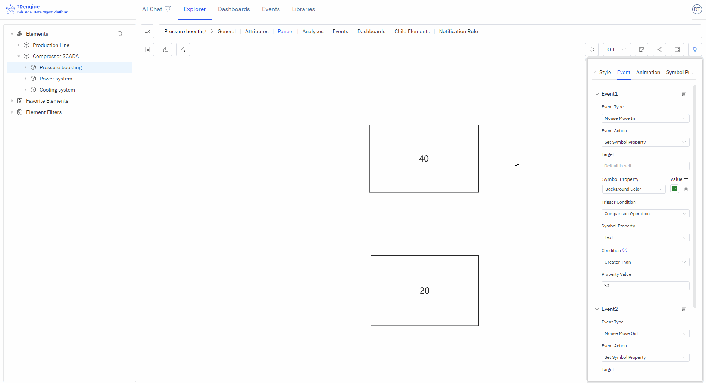

# 5.2 Symbol

Symbols are the basic units that make up the monitoring screen, just like Lego blocks. Each device icon and closed shape is a symbol. By combining different symbols, you can build a complete industrial monitoring system.

## 5.2.1 Appearance Settings

### 5.2.1.1 Symbol Style

Angle: Set the sharpness or roundness of corners, value range: 0~1

Rotation: Set the rotation angle of the symbol

Progress: Any closed shape can be used as a progress bar: rectangle, circle, SVG, closed polyline, or any other closed shape. The value range is 0~1.


### 5.2.1.2 Image Appearance Style

You can upload images as the appearance or background image of the symbol.

### 5.2.1.3 Font Icon Appearance Style

You can set the font, size, color, style, weight, line height, position, etc. of the text displayed on the symbol.

## 5.2.2 Event

Creating configurations involves defining events, including event types, event actions, and trigger conditions. Event types include mouse enter, mouse leave, selection, etc., but the most important is "symbol attribute value change." The attributes of a symbol can be bound to an IDMP element's attribute, and when a trigger condition for this value is met, a specified event action can be triggered. Event actions include starting animations, stopping animations, etc., but the most important action is "setting symbol attributes," which can change the display of the symbol, such as its color, background color, displayed text, etc.

### 5.2.2.1 Adding Events

Add the corresponding events to achieve the corresponding event behaviors. Tip: Some event behaviors only show effects when viewing and cannot be displayed during editing.

Event types: mouse enter, mouse leave, selection, deselection, mouse down, mouse up, click, double click, symbol attribute value change.

Event actions: open link, set symbol attributes, execute animation, pause animation, stop animation, execute JavaScript, execute Window function, custom message.

The following figure shows two events set for the symbols on the canvas: when the mouse enters, the background color is set to green, and when the mouse leaves, the background color is restored.


### 5.2.2.2 Conditional Triggers

You can add trigger conditions to events. The most commonly used trigger condition is "relational operation," which allows logical judgments on the attributes of symbols, including value, progress, status, and text (other attributes do not support logical judgments).

The following figure shows that the event is triggered only when the symbol text is greater than 30 upon mouse enter. In the figure, the symbol with text 40 meets the condition and triggers the background to turn green, while the symbol with text 20 does not meet the condition and does not trigger the background to turn green upon mouse enter.



#### 5.2.2.2.1 Trigger Condition Data Structure

A trigger condition is described by the `where` object on a symbol event and contains the following fields:

- `type`: An arbitrary value; using the condition's functional name is recommended for readability. When empty, no trigger condition is applied.
- `fn`: A condition function that returns a boolean value. Highest priority.
- `fnJs`: A JavaScript code snippet for the condition. It can access the `pen` and `context` parameters and must return a boolean value. Second priority.
- `key`: Compare against an attribute name. Lowest priority.
- `comparison`: The comparison operator, used together with `key`.
- `value`: The value to compare against, used together with `key`.

The operators supported by `comparison` are:

| Operator | Meaning                                                                                                                                     |
| -------- | ------------------------------------------------------------------------------------------------------------------------------------------- |
| `>`      | Greater than                                                                                                                                |
| `>=`     | Greater than or equal to                                                                                                                    |
| `<`      | Less than                                                                                                                                   |
| `<=`     | Less than or equal to                                                                                                                       |
| `=`      | Equal to                                                                                                                                    |
| `!=`     | Not equal to                                                                                                                                |
| `[)`     | Between. The operator itself only denotes the "between" semantic; the actual interval boundaries are specified by the `value` field using standard mathematical interval notation, supporting all four combinations: `[]`, `[)`, `(]`, `()`. For example, a `value` of `[0, 100)` includes 0 but excludes 100; `(0, 100]` excludes 0 but includes 100; `[0, 100]` includes both 0 and 100. |
| `![)`    | Not between, i.e., outside the "between" range. Interval boundaries are likewise specified by the `value` field.                            |
| `[]`     | Belongs to a set, for example `[1,20,30..50,65]`, where `30..50` denotes the inclusive integer range from 30 to 50. Strings are supported since version 1.0.48, for example `[1,20,aaa,value1]`. |
| `![]`    | Does not belong to the set above.                                                                                                           |

### 5.2.2.3 Execute JavaScript

When the event action is set to "Execute JavaScript," a user-defined JavaScript snippet runs after the event is triggered. This is useful for reporting data, calling APIs, refreshing business state, and similar scenarios. The following variables are available inside the snippet:

- `pen`: The symbol object that triggered the event.
- `params`: The parameters passed in from the event configuration.
- `context`: The execution context.
- `arguments`: The original event arguments.

The equivalent symbol-event data structure looks like this:

```typescript
// EventAction is provided by the Canvas runtime; inlined here so the example
// is self-contained. The value "JS" stands for the "Execute JavaScript" action.
const EventAction = { JS: "JS" };

const pen = {
  name: "rectangle",
  text: "rectangle",
  x: 100,
  y: 100,
  width: 100,
  height: 100,
  events: [
    {
      name: "click",
      action: EventAction.JS,
      params: "my params", // parameters passed to the code block
      value: `
        console.log('arguments', arguments);
        console.log('current symbol', pen);
        console.log('params', params);
        console.log('context', context);
      `, // code block
    },
  ],
};
```

Example of calling an API (assign either snippet below as a string to the event's `value` field):

```javascript
// Using chained .then()
fetch('/api/device/data?mock=1')
  .then((res) => res.text())
  .then((data) => console.log(data));

// Or using async/await
(async () => {
  const res = await fetch('/api/device/data?mock=1');
  const data = await res.text();
  console.log(data);
})();
```

## 5.2.3 Animation Effects

IDMP has many built-in symbol animation effects and also allows frame-by-frame custom animations.

### 5.2.3.1 Symbol Animation

Add animations and mouse tips to symbols, set animation duration, animation effects, number of loops, next animation tag, whether to play automatically, and whether to maintain animation state.

### 5.2.3.2 Built-in Animation

None, bounce up and down, bounce left and right, heartbeat, success, warning, error, show off, rotate, custom.

### 5.2.3.3 Custom Animation

Create frame-by-frame custom animations by adding animation frames.

### 5.2.3.4 Mouse Tips

Display mouse tip information when the mouse hovers over a symbol. Two methods are supported:

1. Write mouse tips using Markdown syntax
2. Write Mark functions to display the return value of the function

## 5.2.4 Symbol Grouping and States

You can select multiple shapes on the canvas, then right-click and choose Group/Group as State. You can splice and combine them in any way you want, and perform symbol processing operations on any sub-symbols within the grouped symbols, which is conducive to symbol reuse.

Two or more symbols grouped as a state is a very effective way of representation. For example, on and off, the rotation and stop of a fan can be combined into one state. Alarm lights of different colors, such as red, yellow, and green, can be combined into one state. The modification of states can be driven by events or by binding IDMP element attributes to achieve animation effects.


## 5.2.5 Symbol Attributes

Symbols have many attributes, including color, text font, font color, progress, etc. These common attributes can be directly set manually in the appearance settings. However, you can automatically control the following symbol attributes through configuration: background color, color, text color, text, X, Y, height, width, visibility, progress value, progress color, value, state, rotation, disabled, etc.

The four attributes of text, progress value, state, and value can also be used for logical judgment in the event trigger conditions of events.

In event configuration, you can automatically control symbol attributes by selecting the "set symbol attributes" event action. Another way is to bind these attributes to IDMP element attributes.

Binding variables allows for quick real-time dynamic data display. As shown in the figure below, add attribute binding to bind the "text" of the symbol to the voltage of the element "em-1". When the element voltage acquisition value changes, the text of the symbol will also change in real time when the data is refreshed.


:::tip
Before binding variables, it is recommended to choose the appropriate input method, manually enter attribute values, and test the desired effects, such as progress bar changes, state changes, event triggers, etc. After testing achieves the desired effect, bind the attributes to the attributes of an IDMP element. In production operation configurations, the attributes of symbols must be bound to the attributes of elements.
:::
