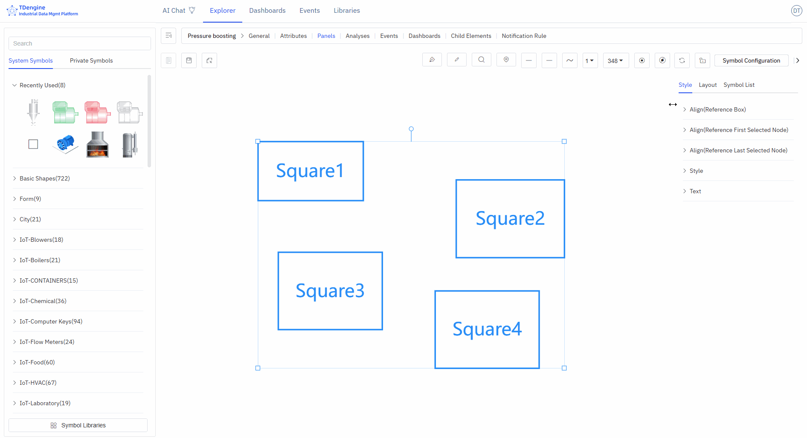

# 5.5 Canvas

## 5.5.1 Setting Canvas Properties

Canvas properties control the visual environment for the entire configuration diagram, including default styling, background, grid, and ruler settings.

1. **Default Color**: Pre-set the default color, so that elements dragged onto the canvas (basic shapes, text, icons) automatically unify to the default color.
2. **Background**: Background image, background color
3. **Grid**: Background grid, grid color, grid size, grid angle
4. **Ruler**: Enable ruler, ruler color

## 5.5.2 Setting Canvas Layout

When multiple elements are selected, you can set the canvas layout and perform alignment operations: align left, align right, align top, align bottom, vertical center, horizontal center, distribute evenly left-right, distribute evenly top-bottom, same size, format painter.

## 5.5.3 Viewing Element List

This lists all elements on the entire canvas. If you click on one, that element will be selected and centered on the canvas.

1. **Editable**: Can edit properties and events
2. **Locked**: Can execute events and interactions
3. **Disabled**: Cannot be selected, does not trigger any events, can be used as a background image.
