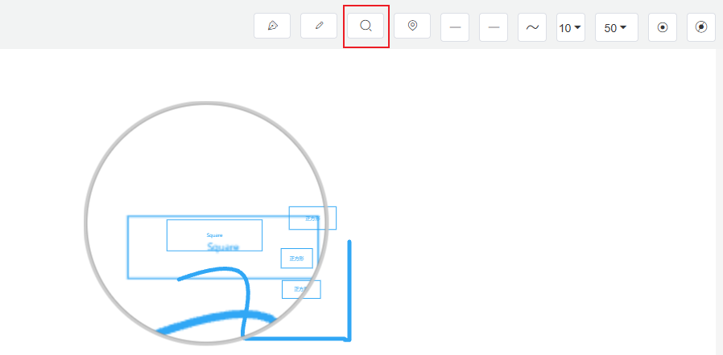

# 5.6 Toolbox

## 5.6.1 Pen

1. Start: Left click
2. Pause: Right click or enter
3. End: esc
4. Close/Unclose: enter

## 5.6.2 Pencil

1. Start: Continuous left drag
2. Pause: Release left button
3. End: esc
4. Close/Unclose: enter

## 5.6.3 Magnifier

Used to observe details in the image.

## 5.6.4 Overview Map (Thumbnail)

The global view of the configuration diagram. Clicking on the overview map allows you to quickly switch the center position on the canvas.

