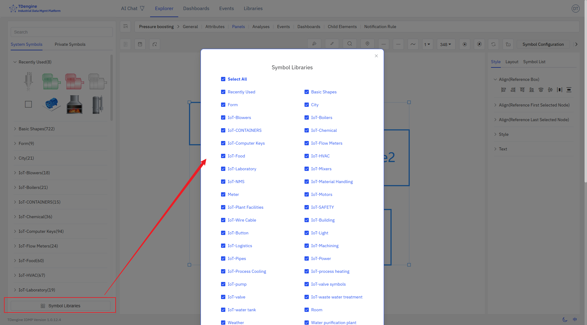

# 5.7 Symbol Library

The IDMP system already includes a basic symbol library and some industry-specific symbol libraries. If you have more requirements during use, you can create and upload your own symbols, or contact the IDMP team for design support.

## 5.7.1 System Symbol Library

IDMP's built-in symbol library meets the basic needs of most industries, offering symbols in three formats: native code (JS), Alibaba font (iconfont), and images (svg, gif). Additionally, the canvas supports video playback for MP4, WebM, and Ogg formats.

## 5.7.2 Private Symbol Library

IDMP symbol library is an extensible and open graphic library that can customize various cool component effects and scenes according to different needs. Supports creating symbol libraries, uploading symbols, etc.

## 5.7.3 Symbol Library Management

Symbol library management can configure whether to display the symbol library, and you can choose to display only the symbol libraries you need.

