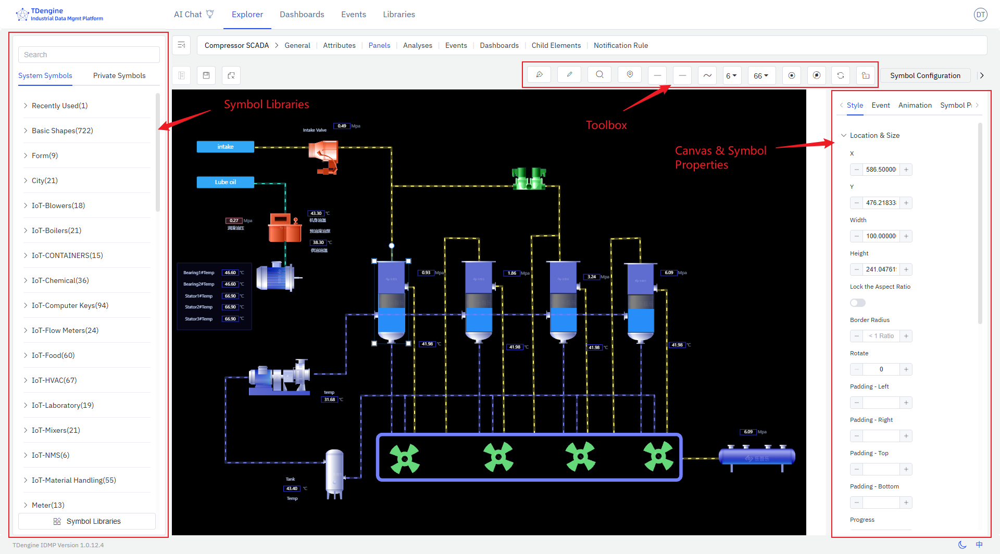

# 5 Canvas Panels

TDengine IDMP supports not only Grafana-style panels but also configuration panels popular in industrial scenarios. It allows business personnel to achieve Web configuration, SCADA, and other solutions through "drag and drop" with "zero code," visually presenting the current operating status of devices and processes. Currently, it supports 2D and 2.5D, with plans to support 3D in the future. It seamlessly integrates with IDMP's asset model, enabling rapid solution delivery and reducing development costs. It has the following features:

1. **Intuitive and easy-to-use drag-and-drop editing**: No technical background required, easily create monitoring screens like building blocks
2. **Intelligent data-driven**: Configure once to automatically update the screen with real-time data, reducing repetitive operations
3. **Rich animation effects**: Built-in multiple animations, support customization, making the monitoring screen vivid and intuitive
4. **Flexible state management**: Automatically switch device states such as running/stopped/alarm based on data changes
5. **Expandable graphic library**: Support uploading custom graphics (JS, SVG, images, etc.) to meet special needs
6. **Powerful performance**: A single screen can support tens of thousands of symbols, meeting the needs of large industrial scenarios

Below is a typical configuration editing interface:

The entire editing screen consists of several major parts:

1. **Canvas**: The canvas is the central drawing area where symbols are dragged and dropped for editing and drawing. The canvas has various properties, such as background color, grid, ruler, etc., all of which can be personalized.
2. **Symbols**: These are the basic units of the canvas, the fundamental elements of graphical expression. Various devices and components on the diagram are symbols. Symbols have various properties, such as color, background color, size, displayed text, progress, value, state, etc.
3. **Toolbox**: The top toolbox provides drawing tools such as pen, pencil, magnifier, eagle eye map (thumbnail), line start point, line end point, line width, view scale, auto anchor point, disable anchor point, etc.
4. **Symbol Library**: There are basic graphic libraries and industry graphic libraries, and users are allowed to upload their own drawn graphics.
5. **Configuration**: Configure the canvas and each symbol on the canvas, such as color, background color, font, events, animations, etc., to modify their display and interactive behavior.

This document only provides a brief introduction to the basic concepts and basic operations. More details need to be discovered through extensive use.

import DocCardList from '@theme/DocCardList';

<DocCardList />
