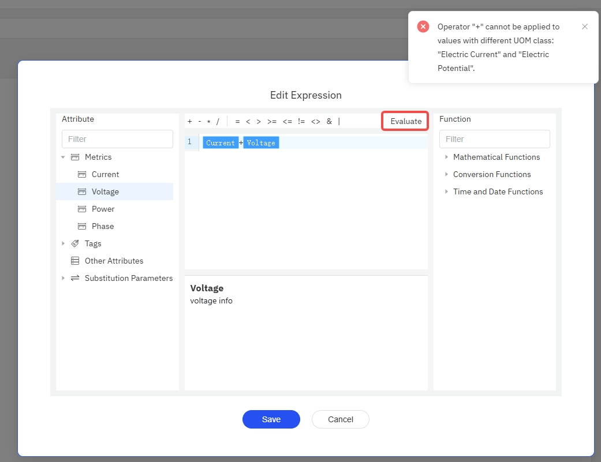
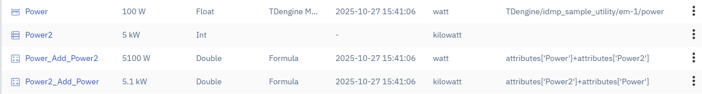
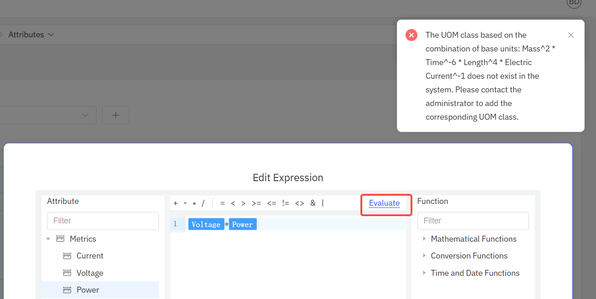
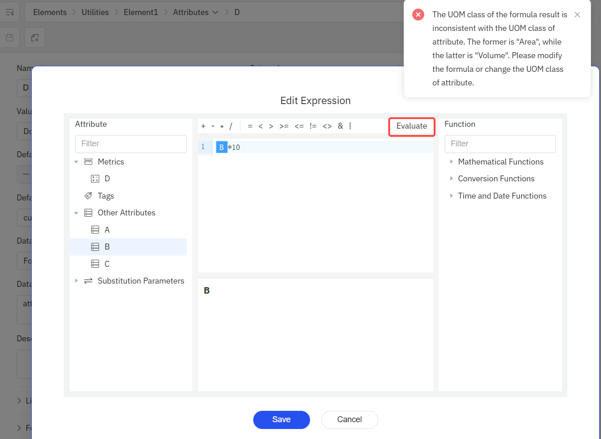

## Unit of Measurement Management

In IoT and industrial scenarios, each collected data point may use different units of measurement (UoM). Even if unit conversion is performed during data ingestion, due to variations in project implementation timelines and other factors, inconsistencies in units may still exist in the stored data. Therefore, to ensure accurate data analysis, unit conversion is essential.

Because modifying data already stored in the database is not advisable, TDengine IDMP allows you to configure a unit of measurement for each attribute of an element, as well as a display unit. Whether for expression-based calculations or simple display purposes, IDMP will automatically perform unit conversions based on the storage unit of the data.

TDengine IDMP comes with built-in units for mass, length, time, temperature, volume, force, electric current, electric potential, energy, storage, power, molar amount, and more. You can also extend the list as needed.

Unit of measurement management is available under **Libraries** in the main menu. The interface is intuitive and requires no further explanation.

## Units of Measurement in Formula References

The expressions in [formula references](../../basic/data-model/#formula) can be quite complex. When attributes with configured units of measurement are involved in expression calculations, various scenarios may arise. Below are the handling rules for different situations. To simplify the explanation, we use uppercase letters to represent the quantities involved in calculations, such as A and B, which may represent either an attribute or an intermediate calculation result.

### Addition and Subtraction Operations

For formulas in the form of A + B or A - B:
1. If A and B belong to different unit of measurement classes (UOM Class), an error will be reported.
2. If the two quantities belong to the same unit of measurement class but have different units (e.g., one is in watts (W) and the other is in kilowatts (kW)), the second quantity's unit will be converted to match the first quantity's unit.
3. If one quantity has a unit and the other does not, the quantity without a unit will automatically be converted to have the same unit as the other quantity before calculation. For example, you can add an electric current to a unitless constant.

#### Examples
For instance, attempting to add two attributes, electric current and electric potential, will result in an error: Operator "+" cannot be applied to values with different UOM class: "Electric Current" and "Electric Potential".

Another example: consider two attributes Power and Power2, with units W and kW respectively. The formula `Power + Power2` yields a result in W, while the formula `Power2 + Power` yields a result in kW.

:::tip
When editing a formula reference for an attribute, you can preview the expression value or detect errors in advance by clicking the "Evaluate" button in the upper right corner of the expression editor.
Clicking the "Evaluate" button has another benefit: the page remembers the unit of measurement of the expression evaluation result. If the attribute does not yet have a unit of measurement class and default unit configured, after closing the expression editor, the page will automatically set the unit from the last evaluation result as the attribute's default unit. This saves you the trouble of manually selecting the unit.
:::

### Multiplication and Division Operations

For formulas in the form of A/B or A*B:
1. Both A and B will be converted to the base unit of their respective unit of measurement class (UOM Class) before calculation.
2. The "unit of measurement class" of the result can be determined through the combination of these base units, and the "unit of measurement" of the result will be the default unit of the identified "unit of measurement class".
3. If the unit of measurement class of the multiplication or division result is not defined in the system, an error will be displayed when editing the formula.

#### Examples
For example, suppose attribute A has unit centimeters (cm), attribute B has unit square meters (m2), and attribute C has unit cubic meters (m3). These involve 3 unit of measurement classes: length, area, and volume. For the formula `A*B-C`, A will first be converted to a value in meters, then multiplied by B to get a result in cubic meters, and finally subtracted from C. As shown below:

Another example: multiplying electric potential by power results in a meaningless unit that doesn't exist in the system, which will trigger an error as shown below:

### Comparison and Bitwise Operations

Expressions support comparison operators: `=`, `<>`, `>`, `<`, `>=`, `<=`; and bitwise operations: `|` and `&`. The UOM handling rules for quantities on both sides of these operators are as follows:
1. If both sides have UOM but belong to different UOM Classes, an error will be reported.
2. If one side has UOM and the other does not, the UOM is ignored.
3. If both sides have UOM and belong to the same UOM Class, then:
    * If the UOMs are the same, the operation is performed directly.
    * If the UOMs are different, the right side's UOM is converted to match the left side's UOM before the operation.

### Functions

If a function is used in an expression, the UOM of the function's result will match the UOM of the function's first parameter. For example, the result of the formula `SIN(A)` will have the same UOM as A.

## Automatic Unit Conversion

As mentioned above, when quantities with units of measurement participate in formula calculations, unit conversions are performed automatically based on the context. In addition to this, there are two other scenarios where automatic unit conversion occurs:
1. When an attribute's default unit of measurement differs from its display unit of measurement, the attribute value is automatically displayed using the display unit.
2. When the unit of measurement of a formula result differs from the attribute's unit of measurement, the formula result is automatically converted to match the attribute's display unit of measurement.

If the unit of measurement of the formula result does not belong to the same unit of measurement class as the attribute's unit, automatic conversion is not possible. As shown below:

