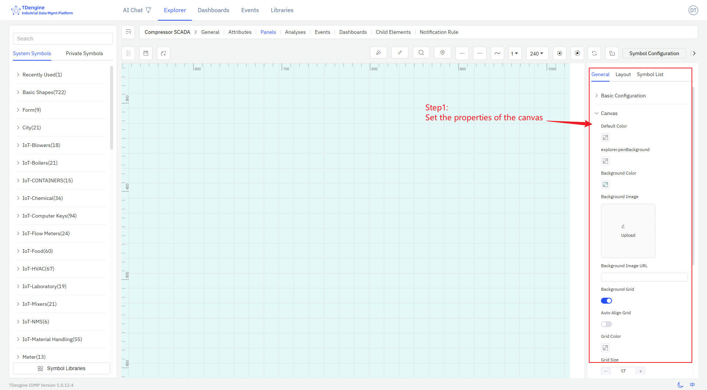
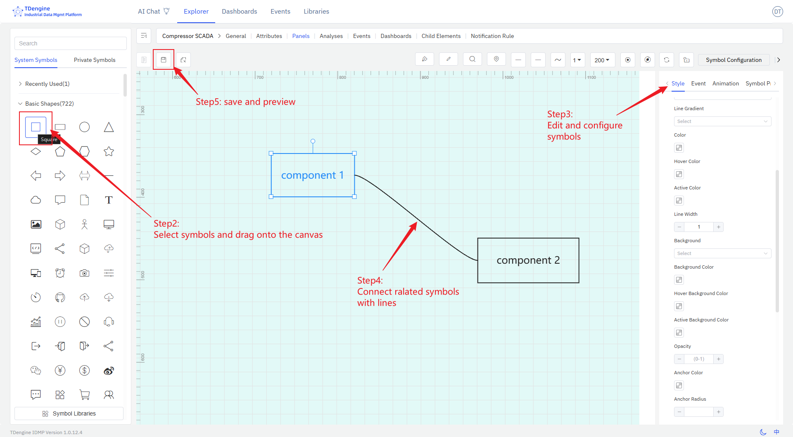

# Creating Canvas Panel

Select the element, then select the panel, click `New Panel`, and then select `Canvas` to enter the canvas editing interface.

Designing the canvas involves the following steps:

1. Set the properties of the canvas, including layout, color, background color, grid, etc.
   
2. Select symbols from the symbol library and drag them onto the canvas.
3. Edit and configure symbols, including:
   - Configure text, color, background color, etc. for symbols
   - Configure events for symbols, setting event types (such as click, symbol value change), event actions (such as setting symbol properties, playing animations), and trigger conditions (such as threshold judgments) to enable data-driven display effects of symbols
   - Add animation effects to symbols. The system has built-in animations such as up and down jumping, left and right jumping, heartbeat, rotation, etc., and you can customize animations.
   - Configure symbol properties, including value, progress, progress color, state, etc., and bind them to IDMP element properties so that collected data can drive the display of symbols in real time.

4. Connect related symbols with lines, and configure line types and line animations.
5. During the editing process, you can preview, and after editing, save it.

These steps do not need to be performed in a fixed order and can be rearranged.
