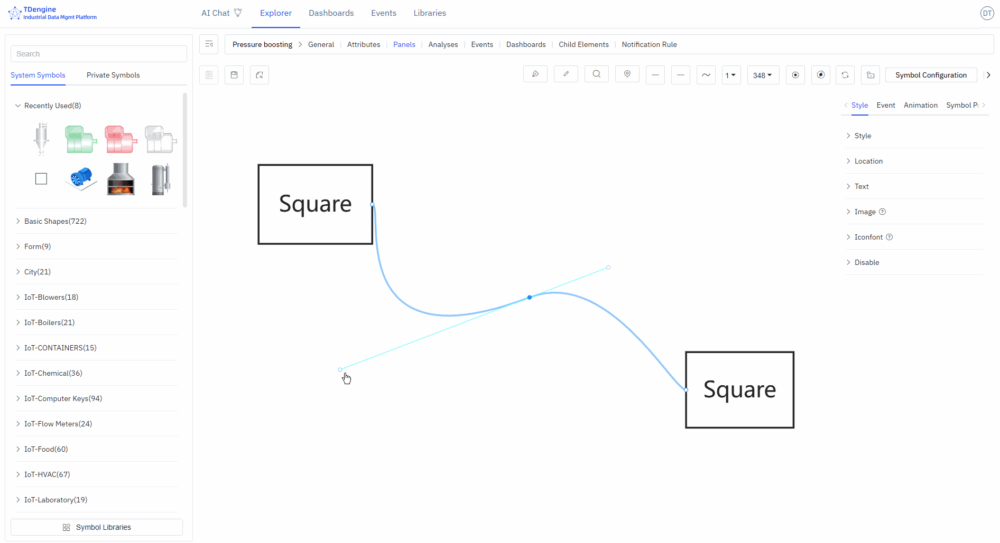

# Anchor Points

Anchor points are the "magic buckles" that keep device connections intact, ensuring that when you move device elements, the connected pipelines automatically adjust to maintain a tidy layout.

## Adding/Removing Anchor Points (A)

Anchor points can be added/removed on both symbols and lines.

Press the keyboard shortcut "A", hover the mouse over a symbol, and click the left mouse button to add an anchor point.

Press the keyboard shortcut "A", hover the mouse over an anchor point, and click the left mouse button to delete the anchor point.

## Moving Anchor Points (G)

Move the cursor over an anchor point, press the shortcut key G, and drag the mouse to move the anchor point.

## Handles

### Function of Handles

Handles allow precise adjustment of local shapes without damaging the shape of other sections of the curve, supporting fine-tuning of curve details.

1. **Control the curve bending direction**: The direction of the handle determines the entry and exit direction of the curve at the anchor point. The curve naturally transitions along the extended line of the handle, avoiding sharp corners.
2. **Adjust the curve arc and curvature**: Dragging the handle changes its length and angle, directly adjusting the degree of curve bending: the longer the handle, the gentler the curvature; the shorter the handle, the steeper the curvature.
3. **Achieve smooth transitions and sharp corner switching**: Symmetrical handles on both sides can create continuous, smooth curves; independently adjustable handles on one side can achieve a mix of polyline + curve at the same anchor point, meeting complex shape requirements.

### Adding Handles (H) / Deleting Handles (D)

Click on the anchor point on the line, press the shortcut key H to add a handle to adjust the line.

In the handle activation state, press the shortcut key D to delete the handle.

In the handle activation state, press the Shift key to switch between three different handle types:

1. Both ends of the handle are completely symmetrical
2. One end of the handle can freely stretch in length
3. One end of the handle can freely stretch in length and change angle

## Automatic Anchor Points

Click the "Automatic Anchor Points" button in the toolbox to activate automatic anchor points. When drawing lines on the canvas, if there are no anchor points at both ends of the line, the nearest anchor points will be automatically connected.

## Disabling Anchor Points

Disabling anchor points means that anchor points are not displayed.
