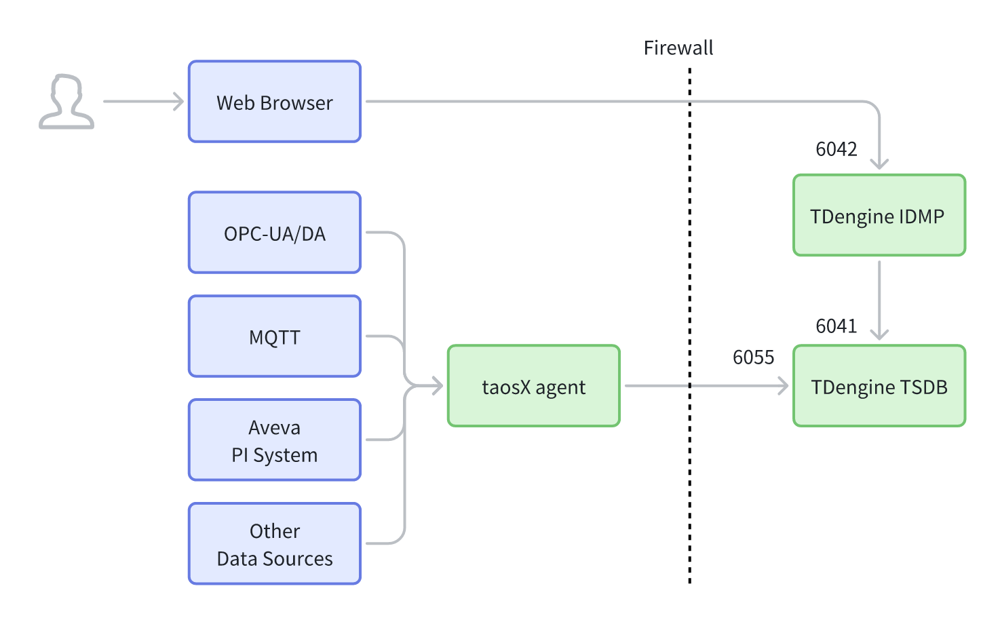
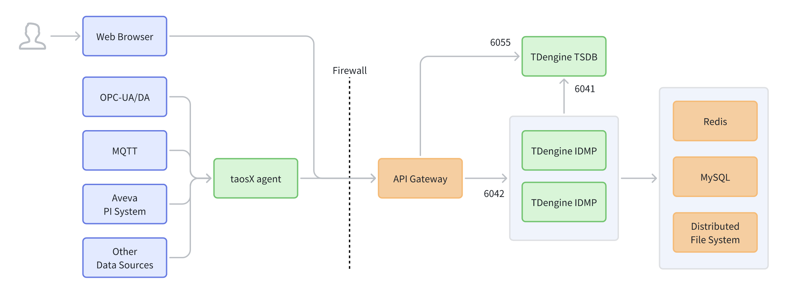
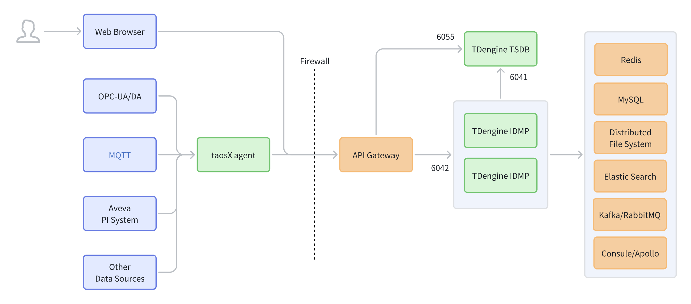

# Deployment Architecture

This article introduces three typical deployment forms of TDengine IDMP: **Single Instance Deployment**, **Simplified High Availability (HA) Deployment**, and **Complex High Availability (HA) Deployment**. It covers general descriptions, specific introductions, component descriptions, and deployment recommendations.

---

## 1. General Description

A TDengine IDMP deployment typically consists of the following parts:

- **Data Collection Side**: Connects to OPC-UA/DA, MQTT, Aveva PI, and other data sources, using **taosX agent** for unified data collection and forwarding.
- **Service Side**: **TDengine IDMP** (supports HA and multi-instance) provides business capabilities; **TDengine TSDB** carries time-series data writing and querying.
- **Access and Governance Layer (Optional)**: **API Gateway** serves as a unified external entry point, providing routing, authentication, and traffic governance.
- **External Infrastructure Dependencies (Scenario-based)**: Redis, MySQL, Distributed File System (DFS), and optional components like search engines, message queues, and configuration centers.
- **Network Boundary**: The dashed line **Firewall** in the diagram represents the isolation boundary; cross-boundary communication should minimize open ports and define clear access policies.

---

## 2. Specific Introduction

### 2.1 Single Instance Deployment

**Introduction:**  
The single instance deployment aims for "fast delivery and low complexity," typically used for PoC, demonstration verification, small-scale delivery, or closed network environments. TDengine IDMP provides Web/API services as a single instance. The collection side writes data to TDengine TSDB via taosX agent, and IDMP accesses TSDB through internal ports for data management and querying. This form has the fewest components, the shortest link, and the lowest deployment and maintenance costs, but it has a larger external exposure surface and a single point of failure risk. Production scenarios generally introduce gateways and multiple instances to enhance security and availability.

**Link Overview:**

- Web Browser → **TDengine IDMP (6042)**
- taosX agent → (Through Firewall) → **TDengine TSDB (6055)**
- **TDengine IDMP → TDengine TSDB (6041)**

**Features:**

- Fewer components and shorter links, suitable for PoC/small-scale/closed networks.
- Relatively larger external exposure (browser connects directly to IDMP); unified authentication/rate limiting/auditing need to be implemented separately on the service side or external facilities.
- When scaling to multi-instance or canary releases, an additional access layer (such as a gateway or load balancer) is usually required.

---

### 2.2 Simplified High Availability (HA) Deployment

**Introduction:**  
The simplified HA deployment aims for a "production-ready minimum closed loop." While maintaining low deployment complexity, it introduces an API Gateway as a unified entry and governance layer. Externally, only the gateway is exposed, and requests are routed to the backend IDMP, reducing direct exposure of IDMP and facilitating unified authentication, rate limiting, and auditing. It also includes common production dependencies like Redis, MySQL, and DFS. IDMP can be expanded to HA multi-instances as needed to improve availability and throughput, making it suitable for transitioning from PoC to production and reserving space for future capacity expansion.

**Link Overview:**

- Web Browser → **API Gateway** → **TDengine IDMP (6042)**
- taosX agent → (Through Firewall) → **TDengine TSDB (6055)**
- **TDengine IDMP ↔ TDengine TSDB (6041)**
- IDMP Dependencies (Simplified): **Redis / MySQL / Distributed File System**

**Features:**

- Unified external entry: External access only needs the gateway, reducing direct IDMP exposure.
- Retains the three most common types of basic dependencies, facilitating rapid implementation of a production minimum closed loop.
- Suitable for deployment paths that want to "standardize entry governance first, then gradually expand surrounding capabilities."

---

### 2.3 Complex High Availability (HA) Deployment

**Introduction:**  
The complex HA deployment is designed for medium-to-large production environments and enterprise-level integration needs. Building on the "gateway-unified access," TDengine IDMP is planned as HA multi-instances for higher throughput and availability. It introduces more complete surrounding capabilities (such as search, message queues, configuration centers, etc.) to support asynchronous decoupling, unified search analysis, dynamic configuration, and service governance. This form has higher deployment and maintenance complexity but is more robust in terms of stability, scalability, auditing, and observability, making it suitable for multi-system integration, continuous growth in concurrency and capacity, and scenarios with high requirements for reliability and governance.

**Link Overview:**

- Web Browser → **API Gateway** → **TDengine IDMP (Multi-instance)**
- taosX agent → (Through Firewall) → **TDengine TSDB (6055)**
- **TDengine IDMP → TDengine TSDB (6041)**
- IDMP External Dependencies (Full): **Redis, MySQL, Distributed File System, Elastic Logstash Search, Kafka/RabbitMQ, Consul/Apollo**, etc.

**Features:**

- Gateway handles unified access and governance; IDMP multi-instances improve throughput and HA.
- More complete surrounding dependencies to meet enterprise-level capabilities like search analysis, asynchronous decoupling, and dynamic configuration/service discovery.
- Applicable to medium-to-large production environments with high auditing and stability requirements and a need for multi-system integration.

---

## 3. Key Component Description

### 3.1 API Gateway

**Positioning:** The unified entry and governance layer between external access and internal services.

**Typical Responsibilities:**

- **Unified Entry**: Exposes a single address/port to reduce direct exposure of backend services.
- **Routing and Load Balancing**: Distributes requests to IDMP instances and TSDB instances (supports horizontal scaling).
- **Security Control**: TLS security certificates, unified authentication (Token/SSO), IP access control, etc.
- **Traffic Governance**: Rate limiting, circuit breaking, retries, timeouts, and canary releases.
- **Observability and Auditing**: Unified access logs, metrics, and tracing for easier troubleshooting and auditing.

---

### 3.2 External Dependency Components

- **Redis**: Cache and transient state (also used for distributed locks, counters, etc.). Replaced by internal cache and lockers in single-instance deployments.
- **MySQL**: Relational metadata (user permissions, configurations, task definitions, metadata relationships, etc.). Replaced by H2 database in single-instance deployments.
- **Distributed File System**: File/object persistence (metadata, uploaded graphics, import/export files, device documents, etc.). Uses the local file system directly in single-instance deployments.
- **Elastic Search**: Centralized indexing and search. Replaced by internal Lucene in single-instance and simple high-availability (HA) deployments.
- **Kafka/RabbitMQ**: Asynchronous messaging and event bus (decoupling, peak shaving, task orchestration, notifications). Replaced by internal message queues in single-instance mode.

---

## 4. Deployment Recommendations

1. **Use Single Instance for PoC/Demo, HA for Production**  
   Single instance deployment is suitable for rapid verification; production environments should prioritize "Simplified HA Deployment" and evolve to "Complex HA Deployment" as needed.

2. **Principle of Minimum Exposure**  
   External/cross-firewall access should preferably only open the gateway entry; internal ports (e.g., 6041) should only be accessible within the internal network.

3. **IDMP Horizontal Scaling**  
   Use multiple instances when high availability/high concurrency is required, and implement load balancing and session strategies at the gateway layer (choose based on the actual authentication method).

4. **Plan External Dependencies for Availability**  
   Redis/MySQL/DFS should be configured with backups and high availability; once MQ/Configuration Center/Search are enabled, they should be included in monitoring, alerting, and capacity planning.

5. **Unified Observability**  
   It is recommended to collect logs and metrics uniformly for the gateway, IDMP, TSDB, and key dependencies, and establish alerting and tracing
