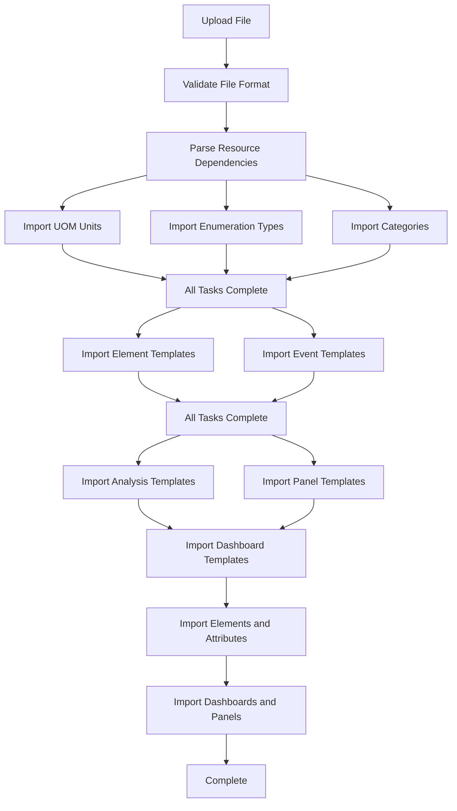

# Import/Export

## Overview

The import/export functionality is used to migrate and share TDengine IDMP data and dependent TDengine TSDB data between different environments or systems, ensuring data consistency and integrity. Currently, only full import and export are supported. Selective resource import/export is under development and will be released soon.

### Supported Resource Types

- Elements
- Panels
- Analyses
- Dashboards
- Notify Rules
- Element Templates
- Attribute Templates
- Panel Templates
- Analysis Templates
- Dashboard Templates
- Notify Rule Templates
- Event Templates
- Enumeration Sets
- Categories
- Unit of Measurement (UOM)

### Main Page

Click the "Admin Console" option in the dropdown menu under the avatar icon in the top-right corner of the page to enter the "Admin Console" page. Then click the "Import/Export" button to access the "Import/Export" main page.

## Export Feature

Click the export icon button on the "Import/Export" main page to open the export page.

### Operation Steps

1. **Select Elements**: Choose elements to export using the tree selector. Supports multiple selections, with all first-level elements selected by default.
2. **Select Other Resources** (In Development): Optional selection of element templates, event templates, enumeration sets, categories, and units of measurement.
3. **Confirm Export**: Click the "Confirm" button to automatically download a ZIP archive.

### Export File Structure

The exported ZIP file contains:

```
export_timestamp.zip
├── metadata.json         # Metadata file containing all resource definitions
└── taosgen.yaml          # TaosGen configuration file (data reference config, optional)
```

**metadata.json**Example:

```json
{
  "elementTemplates": [...],
  "panelTemplateMap": {...},
  "dashboardTemplateMap": {...},
  "eventTemplates": [...],
  "eventTemplateAttrs": {...},
  "enums": [...],
  "categories": [...],
  "uomClass": [...],
  "uomMap": {...},
  "elements": {...},
  "panels": {...},
  "dashboards": {...}
}
```

**taosgen.yaml** configuration file containing:

- **Connection Info**: TDengine database connection parameters
- **Database Config**: Target database settings
- **Table Structure**: Super table and sub-table configurations
- **Field Mapping**: Column definitions and data types

Learn more about [TaosGen Configuration](https://docs.tdengine.com/tdengine-reference/tools/taosgen/)

## Import Feature

Click the import icon button on the "Import/Export" main page to open the export page.

### Operation Steps

#### 1. Upload JSON File (Required)

Click the "Select JSON File" button and choose the exported JSON file. Supported format: `.json`.

#### 2. Upload TaosGen Configuration (Optional)

If data import is needed, provide a TaosGen configuration file. Supported formats: `.yaml`, `.yml`.

#### 3. Select Connection (Required)

Select the target TDengine connection from the dropdown list.

#### 4. Select Contact Point (Required)

Choose a notification contact point to receive notifications for analysis, alerts, and other tasks.

#### 5. Submit Import

Click "Confirm".

### Import Process and Dependency Handling

The system automatically processes resource dependencies in the following order:



## Task Management

### Task List

The task list displays all import records.

| Column       | Description                                                                                                |
| ------------ | ---------------------------------------------------------------------------------------------------------- |
| Created Time | Timestamp when the task was created                                                                        |
| Status       | Task execution status (Running, Success, Failed)                                                           |
| Name         | Task name (auto-generated)                                                                                 |
| Reason       | Error reason when failed                                                                                   |
| Actions      | Download result file (For uploaded tasks, click "Download" button to get a ZIP file with detailed results) |

---

## Future Plans

- Support selective export of more resource types (element templates, event templates, analysis templates, panels, etc.).
- Support conflict handling strategies (overwrite, skip, rename).
- Support new version of TaosGen with data replay functionality.
