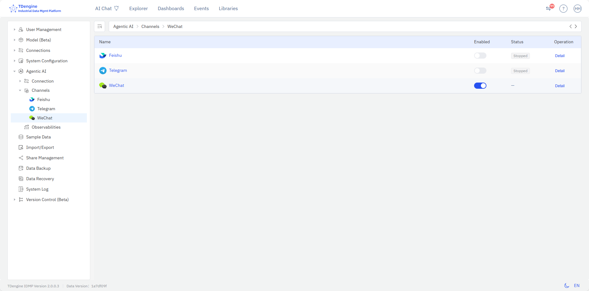
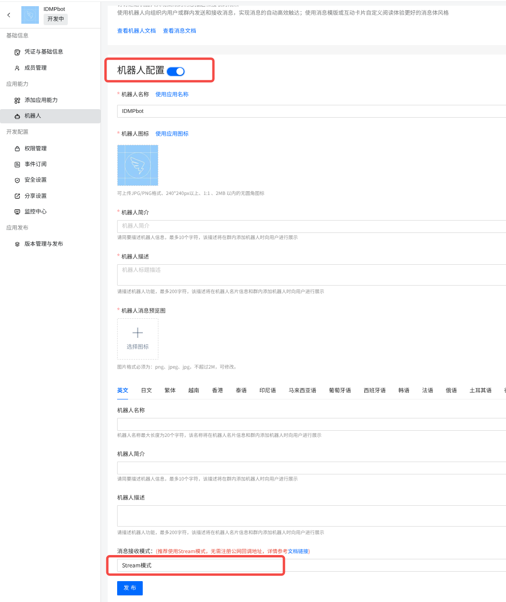
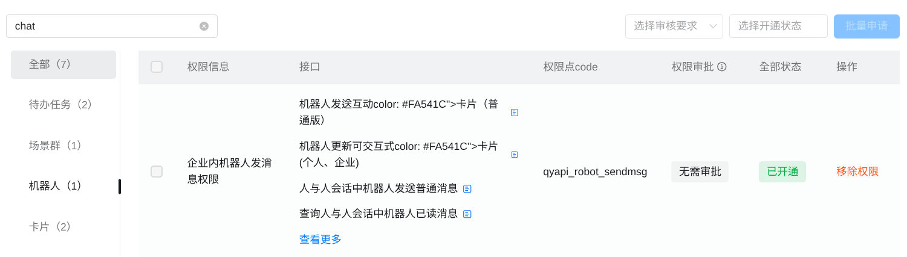
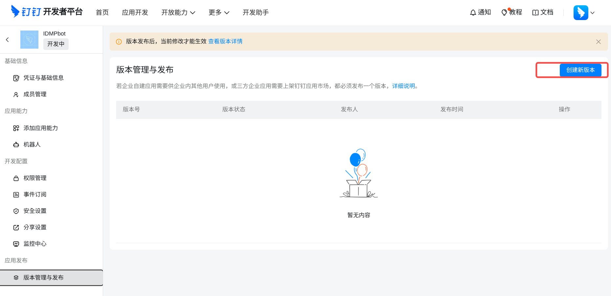
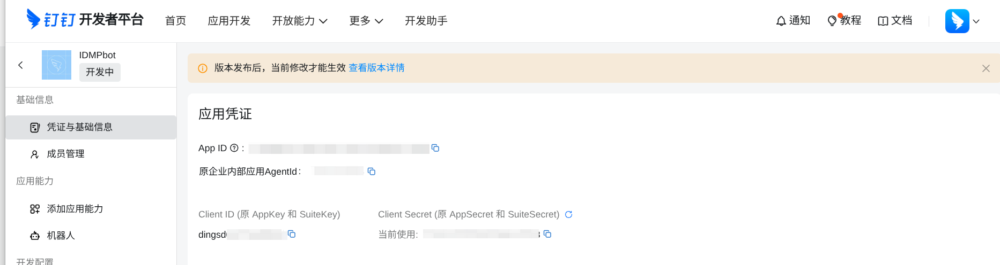

# 8.12 AI Agent IM Channels

AI Agent supports interaction through instant messaging tools. After configuring message channels, you can converse with AI Agent on Feishu (Lark), Telegram, or WeChat without always needing to open the IDMP Web interface. The system administrator configures the channels, then each user binds their IM account to their IDMP user account to establish a secure conversation channel.

## 8.12.1 Channel Overview

Message channels involve three layers:

1. **Admin configures channels**: Configure Bot credentials for each IM platform in the Admin Console.
2. **User binding**: Each user binds their IM account to their IDMP user account.
3. **Daily use**: Once bound, you can talk to AI Agent directly in IM.

IDMP currently supports four message channels:

| Channel | Bot Configuration | User Binding Method | Notes |
| --- | --- | --- | --- |
| **Feishu (Lark)** | App ID + App Secret | Scan QR code, send any message to get 6-digit binding code | Commonly used by enterprises; requires creating a Feishu app |
| **Telegram** | Bot Token (± Proxy) | Open Bot link, send command to get 6-digit binding code | Commonly used by individuals; requires creating a Bot via @BotFather |
| **WeChat** | System toggle, no Bot credentials needed | Scan QR code + phone confirmation | Bind personal WeChat; user scans code to complete automatically |
| **DingTalk** | Client ID + Client Secret + Bot Name | Search the bot in DingTalk, send a message to get 6-digit binding code | Commonly used by enterprises; requires creating a Stream-mode bot on the DingTalk Open Platform |

## 8.12.2 Configuring Message Channels (Admin)

Go to **Admin Console → AI Management → Channel Management** to manage message channel Bot configurations.



### Channel List

The channel list displays all four channels in a table, each showing the channel name, enable toggle, running status, and a "Details" action:

| Column | Description |
| --- | --- |
| **Name** | Channel icon + name (Feishu / Telegram / WeChat / DingTalk) |
| **Enabled** | Toggle switch. Feishu/Telegram/DingTalk cannot be enabled without saved Bot configuration; WeChat controls the system-level toggle directly |
| **Status** | Feishu/Telegram/DingTalk show Running / Stopped; WeChat does not display a status |
| **Actions** | "Details" button to enter the channel's detailed configuration page |

### Feishu Channel Configuration

Click the "Details" button on the Feishu row in the channel list to enter the Feishu channel configuration page.

**Initial setup:**

1. Visit the Feishu Open Platform ([https://open.feishu.cn/page/launcher](https://open.feishu.cn/page/launcher)) and create an enterprise self-built app.
2. Obtain **App ID** and **App Secret** from the app credentials.
3. Enter the App ID and App Secret in the IDMP Feishu configuration page, then click **Save**.
4. Enable the channel toggle after saving.
5. Click **Start** to start message listening.

**Modifying configuration:** Click the edit icon. Leave App Secret blank to keep the original value unchanged.

**Viewing bound users:** The lower half of the configuration page shows the list of bound users, including email, name, and binding time. Administrators can unbind users directly.

### Telegram Channel Configuration

Click the "Details" button on the Telegram row in the channel list to enter the Telegram channel configuration page.

**Initial setup:**

1. Search for @BotFather in Telegram, follow the instructions to create a new Bot and obtain the Bot Token.
2. Enter the Token in the IDMP Telegram configuration page.
3. Optional: If your network requires a proxy, fill in the **Proxy** field (e.g., `http://proxy.example.com:8080`).
4. Click **Save**.
5. Enable the channel toggle after saving.
6. Click **Start** to start message listening.

**Modifying configuration:** Click the edit icon. Leave Token blank to keep the original value unchanged. You can also delete the Telegram configuration at any time.

**Viewing bound users:** The lower half of the configuration page shows the list of bound users.

### DingTalk Channel Configuration

Click the "Details" button on the DingTalk row in the channel list to enter the DingTalk channel configuration page.

**Initial setup (create an app on the DingTalk Open Platform):**

1. Visit the DingTalk Open Platform ([https://open.dingtalk.com](https://open.dingtalk.com)), sign in, go to the Developer Console, click **Create App**, and select **Enterprise Internal App**.

   

2. In the app development page, go to **App Capabilities → Bot**, click **Add Bot**, and select **Stream Mode** as the message receiving mode.

   

3. Fill in the bot name and other details in the bot configuration. After saving, the app has Stream-mode bot capability.

   

4. In **Permissions Management**, apply for the following permissions:
   - **Interactive Card (qyapi_im_card)** — shows the "thinking…" card while processing messages;
   - **Message Send (qyapi_robot_sendmsg)** — required to reply to users and send proactive pushes.

   

   

5. In **Version Management & Release**, create a version and release the app so it takes effect within your organization.

   

6. In **Credentials & Basic Info**, obtain the **Client ID** (AppKey) and **Client Secret** (AppSecret).

   

**Configure in IDMP:**

1. Enter the **Client ID**, **Client Secret**, and **Bot Name** (matching the DingTalk console; used in the binding hint) on the IDMP DingTalk configuration page, then click **Save**.
2. Enable the channel toggle after saving.
3. Click **Start** to start message listening.

**Modifying configuration:** Click the edit icon. Leave Client Secret blank to keep the original value unchanged.

**Viewing bound users:** The lower half of the configuration page shows the list of bound users.

### WeChat Channel Configuration

The WeChat channel does not require Bot credentials. Click the "Details" button on the WeChat row in the channel list to enter the WeChat configuration page, which only displays the bound user list.

Use the **Enabled** toggle on the channel list page to control the global availability of this channel.

## 8.12.3 Users Binding IM Accounts

### Viewing Channel Status

In the **IM Binding** section of your personal settings page, the status cards for all four channels are always displayed, regardless of whether you have bound them:

```text
[Feishu icon]  Feishu    Status: Listening  |  ID: ou_xxxx  [Unbind]
[Telegram]     Telegram  Status: Listening stopped  |  [Start Listening]
[WeChat icon]  WeChat    Status: Not bound  |  [Bind User]
[DingTalk icon] DingTalk Status: Listening  |  [Bind User]
```

Status descriptions:

| Status | Description |
| --- | --- |
| **Not Enabled** | The administrator has not configured this channel |
| **Listening Stopped** | The channel is configured but Bot listening has not started |
| **Listening** | The channel is configured and listening is running normally |
| **Not Bound** | Your IM account is not bound to IDMP |
| **Bound** | Your IM account is bound and can receive AI Agent messages |

### Binding Feishu

1. Make sure the administrator has configured the Feishu channel and listening is running.
2. In the IM Binding section, when the Feishu row shows "Listening," click **Bind User**.
3. A Feishu QR code pops up. Scan it with the Feishu client.
4. After scanning, open the Bot conversation and send any message to get a 6-digit binding code.
5. Enter the 6-digit binding code in the dialog and click **Bind**.
6. After successful binding, the page refreshes automatically and the status changes to "Bound."

### Binding Telegram

1. Make sure the administrator has configured the Telegram channel and listening is running.
2. In the IM Binding section, when the Telegram row shows "Listening," click **Bind User**.
3. A new window opens with the Telegram Bot link.
4. Send a message to the Telegram Bot to get a 6-digit binding code.
5. Return to the IDMP dialog, enter the 6-digit code, and click **Bind**.

### Binding WeChat

1. Make sure the administrator has enabled "Personal WeChat Binding" in system settings.
2. In the IM Binding section, click **Bind User** on the WeChat row.
3. A QR code appears. Scan it with WeChat.
4. Confirm login on your phone.
5. The system automatically polls the QR code status and completes binding upon confirmation.
6. After successful binding, the popup closes automatically and the status updates to "Bound."
7. In WeChat on your phone, tap the newly added WeChat Clawbot to customize settings such as nickname, pin to top, or change profile picture.


### Binding DingTalk

1. Make sure the administrator has configured the DingTalk channel and listening is running.
2. In the IM Binding section, when the DingTalk row shows "Listening," click **Bind User**.
3. The dialog tells you to search for the **bot name** configured by the administrator (e.g., `IDMPbot`) in DingTalk, or add the bot to a group chat to start chatting.
4. Send any message to the bot in DingTalk. The bot replies with a 6-digit binding code.
5. Return to the IDMP dialog, enter the 6-digit code, and click **Bind**.
6. After successful binding, the status updates to "Bound."

### Unbinding

For a bound channel, click the **Unbind** button. Click **Confirm** in the confirmation dialog, and the system unbinds your IM account from your IDMP account.

## 8.12.4 Data and Security

- **Binding information** is stored in the `channel_user_binding` table, including the IM platform's user open ID, binding time, and binding code.
- **Binding codes** are 6-digit temporary codes with a 5-minute validity period. Expired codes require re-requesting.
- **AI Agent cache**: When unbinding, the system automatically clears the cached API Key to prevent old credentials from being reused.
- Bot configuration Secrets and Tokens are masked (`********`) when viewed in the Admin Console. Leaving them blank during editing preserves the original values.

## 8.12.5 Frequently Asked Questions

**Q: Can't receive messages after creating a Feishu Bot?**

A: After publishing a Feishu app, it takes a few minutes to take effect. Make sure event subscriptions and permissions are correctly configured on the Feishu Open Platform, and that the Bot is enabled. Then check that the **App ID** and **App Secret** are correct on the IDMP Feishu configuration page, and click **Start** to start listening.

**Q: How do I create a Telegram Bot?**

A: Search for @BotFather in Telegram, send the `/newbot` command, and follow the instructions to set the Bot name and username. After successful creation, @BotFather will return a Bot Token. Enter it in the IDMP Telegram channel configuration page.

**Q: What if my binding code expires?**

A: Binding codes are valid for 5 minutes. After expiry, send a message to the Bot again to get a new 6-digit code, then enter the new code in the dialog.

**Q: The DingTalk bot cannot reply or send proactive messages?**

A: On the DingTalk Open Platform, make sure the app has applied for and released the following permissions: **Interactive Card (qyapi_im_card)** and **Message Send (qyapi_robot_sendmsg)**. Permission changes take effect only after publishing a new version. Also confirm the Client ID and Client Secret on the IDMP DingTalk configuration page are correct.

**Q: The bot name shown in the DingTalk binding hint is wrong?**

A: The binding hint uses the **bot name** filled in by the administrator on the IDMP DingTalk configuration page. Make sure it matches the bot name in the DingTalk console (e.g., `IDMPbot`) so users can find the bot in DingTalk.

**Q: Can AI Agent still contact me via IM after unbinding?**

A: No. After unbinding, AI Agent will no longer send messages to your IM account. To restore, simply re-bind.
