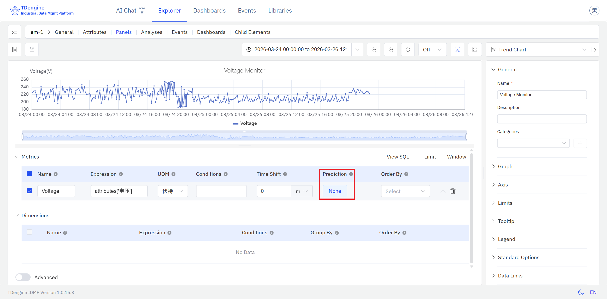
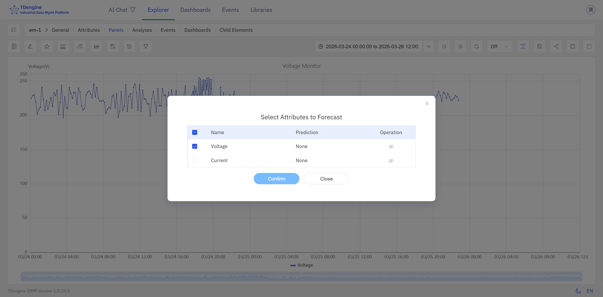

# 9.1 Time-Series Forecasting

Time-series forecasting is one of the most widely applied capabilities in industrial data analysis. Powered by **TDgpt**, IDMP enables AI-driven forecasting that helps users produce quantitative estimates of future trends from historical data — shifting operations from reactive to proactive.

## How It Works

The fundamental idea behind time-series forecasting is simple: **learn from the past, project into the future**.

A forecasting algorithm analyzes a window of historical data to extract the underlying patterns in a signal — its trend direction, cyclic behavior, seasonal rhythms, and noise characteristics. It then assumes those patterns will continue to hold over a future horizon, and uses them to generate a sequence of predicted values.

This is more than simple linear extrapolation. Modern forecasting algorithms can capture complex nonlinear dynamics: the daily peaks and troughs in electricity consumption, the gradual degradation of equipment performance over time, or the seasonal swings in production load. Forecast accuracy depends on data quality, the length and completeness of the historical record, and how well the chosen algorithm fits the signal's underlying behavior.

## Supported Algorithms

TDgpt ships with a broad selection of forecasting algorithms spanning statistical models, machine learning, and deep learning:

| Algorithm | Category | Characteristics |
|---|---|---|
| **HoltWinters** | Statistical | Exponential smoothing with trend and seasonal decomposition; excels on signals with regular periodic patterns; low computational overhead (default) |
| **ARIMA** | Statistical | Classic differenced autoregressive moving-average model; well-suited to stationary series with trend and seasonal components; highly interpretable |
| **CES** | Statistical | Complex Exponential Smoothing; handles signals with intricate seasonal structures |
| **ETS** | Statistical | Error-Trend-Seasonality model; automatically selects the best combination of trend and seasonal components |
| **Theta** | Statistical | Theta decomposition method; delivers robust short-term forecasts |
| **MSTL** | Statistical | Multiple Seasonal-Trend decomposition using LOESS; designed for signals with more than one overlapping seasonality |
| **Prophet** | Statistical | Additive model open-sourced by Meta; robust to holiday effects and missing data |
| **XGBoost** | Machine Learning | Gradient-boosted trees; well-suited to multi-variate forecasting after feature engineering |
| **LightGBM** | Machine Learning | Lightweight gradient-boosting framework; fast training, handles large datasets efficiently |
| **LSTM** | Deep Learning | Long Short-Term Memory network; captures complex nonlinear temporal dependencies; good for signals with intricate dynamics |
| **MLP** | Deep Learning | Multi-Layer Perceptron; simple architecture, trains quickly, useful as a baseline |
| **DeepAR** | Deep Learning | Autoregressive RNN-based probabilistic forecasting; outputs a distribution rather than a point estimate |
| **N-BEATS** | Deep Learning | Pure neural architecture requiring no feature engineering; strong benchmark performance across multiple datasets |
| **N-HiTS** | Deep Learning | An improvement on N-BEATS using multi-scale sampling to enhance long-horizon accuracy |
| **PatchTST** | Deep Learning | Transformer-based patch model for time series; excels at capturing long-range dependencies |
| **Temporal Fusion Transformer** | Deep Learning | Combines attention mechanisms with gating networks; supports multi-variate input and covariates |
| **TimesNet** | Deep Learning | Reshapes time-series data into 2D feature maps for convolutional learning; handles multi-period complex signals |
| **TDtsfm** | Foundation Model | TDengine's time-series foundation model, pre-trained on diverse industrial data; supports zero-shot forecasting and covariate input; ideal for limited-data scenarios |

### Choosing an Algorithm

- For signals with clear periodicity (daily, weekly cycles) and stable historical patterns, start with **HoltWinters** or **ARIMA**
- For series affected by holidays, planned shutdowns, or other calendar events, use **Prophet**
- For signals with complex nonlinear dynamics, try **LSTM**, **N-BEATS**, or **PatchTST**
- When historical data is limited or you need to deploy quickly, use **TDtsfm** — it requires no training and works out of the box
- When related variables are available to improve accuracy, choose an algorithm that supports covariates (see next section)

## Univariate vs. Covariate Forecasting

TDgpt supports two forecasting modes:

**Univariate forecasting:** The default mode. Only the target attribute's own historical values are used — suitable for most scenarios.

**Covariate forecasting:** Additional related time-series data can be supplied as auxiliary input to improve accuracy. Two types of covariates are supported:

- **Historical covariates:** Data from the same time window as the target, such as ambient temperature used to improve equipment energy consumption forecasts.
- **Future covariates:** Known future values, such as a scheduled production plan or weather forecast, used to improve predictions of future load or consumption.

:::note
Covariate forecasting requires the **TDtsfm** foundation model to be deployed. Only historical and future covariates are currently supported — static covariates are not. Each forecast call accepts up to 10 columns of historical covariate data.
:::

## How to Use

IDMP offers two ways to enable time-series forecasting, both accessible from Trend Chart and Event Trend Chart panels.

### Enable Forecasting via Attribute Configuration

Configuring forecasting at the attribute level causes forecast values to be computed continuously and displayed automatically in every Trend Chart panel that includes that attribute.

Steps:

1. In the element's **Attributes** tab, click an attribute name to open its detail page.
2. Click **Edit**.
3. Expand the **Forecast Configuration** section.

4. Set **Forecast Provider** to **TDgpt**.
5. Configure the forecast parameters:

| Field | Description |
|---|---|
| **Algorithm** | Select a forecasting algorithm (see the table above) |
| **Forecast rows** | Number of future data points to predict |

6. Click **Save**.

Once saved, open any Trend Chart panel containing this attribute. The forecast values appear as a distinct projected line extending beyond the last historical data point.

### Toggle Forecasting from the Panel Toolbar

The Trend Chart and Event Trend Chart panels include a **Show Forecast** icon in their toolbars, letting you toggle the forecast overlay on or off without modifying the underlying attribute configuration.

- **In view mode:** Click the forecast icon to overlay or hide the predicted values on the current chart — handy for quickly comparing actuals against forecasts while browsing historical data.
- **In edit mode:** Click **Show Forecast** to preview the forecast in real time within the panel editor, helping you evaluate the result before saving any configuration changes.

If no forecast has been configured for the attributes in the panel, clicking **Show Forecast** opens a configuration dialog where you can select an algorithm and set forecast parameters inline, without navigating to the attribute page.

## Application Scenarios

Time-series forecasting has broad practical value across industrial domains:

**Energy and Power**

- Forecast electricity consumption over the next 24 hours or longer to support grid dispatch and load balancing
- Forecast solar or wind generation output to plan ahead for storage dispatch or backup capacity

**Equipment Health Metrics**

- Predict trends in temperature, vibration, or pressure to anticipate when a threshold breach might occur
- Forecast equipment energy consumption or efficiency trends to support energy optimization and performance benchmarking

**Production and Supply Chain**

- Forecast tank levels or warehouse inventory to plan replenishment or transfers in advance
- Forecast production line throughput and output to support scheduling

**Environment and Utilities**

- Forecast influent flow at a wastewater treatment plant to adjust treatment capacity ahead of time
- Forecast temperature and humidity changes inside a facility to pre-condition HVAC or dehumidification equipment

**Process Industry**

- Predict key parameter trends in chemical reaction processes
- Forecast operating parameters for boilers, compressors, and similar equipment

### Example: Forecasting Daily Influent Flow at a Wastewater Treatment Plant

**Background**

A municipal wastewater treatment plant processes around 150,000 tonnes per day. Influent volume follows a consistent weekly rhythm, with clear differences between workdays and holidays. Under-capacity risks regulatory violations from untreated discharge; over-dosing chemicals wastes money. The operations team wants a 24-hour rolling forecast available each morning so they can plan blower schedules and chemical dosing in advance.

**Steps**

1. In the treatment plant element's attribute list, open the `Daily Influent Flow` attribute and click **Edit**.
2. Under **Forecast Configuration**, set **Forecast Provider** to **TDgpt**, choose **Prophet** as the algorithm — influent volume follows both daily and weekly cycles and is significantly affected by public holidays, making Prophet a natural fit — and set **Forecast rows** to `24` to cover the next 24 hours.
3. After saving, the forecast curve appears in the Trend Chart panel on the plant's monitoring dashboard, ready for the shift handover briefing each morning.

**Outcome**

On the eve of a national holiday week, the forecast showed a 22% drop in influent on the first day of the holiday, followed by a clear rebound spike on the first working day after the break. The operations team used this information to delay the start-up of two standby blowers and to pre-warm them before the post-holiday rush.

Actual influent tracked within 5% of the forecast. Capacity transitions went smoothly, chemical consumption fell roughly 8% compared to the same period last year, and no compliance issues were recorded.
