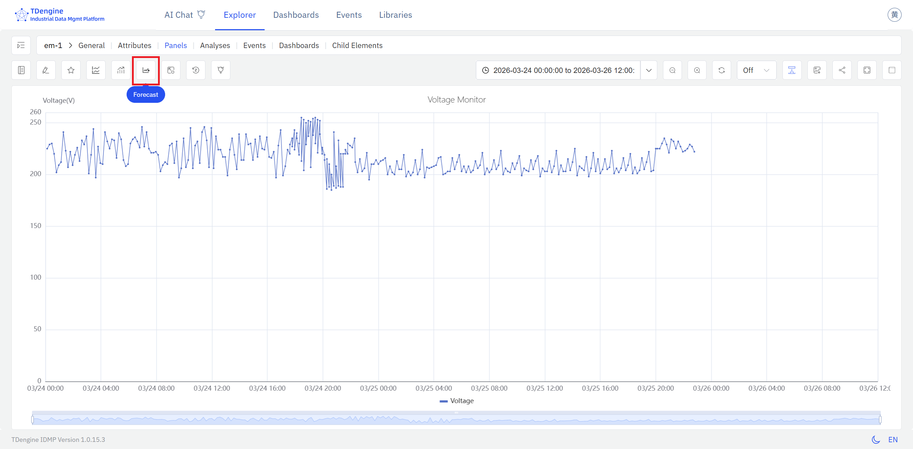
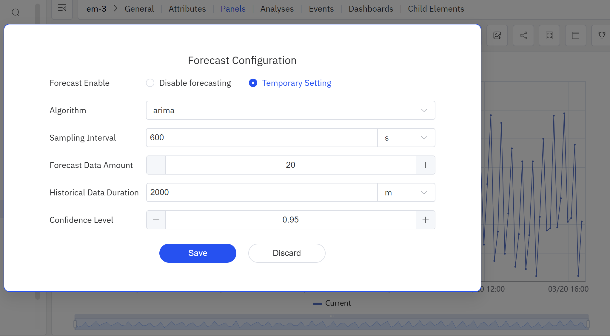

# 9.1 Time-Series Forecasting

Time-series forecasting is one of the most widely used capabilities in industrial data analysis. Powered by **TDgpt**, IDMP provides AI-driven forecasting that helps users estimate future trends from historical data and shift operations from reactive response to proactive planning.

## How It Works

The fundamental idea behind time-series forecasting is simple: **learn from the past, project into the future**.

A forecasting algorithm analyzes a window of historical data to extract the underlying patterns in a signal — its trend direction, cyclic behavior, seasonal rhythms, and noise characteristics. It then assumes those patterns will continue to hold over a future horizon, and uses them to generate a sequence of predicted values.

This is more than simple linear extrapolation. Modern forecasting algorithms can capture complex nonlinear dynamics: the daily peaks and troughs in electricity consumption, the gradual degradation of equipment performance over time, or the seasonal swings in production load. Forecast accuracy depends on data quality, the length and completeness of the historical record, and how well the chosen algorithm fits the signal's underlying behavior.

## Application Scenarios

Time-series forecasting has broad practical value across industrial domains:

**Energy and Power**

- Forecast electricity consumption over the next 24 hours or longer to support grid dispatch and load balancing
- Forecast solar or wind generation output to plan ahead for storage dispatch or backup capacity

**Equipment Health Metrics**

- Predict trends in temperature, vibration, or pressure to anticipate when a threshold breach might occur
- Forecast equipment energy consumption or efficiency trends to support energy optimization and performance benchmarking

**Production and Supply Chain**

- Forecast tank levels or warehouse inventory to plan replenishment or transfers in advance
- Forecast production line throughput and output to support scheduling

**Environment and Utilities**

- Forecast influent flow at a wastewater treatment plant to adjust treatment capacity ahead of time
- Forecast temperature and humidity changes inside a facility to pre-condition HVAC or dehumidification equipment

**Process Industry**

- Predict key parameter trends in chemical reaction processes
- Forecast operating parameters for boilers, compressors, and similar equipment

## Supported Algorithms

TDgpt ships with a broad selection of forecasting algorithms spanning statistical models, machine learning, deep learning, and foundation models:

| Algorithm | Category | Characteristics |
|---|---|---|
| **HoltWinters** | Statistical | Exponential smoothing with trend and seasonal decomposition; excels on signals with regular periodic patterns; low computational overhead (default) |
| **ARIMA** | Statistical | Classic differenced autoregressive moving-average model; well-suited to stationary series with trend and seasonal components; highly interpretable |
| **CES** | Statistical | Complex Exponential Smoothing; handles signals with intricate seasonal structures |
| **ETS** | Statistical | Error-Trend-Seasonality model; automatically selects the best combination of trend and seasonal components |
| **Prophet** | Statistical | Additive model open-sourced by Meta; robust to holiday effects and missing data |
| **XGBoost** | Machine Learning | Gradient-boosted trees; well-suited to multi-variate forecasting after feature engineering |
| **LSTM** | Deep Learning | Long Short-Term Memory network; captures complex nonlinear temporal dependencies; good for signals with intricate dynamics |
| **N-BEATS** | Deep Learning | Pure neural architecture requiring no feature engineering; strong benchmark performance across multiple datasets |
| **PatchTST** | Deep Learning | Transformer-based patch model for time series; excels at capturing long-range dependencies |
| **TDtsfm** | Foundation Model | TDengine's time-series foundation model, pre-trained on diverse industrial data; supports zero-shot forecasting and covariate input; ideal for limited-data scenarios |

### Choosing an Algorithm

- For signals with clear periodicity (daily, weekly cycles) and stable historical patterns, start with **HoltWinters** or **ARIMA**
- For series affected by holidays, planned shutdowns, or other calendar events, use **Prophet**
- For signals with complex nonlinear dynamics, try **LSTM**, **N-BEATS**, or **PatchTST**
- When historical data is limited or you need to deploy quickly, use **TDtsfm** — it requires no training and works out of the box
- When related variables are available to improve accuracy, choose an algorithm that supports covariates (see next section)

## Univariate vs. Covariate Forecasting

TDgpt supports two forecasting modes:

**Univariate forecasting:** The default mode. Only the target attribute's own historical values are used — suitable for most scenarios.

**Covariate forecasting:** Additional related time-series data can be supplied as auxiliary input to improve accuracy. Two types of covariates are supported:

- **Historical covariates:** Data from the same time window as the target, such as ambient temperature used to improve equipment energy consumption forecasts.
- **Future covariates:** Known future values, such as a scheduled production plan or weather forecast, used to improve predictions of future load or consumption.

:::note
Covariate forecasting requires the **TDtsfm** foundation model to be deployed. Only historical and future covariates are currently supported — static covariates are not. Each forecast call accepts up to 10 columns of historical covariate data.
:::

## How to Use

Time-series forecasting is triggered from the **Forecast** icon in the toolbar of either a Trend Chart or an Analysis Chart in view mode.

Click the **Forecast** icon to overlay or hide a forecast on the current chart, making it easy to compare measured values with projected values while reviewing historical data.

If no forecast settings have been saved yet, IDMP opens the forecast configuration dialog. There, users can choose the target attribute, select an algorithm, and configure the model hyperparameters.

After the configuration is saved, IDMP runs the forecast automatically and overlays the result on the chart as a colored curve.

## Example

**Background**

A municipal wastewater treatment plant processes around 150,000 tonnes per day. Influent volume follows a consistent weekly rhythm, with clear differences between workdays and holidays. Under-capacity risks regulatory violations from untreated discharge; over-dosing chemicals wastes money. The operations team wants a 24-hour rolling forecast available each morning so they can plan blower schedules and chemical dosing in advance.

**Steps**

1. Open a Trend Chart panel containing the `Daily Influent Flow` attribute and click the **Forecast** icon in the toolbar.
2. In the forecast configuration dialog, choose **Prophet** as the algorithm — influent volume follows both daily and weekly cycles and is significantly affected by public holidays, making Prophet a natural fit — and set **Forecast rows** to `24` to cover the next 24 hours.
3. The forecast curve is immediately overlaid on the chart, ready for the shift handover briefing each morning.

**Outcome**

On the eve of a national holiday week, the forecast showed a 22% drop in influent on the first day of the holiday, followed by a clear rebound spike on the first working day after the break. The operations team used this information to delay the start-up of two standby blowers and to pre-warm them before the post-holiday rush.

Actual influent tracked within 5% of the forecast. Capacity transitions went smoothly, chemical consumption fell roughly 8% compared to the same period last year, and no compliance issues were recorded.
