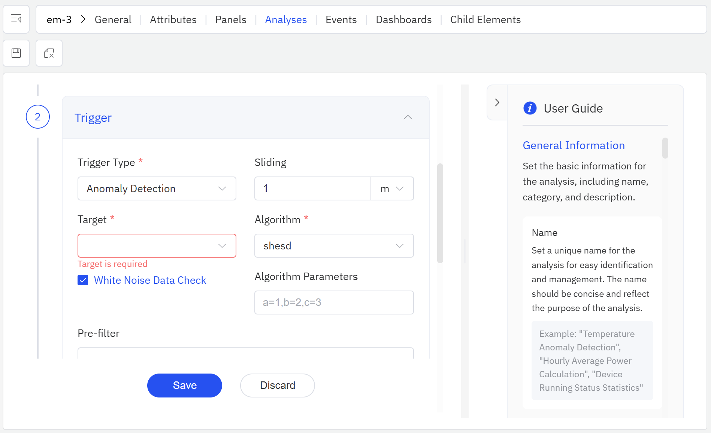

# 9.2 Anomaly Detection

Anomaly detection is one of the core analytical capabilities in industrial data monitoring. Powered by **TDgpt**, IDMP automatically identifies data segments that deviate from normal behavior — enabling early warning and rapid localization of abnormal events before they escalate into failures or quality issues.

## How It Works

Anomaly detection is fundamentally an **unsupervised learning** task. Unlike supervised classification, it requires no labeled examples. Instead, the algorithm models the overall distribution of the signal and flags anything that looks meaningfully different from the rest.

In time-series data, anomalies typically take one of three forms:

- **Point anomaly:** A single value spikes or drops far outside the normal range — for example, a sudden surge in motor current
- **Contextual anomaly:** A value that looks normal in isolation but is anomalous given its timing or context — for example, a production line starting up in the middle of the night
- **Collective anomaly:** No single data point is unusual, but a sequence of values together forms an abnormal pattern — for example, a sustained low-frequency drift in vibration amplitude

TDgpt's detection engine exposes its results through the `ANOMALY_WINDOW()` SQL function, which returns the time windows identified as anomalous. These windows can feed directly into alert triggers, event records, or downstream analysis.

The current version analyzes each attribute independently — building a model for a single time series and identifying anomalies within it. This already covers the majority of real-world industrial monitoring scenarios.

Upcoming releases will extend detection across multiple signals simultaneously. **Multi-metric anomaly localization** will automatically surface the small number of outlying series from a large group of similar signals — for example, pinpointing which turbines among a fleet of 100 are behaving abnormally. **Multivariate anomaly detection** will model the joint distribution of multiple attributes for a single asset, catching compound faults that no single variable would reveal on its own — such as a case where temperature looks normal, but vibration and current are both shifting in a coordinated way.

## Application Scenarios

Anomaly detection delivers practical value across a wide range of industrial settings:

**Energy and Power**

- Detect sudden shifts or gradual drift in transformer current and voltage signals — early indicators of insulation aging or short-circuit risk
- Identify abnormal generation output from solar or wind assets to pinpoint component failures or shading events

**Equipment Condition Monitoring**

- Detect vibration and temperature anomalies in rotating equipment — motors, pumps, compressors — to catch bearing wear or imbalance early
- Identify unusual pressure patterns in hydraulic systems that may indicate valve or piping leaks

**Manufacturing**

- Monitor line speed, cycle time, and yield for unexpected fluctuations that signal process deviations
- Detect anomalies in injection molding, stamping, or other process parameters to support quality control and root-cause analysis

**Process Industry**

- Flag abnormal combinations of temperature, pressure, and flow in chemical processes before they develop into safety or quality incidents
- Detect declining boiler combustion efficiency to support energy diagnosis

**Environment and Utilities**

- Catch sudden changes in wastewater influent quality that may indicate illegal industrial discharge
- Identify anomalous energy consumption spikes in building systems to locate malfunctioning HVAC or lighting equipment

**IT Infrastructure**

- Monitor CPU, memory, and network traffic for anomalies to support operational alerts and capacity management
- Detect irregular data reporting frequencies from industrial gateways or edge nodes as early signs of communication failures

## Supported Algorithms

TDgpt provides several anomaly detection algorithms across statistical, density-based, machine learning, deep learning, and foundation model categories:

| Algorithm | Category | Characteristics |
|---|---|---|
| **IQR** | Statistical | Classic box-plot method based on the interquartile range; flags values outside Q1 − 1.5 × IQR to Q3 + 1.5 × IQR; zero configuration, extremely fast (default) |
| **LOF** | Density-based | Local Outlier Factor; scores each point by comparing its local density to that of its neighbors; handles datasets with varying density regions |
| **Isolation Forest** | Machine Learning | Isolates anomalies by recursively partitioning the data at random; robust to high-dimensional data and uneven density distributions |
| **LSTM-AD** | Deep Learning | LSTM-based sequence anomaly detection; learns complex temporal dependencies and flags deviations from the learned pattern; suited to signals with periodic or trending behavior |
| **TDtsfm** | Foundation Model | TDengine's pre-trained time-series foundation model; supports zero-shot anomaly detection with no training required; well-suited to complex or data-scarce scenarios |

### Choosing an Algorithm

- For most industrial monitoring use cases, start with the default **IQR** — it needs no configuration and is fast and reliable
- For datasets with complex or uneven density distributions, use **LOF**
- For high-dimensional data or datasets where anomalies are scattered unevenly, use **Isolation Forest**
- For signals with clear periodic or trending patterns, use **LSTM-AD**
- When signal behavior is complex or historical data is limited and you need a quick deployment, use **TDtsfm** — no training required

## How to Use

Anomaly detection is configured through **Element Analysis**.

Steps:

1. Navigate to the element's **Analysis** tab and click **+** to create a new analysis.
2. Fill in the **Basic Info**, including a name and category for the analysis.
3. In the **Trigger** step, select **Anomaly Detection** as the trigger type and configure the following:

| Field | Description |
|---|---|
| **Attribute** | The attribute to monitor for anomalies |
| **Algorithm** | The anomaly detection algorithm to use (see above) |
| **Window** | The time window over which each detection evaluation runs |

4. In the **Calculation** step, configure the output attribute and target object where detection results will be written.
5. Optionally configure the **Event** step to generate an event record whenever an anomaly is detected.
6. Click **Save**.

Once saved, the system continuously monitors the selected attribute. When TDgpt identifies an anomalous window, the analysis triggers and writes the anomaly start and end times to the output attribute. If event generation is enabled, an event record covering that window is also created automatically.

Anomaly events can then be reviewed in the element's **Events** tab, or visualized in an **Event Trend Chart** panel — where the anomalous time ranges are overlaid on the raw signal curve, making it straightforward to compare the signal's behavior inside and outside the anomalous windows and quickly narrow down the root cause.

:::note
For a complete description of the analysis configuration workflow — including trigger parameters, calculation settings, and event options — see the [Real-Time Analysis](../07-real-time-analysis/02-creating-analysis.md) chapter.
:::

## Example

**Background**

A plastics manufacturer runs 20 injection molding machines. Barrel temperature is a critical quality driver: too low and the melt doesn't flow properly, causing short shots and sink marks; too high and the material degrades, producing discoloration and scrap. The existing fixed-threshold alarms are insensitive to gradual drift — by the time an alarm fires, defective parts have already been produced.

**Steps**

1. In the injection molding machine element's **Analysis** tab, click **+** to create a new analysis named "Barrel Temperature Anomaly Detection."
2. In the **Trigger** step, select **Anomaly Detection**, set **Attribute** to `Barrel Temperature`, choose **LSTM-AD** as the algorithm — barrel temperature follows a regular rhythm tied to the molding cycle, and LSTM-AD is well-suited to learning this pattern and detecting both gradual drift and abrupt shifts — and set **Window** to `60` minutes.
3. In the **Event** step, enable event generation and configure it to create a "Process Anomaly" event whenever a detection fires.
4. Click **Save**. The analysis begins running continuously.

**Outcome**

During a night shift, the system detected a series of anomalous windows on one machine. Reviewing the event log showed that temperature fluctuation during those windows was about 40% wider than normal — yet the signal never crossed a fixed alarm threshold. An operator investigated and found a faulty heating ring contact causing unstable temperature control. The issue was repaired before the next shift began.

Tracing back the parts produced during the anomalous window revealed that roughly 12% had minor sink marks, all of which were caught by a downstream full inspection. The early detection prevented a much larger batch of defective parts from reaching the next production stage.
