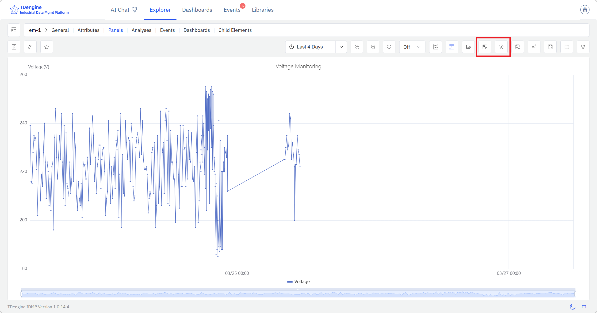
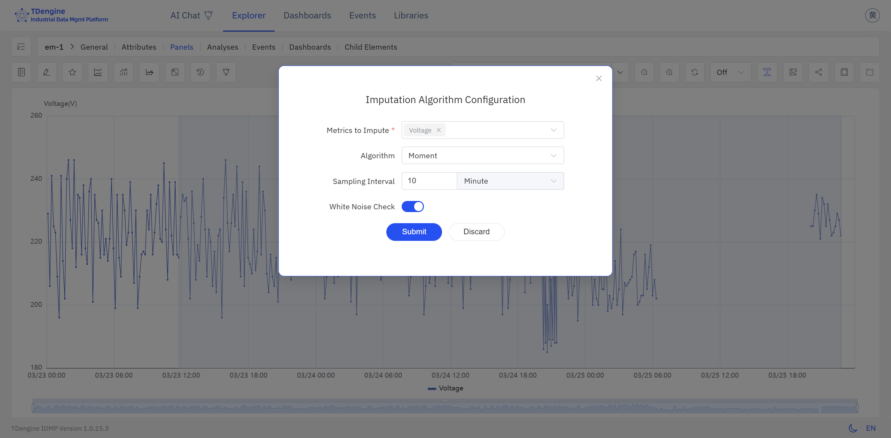
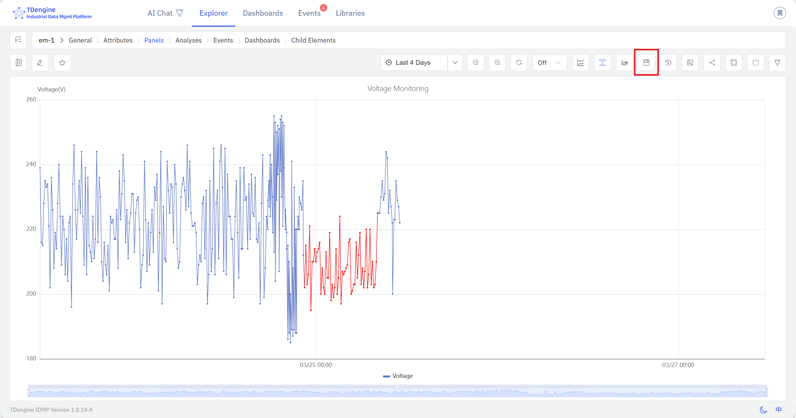
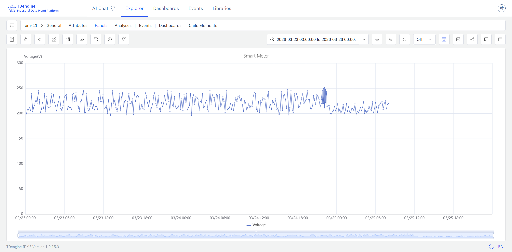

---
title: Missing Data Imputation
sidebar_label: Missing Data Imputation
---

# 9.2 Missing Data Imputation

Gaps in industrial time-series data are unavoidable. Sensors go offline, networks drop, hardware fails, transmission delays accumulate — any of these can leave stretches of a signal with no recorded values. Powered by **TDgpt**, IDMP intelligently fills those gaps by learning from the surrounding signal history and estimating what the sensor most likely would have measured, keeping downstream analytics, cumulative totals, and KPI calculations accurate and complete.

## 9.2.1 How It Works

The core idea behind imputation is: **reason from what is known to fill in what is missing**. The algorithm runs over a window of data surrounding the gap, analyzes the signal's behavior, estimates the most plausible values for each missing timestamp, and writes those estimates back into the dataset. Imputed values are rendered distinctly from actual measurements — the original data is never overwritten.

TDgpt exposes its imputation capability through the `IMPUTATION()` SQL function. The function requires evenly spaced timestamps; for production data with irregular intervals, normalize the data first using a window aggregation such as `INTERVAL` before calling imputation.

TDgpt imputation is a complement to TDengine's native interpolation functions (`INTERP`, `FILL`). Native interpolation uses simple strategies — linear, forward-fill, backward-fill — and works well for short, predictable gaps. TDgpt imputation applies learned signal knowledge and is better suited to longer gaps, irregular signals, or situations where simple interpolation would produce unrealistic values.

## 9.2.2 Application Scenarios

Missing data imputation is most valuable in the following situations:

- **Statistical completeness for continuous metrics:** For attributes like energy consumption, production volume, or flow rate that are summed or averaged over time, gaps directly distort the result. Imputation restores a complete series and eliminates the bias.
- **Input quality for forecasting and trend analysis:** Most forecasting and trend algorithms expect a gap-free input. Filling gaps upstream improves model quality and forecast accuracy.
- **Audit trails and compliance records:** In scenarios requiring a complete equipment operating log — regulatory compliance, quality traceability — imputation provides defensible estimated values that maintain record continuity.
- **Multi-attribute alignment:** When multiple time series need to be analyzed jointly, a gap in one attribute disrupts alignment and joint calculations. Imputation ensures all attributes share a consistent time axis.

## 9.2.3 Supported Algorithms

TDgpt provides several imputation algorithms across statistical, deep learning, and foundation model categories:

| Algorithm | Category | Characteristics |
|---|---|---|
| **Mean** | Statistical | Fills the gap using the local mean of surrounding data; extremely fast; works well for stable, low-variance signals (default) |
| **IEM** | Statistical | Iterative Expectation-Maximization; suited to multi-variate signals with correlated attributes |
| **LSTM** | Deep Learning | Captures temporal dependencies in complex, non-stationary signals; best for longer gaps in signals with intricate dynamics |
| **TDtsfm / Moment** | Foundation Model | TDengine's pre-trained time-series foundation model; automatically adapts to signal frequency and delivers high-quality imputation across diverse signal types |

:::note
When calling through the `IMPUTATION()` SQL function, only the **Moment** (TDtsfm family) algorithm is currently available. When triggering imputation from the Trend Chart panel toolbar, all algorithms listed above are selectable. Each imputation call handles up to 2,048 missing records, with an input data requirement of at least 10 and no more than 8,192 records.
:::

## 9.2.4 How to Use

Missing data imputation is triggered from the toolbars in view mode of both the **Trend Chart** and the **Analysis Chart**.

### Performing Imputation

**Step 1: Identify the gap**

Open the **Trend Chart panel** containing the attribute with missing data. Gaps appear as blank segments on the chart, making it straightforward to locate the time range that needs to be addressed.

**Step 2: Select the time range and configure the algorithm**

Click the **Imputation** button in the panel toolbar to enter imputation mode. **Click and drag** on the chart to select the time range to fill — extend the selection slightly beyond the gap on both sides so the algorithm can draw on real measurements from before and after the missing window. When you release, an **algorithm configuration dialog** appears, where you can choose the most appropriate algorithm for your signal — Mean, IEM, LSTM, or Moment.

**Step 3: Review the imputed values**

After you confirm the configuration, IDMP calls TDgpt to estimate the missing values. The newly generated data is overlaid on the chart **highlighted in red**, clearly distinguished from the original measurements, so you can verify the result before committing. If the result looks off, click **Reset** to discard the imputation and try a different time range or algorithm.

**Step 4: Save and verify the final result**

Once you are satisfied with the result, click **Save**. The imputed data is written to the data store and the trend chart displays a smooth, continuous curve with the gap resolved.

## 9.2.5 Example

**Background**

A chemical plant relies on natural gas flow data for daily energy accounting and fuel cost settlement. During a network equipment swap, the flow meter lost its communication link for about three hours, leaving that window of flow data completely blank. Because energy consumption is tracked as a daily cumulative total, the gap caused the day's recorded usage to read significantly low — distorting cost calculations and energy efficiency reporting.

**Steps**

1. Open the **Trend Chart panel** containing the `Natural Gas Flow` attribute. In view mode, the communication outage shows up clearly as a flat gap in the signal.
2. Click the **Imputation** button in the toolbar to enter imputation mode.
3. Click and drag to select the missing time range. IDMP calls TDgpt, which analyzes the flow pattern immediately before and after the gap, estimates what the signal most likely measured during the outage, and fills in the values.
4. The imputed values appear overlaid in a distinct style. Once the result looks reasonable, click **Save** to complete the imputation.

**Outcome**

TDgpt identified that the gap fell during normal production hours, when flow was expected to hold steady within a well-defined range. Drawing on two hours of flow history on either side of the gap, it generated a smooth, continuous estimated sequence consistent with the surrounding data.

After imputation, the day's cumulative gas usage matched adjacent workdays to within 1.5%. Energy accounting was restored to normal, and the settlement figures were submitted on schedule without any manual correction.
