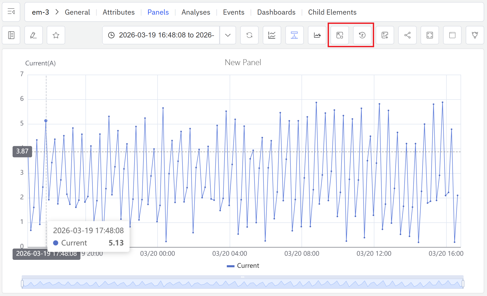

# 9.3 Missing Data Imputation

Gaps in industrial time-series data are unavoidable. Sensors go offline, networks drop, hardware fails, transmission delays accumulate — any of these can leave stretches of a signal with no recorded values. Powered by **TDgpt**, IDMP intelligently fills those gaps by estimating what the signal most likely would have measured, ensuring that downstream analytics, averages, and KPI calculations are not distorted by missing data.

## How It Works

The core idea behind imputation is: **reason from what is known to fill in what is missing**. The algorithm runs over a window of data surrounding the gap, analyzes the signal's behavior, estimates the most plausible values for each missing timestamp, and writes those estimates back into the dataset. Imputed values are rendered distinctly from actual measurements — the original data is never overwritten.

TDgpt exposes its imputation capability through the `IMPUTATION()` SQL function. The function requires evenly spaced timestamps; for production data with irregular intervals, normalize the data first using a window aggregation such as `INTERVAL` before calling imputation.

TDgpt imputation is a complement to TDengine's native interpolation functions (`INTERP`, `FILL`). Native interpolation uses simple strategies — linear, forward-fill, backward-fill — and works well for short, predictable gaps. TDgpt imputation applies learned signal knowledge and is better suited to longer gaps, irregular signals, or situations where simple interpolation would produce unrealistic values.

## Supported Algorithms

TDgpt provides several imputation algorithms across statistical, deep learning, and foundation model categories:

| Algorithm | Category | Characteristics |
|---|---|---|
| **Mean** | Statistical | Fills the gap using the local mean of surrounding data; extremely fast; works well for stable, low-variance signals (default) |
| **IEM** | Statistical | Iterative Expectation-Maximization; suited to multi-variate signals with correlated attributes |
| **LSTM** | Deep Learning | Captures temporal dependencies in complex, non-stationary signals; best for longer gaps in signals with intricate dynamics |
| **TDtsfm / Moment** | Foundation Model | TDengine's pre-trained time-series foundation model; automatically adapts to signal frequency and delivers high-quality imputation across diverse signal types |

:::note
When calling through the `IMPUTATION()` SQL function, only the **Moment** (TDtsfm family) algorithm is currently available. When triggering imputation from the Trend Chart panel toolbar, all algorithms listed above are selectable. Each imputation call handles up to 2,048 missing records, with an input data requirement of at least 10 and no more than 8,192 records.
:::

## How to Use

Missing data imputation is triggered from the **Trend Chart panel** toolbar and is available in both view mode and edit mode.

### Imputing in View Mode

Steps:

1. Open the **Trend Chart panel** containing the attribute with missing data.
2. Click the **Impute** icon in the view mode toolbar to enter imputation mode.
3. **Click and drag** on the chart to select the gap region you want to fill. IDMP calls TDgpt to estimate values for the selected time range and fills them in.
4. To undo an imputation, click the **Reset Imputation** icon in the toolbar to remove all imputed values from the current chart view.

Imputed values are overlaid on the chart in a visually distinct style, making it easy to compare the original signal (with its gap) against the completed view side by side.

### Previewing in Edit Mode

The panel editor toolbar also exposes the **Impute** control. Clicking it enters imputation mode within the panel preview, letting you evaluate the visual result in real time before saving any configuration changes — no need to switch to view mode first.

## Application Scenarios

Missing data imputation is most valuable in the following situations:

- **Statistical completeness for continuous metrics:** For attributes like energy consumption, production volume, or flow rate that are summed or averaged over time, gaps directly distort the result. Imputation restores a complete series and eliminates the bias.
- **Input quality for forecasting and trend analysis:** Most forecasting and trend algorithms expect a gap-free input. Filling gaps upstream improves model quality and forecast accuracy.
- **Audit trails and compliance records:** In scenarios requiring a complete equipment operating log — regulatory compliance, quality traceability — imputation provides defensible estimated values that maintain record continuity.
- **Multi-attribute alignment:** When multiple time series need to be analyzed jointly, a gap in one attribute disrupts alignment and joint calculations. Imputation ensures all attributes share a consistent time axis.

### Example: Repairing a Gas Flow Meter Gap Caused by a Network Outage

**Background**

A chemical plant relies on natural gas flow data for daily energy accounting and fuel cost settlement. During a planned network equipment swap, the flow meter lost its communication link for about three hours, leaving that window of flow data completely blank. Because energy consumption is tracked as a daily cumulative total, the gap caused the day's recorded usage to read significantly low — distorting cost calculations and energy efficiency reporting.

**Steps**

1. Open the **Trend Chart panel** containing the `Natural Gas Flow` attribute. In view mode, the communication outage shows up clearly as a flat gap in the signal.
2. Click the **Impute** icon in the toolbar to enter imputation mode.
3. Click and drag to select the missing time range. IDMP calls TDgpt, which analyzes the flow pattern immediately before and after the gap, estimates what the signal most likely measured during the outage, and fills in the values.
4. The imputed values appear overlaid in a distinct style. Once the result looks reasonable, accept the imputation.

**Outcome**

TDgpt identified that the gap fell during normal production hours, when flow was expected to hold steady within a well-defined range. Drawing on two hours of flow history on either side of the gap, it generated a smooth, continuous estimated sequence consistent with the surrounding data.

After imputation, the day's cumulative gas usage matched adjacent workdays to within 1.5%. Energy accounting was restored to normal, and the settlement figures were submitted on schedule without any manual correction.
