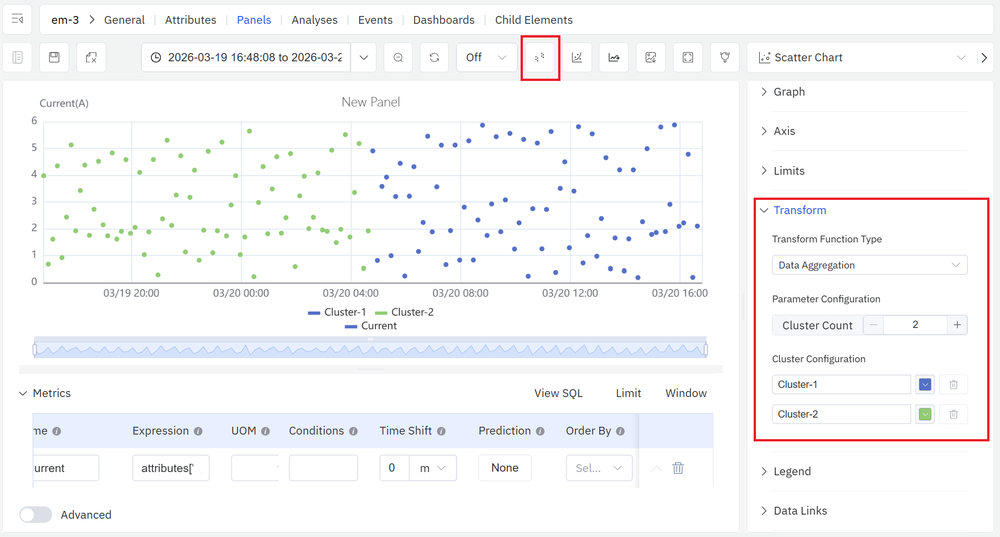

# 9.4 Clustering

Clustering is a widely used exploratory analysis technique in industrial data science. IDMP supports clustering directly within Scatter Chart panels, automatically grouping data points into natural clusters — with no labels or prior knowledge required. The result gives users an intuitive visual picture of how operating states, process modes, or behavioral patterns are distributed across their data, providing a foundation for condition identification, fault attribution, and optimization decisions.

## How It Works

Clustering is an **unsupervised learning** method. Its goal is to partition a dataset into groups — called clusters — such that points within the same cluster are similar to each other, and points in different clusters are distinctly different.

Formally, clustering algorithms optimize for two things simultaneously: minimizing the spread within each cluster (intra-cluster variance) and maximizing the separation between clusters (inter-cluster distance). Algorithms measure similarity through distance metrics — Euclidean distance, cosine similarity, and others — then find groupings that satisfy the optimization objective, either by iterating toward a stable solution or by building a hierarchy of nested groups.

Unlike classification, clustering requires no predefined category labels and no labeled examples. The algorithm discovers structure purely from the data itself. This makes clustering especially well-suited to industrial scenarios where you know operating states vary but don't yet know how many distinct states exist or what characterizes each one.

In IDMP, clustering takes the two attributes assigned to the X and Y axes of a Scatter Chart as its input, grouping data points in two-dimensional space. The resulting clusters are rendered as color-coded regions directly on the chart, making the grouping structure immediately visible and easy to interpret in terms of the underlying physical quantities.

## Application Scenarios

Clustering delivers practical value across a broad range of industrial use cases:

- **Equipment condition identification:** Cluster rotating equipment data by vibration, temperature, or current to automatically distinguish normal operation from degraded or abnormal states — establishing a data-driven baseline for predictive maintenance
- **Process grouping:** Cluster process parameters to surface the operating windows associated with good product quality versus those linked to defects, supporting process optimization and quality control
- **Load pattern discovery:** Cluster energy consumption or electrical load data by time period to identify characteristic usage patterns — workday vs. holiday, peak vs. off-peak — supporting demand response and energy efficiency programs
- **Fleet health stratification:** Cluster a population of similar assets by their operating characteristics to automatically stratify them by health level, supporting prioritized maintenance and asset management decisions

## Supported Algorithms

Several established algorithms are available, each suited to different data structures and analysis goals:

| Algorithm | Type | Characteristics |
|---|---|---|
| **K-Means** | Centroid-based | Partitions data into K clusters by iterating toward cluster mean centroids; computationally efficient; works best with large datasets and roughly spherical cluster shapes; requires specifying K upfront |
| **K-Medoids** | Centroid-based | Uses actual data points as cluster centers rather than means; more robust to outliers than K-Means; suited to noisy industrial data |
| **DBSCAN** | Density-based | Discovers clusters of arbitrary shape by identifying dense regions; no need to specify the number of clusters; naturally labels low-density points as noise; useful for anomaly detection alongside clustering |
| **Hierarchical** | Hierarchy-based | Builds a tree of nested clusters (dendrogram) bottom-up or top-down; no need to specify cluster count upfront; the dendrogram can be cut at different levels to explore groupings at multiple granularities |
| **GMM** | Probability-based | Models data as a mixture of Gaussian distributions fitted via Expectation-Maximization; supports soft assignment (each point receives a probability of belonging to each cluster); handles overlapping or fuzzy cluster boundaries |
| **Spectral Clustering** | Graph-based | Maps data into a Laplacian eigenspace before clustering; can handle complex nonlinear manifold structures; suited to high-dimensional data with intricate topology |

### Choosing an Algorithm

- For most industrial multi-attribute datasets, start with **K-Means** — it is efficient and the results are easy to explain
- When the data contains noise or outlier points, use **DBSCAN** or **K-Medoids** for greater robustness
- When the number of groups is unknown and you want to explore the hierarchical structure of the data, use **Hierarchical clustering**
- When cluster boundaries are fuzzy or operating states transition gradually, use **GMM**
- For high-dimensional data with nonlinear feature distributions, use **Spectral Clustering**

## How to Use

Clustering is currently accessed through the data transformation settings in a **Scatter Chart panel**.

Steps:

1. Open or create a **Scatter Chart panel** and assign attributes to the X and Y axes to display a two-dimensional scatter of your data.
2. Open the panel's **Data Transformation** settings.
3. Switch the transformation mode to **Data Aggregation**.
4. IDMP automatically runs clustering on the current data points and renders each cluster in a distinct color, making the grouping structure immediately visible.

The clusters appear on top of the raw scatter, with each color representing a distinct group. Reading the cluster boundaries in terms of the physical quantities on each axis gives you a direct picture of what conditions define each operating state.

:::note
The current entry point for clustering is the Scatter Chart panel's data transformation settings. Future releases will expand this — adding more algorithm options and enabling direct access through the **Model Development** module under development, which will allow building more sophisticated analysis workflows for specific industrial scenarios.

The same data transformation settings also offer a **Regression Analysis** option for fitting curves to scatter data. For full Scatter Chart panel configuration details, see the [Scatter Chart](../04-visualization/02-chart-types/12-scatter-chart.md) chapter.
:::

## Example

**Background**

A wind farm operations team runs regular performance reviews of individual turbines. Under normal conditions, wind speed and active power follow a stable, predictable relationship — the power curve. When a blade ices up, the yaw system lags, or curtailment is applied, the relationship breaks down. The team wants a quick, visual way to check whether a turbine's recent operating data stays on the expected curve or shows signs of deviation.

**Steps**

1. Open or create a **Scatter Chart panel**, set the X axis to `Wind Speed` and the Y axis to `Active Power`, and select seven days of historical data for the target turbine.
2. Open the **Data Transformation** settings and switch to **Data Aggregation**.
3. IDMP runs clustering on the scatter data and color-codes the results.

**Outcome**

The clustering result naturally separates into two or three distinct regions. The majority of points form a main cluster that traces the expected power curve shape. A smaller group of points forms a separate low-power cluster — these correspond to wind speed conditions where the turbine should have been generating near its rated output, but actual power was significantly below that.

The operations team flagged this period for investigation. Cross-referencing with the operating log confirmed that yaw tracking was sluggish during the affected window. A calibration was scheduled and completed, and subsequent data showed the turbine returning to its normal power curve.
