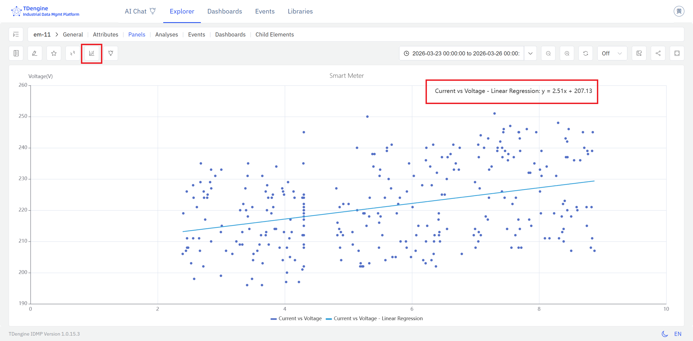
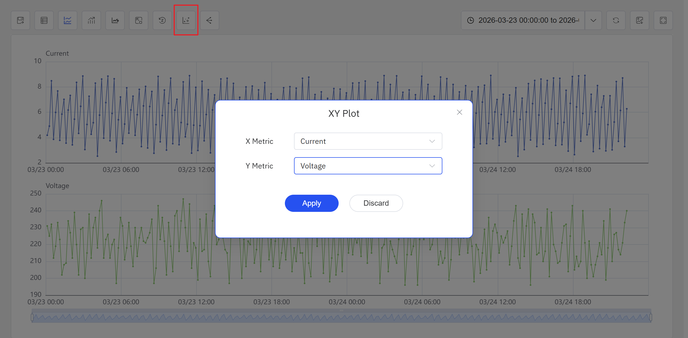
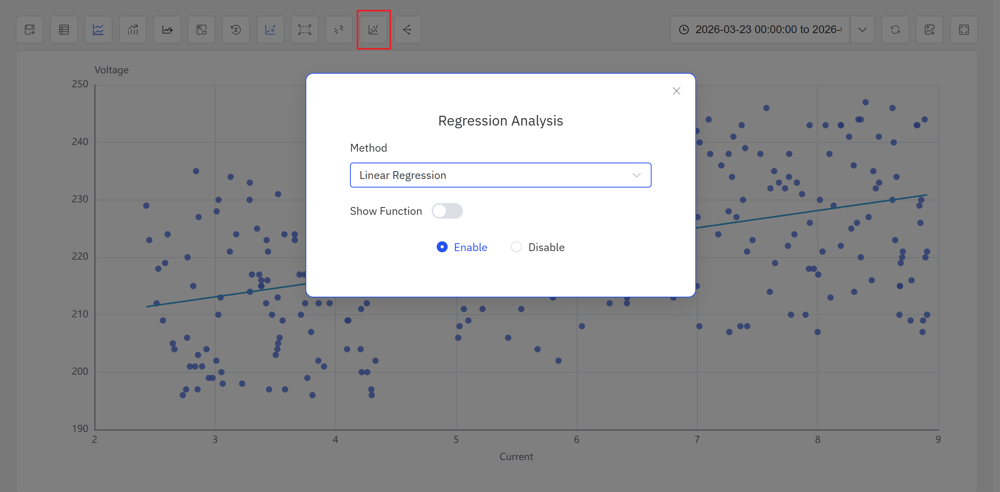
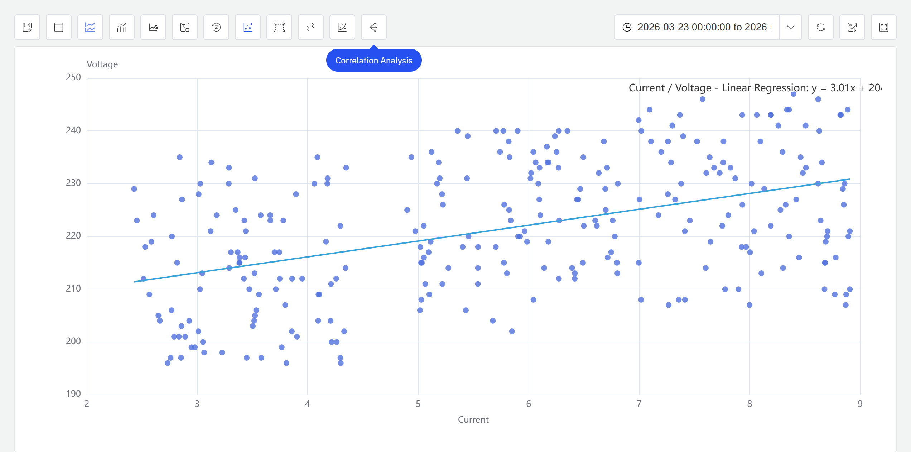

# 9.4 Regression

Regression analysis is the core method for quantifying relationships between variables in industrial data. IDMP supports regression directly within Scatter Chart panels, helping users discover and measure the functional relationship between two attributes — providing a quantitative foundation for process modeling, performance benchmarking, and factor analysis.

## 9.4.1 How It Works

The goal of regression is to find a mathematical function that best describes how one variable (the dependent variable, or output) changes in response to another (the independent variable, or input). The algorithm fits this function by minimizing the difference between predicted and observed values — typically measured as the sum of squared residuals, the method known as least squares.

Different regression models make different assumptions about the shape of the relationship. Linear regression assumes a straight-line relationship. Exponential regression captures relationships that accelerate or decay. Polynomial regression bends to fit more complex curves by adding higher-order terms.

Unlike clustering, regression is a **supervised** modeling approach: you specify which variable is the input and which is the output, and the model fits a function that describes the relationship between them. A commonly used measure of fit quality is R² (the coefficient of determination): values closer to 1 indicate that the chosen function shape explains more of the variation in the data.

In IDMP, regression analysis uses the Scatter Chart as its canvas: the X axis carries the independent variable, the Y axis carries the dependent variable, and the fitted curve is overlaid on the scatter of data points — making the quantitative relationship immediately readable in physical terms.

## 9.4.2 Application Scenarios

Regression analysis delivers practical value across a range of industrial domains:

- **Energy modeling:** Fit a regression between production load and electricity consumption to quantify the energy intensity per unit of output — establishing a baseline for energy benchmarking and efficiency tracking
- **Equipment performance curves:** Fit pump or compressor flow-to-power curves to detect efficiency degradation and support condition-based maintenance decisions
- **Process parameter impact:** Quantify how a process input (mold temperature, injection pressure, feed rate) influences a quality output, supporting data-driven process optimization
- **Wear and remaining-life estimation:** Fit the relationship between cumulative runtime and a wear indicator such as vibration amplitude or temperature rise, to extrapolate when maintenance will be needed

## 9.4.3 Supported Algorithms

IDMP supports three classic curve types, covering linear and common nonlinear function shapes:

| Algorithm | Function Form | Characteristics |
|---|---|---|
| **Linear** | y = ax + b | The simplest regression form; assumes a straight-line relationship; analytically solvable, highly interpretable; suited to monotonic, approximately linear relationships |
| **Exponential** | y = ae^(bx) | Captures relationships that accelerate or decay as the input grows — such as equipment aging curves or battery capacity fade |
| **Polynomial** | y = a₀ + a₁x + a₂x² + … + aₙxⁿ | Fits more complex curves by increasing the polynomial degree (n); higher degrees offer more flexibility but risk overfitting — choose the degree based on data volume and domain knowledge |

### Choosing an Algorithm

- For roughly linear, monotonic relationships, use **Linear** regression — it is the most interpretable and easiest to act on
- For relationships that grow or decay exponentially, use **Exponential** regression
- For curves with local peaks, valleys, S-shapes, or other complex forms, use **Polynomial** regression; degrees of 2 to 4 cover most industrial scenarios

## 9.4.4 How to Use

There are two ways to access regression analysis.

**Option 1: From a Scatter Chart panel**, click the **Regression** icon in the toolbar while in view mode.

Steps:

1. Open or create a **Scatter Chart panel**. Assign the independent variable to the X axis and the dependent variable to the Y axis so the panel displays the joint scatter of both attributes.
2. In the panel's view mode, click the **Regression** icon in the toolbar.
3. Select a regression type — Linear, Exponential, or Polynomial. For Polynomial, also set the degree.
4. IDMP fits the regression curve to the current data, overlays it on the scatter chart, and displays the fitted equation.

The fitted curve sits on top of the raw scatter, making it straightforward to read the direction of the relationship (positive or negative), the slope, and any nonlinearity — all expressed in the physical units of the X and Y axes.

**Option 2: From an Analysis Chart panel**, click the **Enable XY Plot** icon in the toolbar.

Steps:

1. Open or create an **Analysis Chart** panel. Click the **Enable XY Plot** icon in the toolbar, select the X-axis and Y-axis attributes in the popup, and click Apply. The panel switches to a scatter chart view.

2. Click the **Regression** icon in the toolbar and configure the regression algorithm in the popup.

3. After confirming the configuration, the system generates the regression result and displays it on the scatter chart.

:::note
In the current version, regression analysis is accessible from both the Analysis Chart panel and the Scatter Chart panel toolbar while in view mode. Future releases will expand the available algorithms and usage patterns.

The Scatter Chart panel toolbar in view mode also provides a **Clustering** icon for grouping scatter data into clusters. For full Scatter Chart panel configuration details, see the [Scatter Chart](../04-visualization/02-chart-types/12-scatter-chart.md) chapter.
:::

## 9.4.5 Example

**Background**

The central chiller plant in an office building operates at varying load levels throughout the day. A well-known efficiency lever is the chilled water supply temperature setpoint: raising it reduces the pressure differential the compressor must maintain, which directly lowers power consumption. The facilities team wants to visualize this relationship quantitatively — to confirm the chiller is behaving as expected and to have a data-driven basis for setpoint adjustments.

**Steps**

1. Open or create a **Scatter Chart panel**, set the X axis to `Chilled Water Supply Temp Setpoint` and the Y axis to `Chiller Power`, and load 30 days of historical data.
2. In the panel's view mode, click the **Regression** icon in the toolbar, and select **Linear**.
3. IDMP fits a linear curve to the scatter and overlays it on the chart.

**Outcome**

The fitted line shows a clear negative relationship: for every 1°C increase in the supply temperature setpoint, chiller power drops by approximately 15 kW. The scatter points cluster tightly around the line, confirming the relationship is stable across the operating range.

The facilities team used this curve as a reference benchmark for setpoint optimization. By raising the setpoint during periods when outdoor conditions permitted, they measured roughly a 6% reduction in monthly chiller energy consumption.
