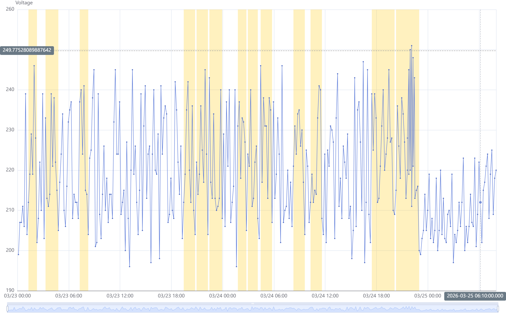

# 9.5 Window Analysis

Window analysis is an interactive historical data exploration tool provided by IDMP. It lets users search large volumes of historical time-series data on demand for meaningful time segments. Users select a window strategy, configure parameters, and the system scans the specified time range — surfacing qualifying segments as highlighted windows overlaid on the Analysis Chart, helping users quickly locate operating intervals of interest.

This capability is broadly comparable to Seeq's Value Search: an engineer-facing historical data search workflow that lets users locate time segments of interest through condition-based configuration rather than writing SQL or other query logic.

## How It Works

The core idea behind window analysis is: **apply a windowing strategy to divide continuous time-series data into discrete segments, surface those that match the specified criteria, and highlight them on the chart to help users discover patterns, anomalies, and trends.**

The process works as follows:

1. In the Analysis Chart, the user selects a window type (such as Event Window, State Window, Anomaly Detection, etc.) and configures the corresponding parameters (threshold conditions, state attributes, time intervals, etc.).
2. The system performs a one-time scan of historical data within the current chart's time range, finding all matching time segments according to the window rules.
3. Discovered windows are overlaid as highlighted segments on the attribute trend curves, allowing users to visually observe data behavior within each window.

**Window analysis does not create events.** It is a purely visual exploration tool — it does not write data, does not generate system events, and does not trigger alerts or processing workflows. Window analysis is designed for "look first, decide later" — helping users quickly locate time segments of interest in historical data, then decide whether to configure persistent real-time analysis rules.

### Window Analysis vs. Real-Time Analysis Triggers

The six window types supported by window analysis share the same window semantics as [real-time analysis trigger types](../07-real-time-analysis/03-trigger-types.md), but serve different purposes:

| | Real-Time Analysis Triggers (Chapter 7) | Window Analysis (This Section) |
|---|---|---|
| **Execution mode** | Continuous, against live data streams | Interactive, against historical data, executed on demand |
| **Output** | Creates events + writes calculation results | Generates highlighted windows on the chart |
| **Creates events?** | Yes | No |
| **Entry point** | Element → Analysis → Configure trigger | Analysis Chart in view mode → Window Analysis icon |

In short, real-time analysis triggers are like "security cameras" — configured once, running continuously; window analysis is like "reviewing recorded footage" — searching for specific scenes in historical data on demand.

## Application Scenarios

Window analysis has broad practical value across industrial domains:

**Condition Search and Anomalous Period Location**

- Search for "all periods where temperature exceeded 85°C" to quickly locate equipment overheating intervals and assess overheating frequency and duration
- Search for "periods where vibration amplitude stayed above the normal baseline for 10+ minutes" to map the time distribution of mechanical anomalies

**Anomaly Detection and Exploration**

- Run AI anomaly detection algorithms on target attributes without setting thresholds — automatically discover data segments that deviate from normal behavior
- Quickly understand potential anomaly patterns during the exploration phase, providing reference for subsequent real-time anomaly detection rule configuration

**Operating Mode and State Review**

- Split windows by equipment operating state (running/idle/fault) to measure duration and distribution of each state
- Split windows by batch number to quickly review time boundaries and data behavior for each batch

**Periodic Analysis and Comparison**

- Split windows at fixed intervals (hourly, per shift) to compare metrics across time periods and discover periodic patterns
- Split windows by equipment start/stop cycles to analyze data trends within each operating cycle

**Data Quality Review**

- Use session windows to find data reporting gaps, assessing sensor and communication link reliability
- Use count windows to split data by fixed sample size, identifying intervals with abnormal sampling frequency

## Supported Window Types

IDMP window analysis provides six window types, covering needs from simple time-based splitting to AI-driven anomaly discovery:

- **Sliding Window:** Divides data at fixed sliding time intervals based on event time. Suitable for rolling review scenarios, e.g., "one segment per hour — which hour had the highest energy consumption."
- **State Window:** Splits windows when an integer attribute's value transitions from one state to another. Suitable for reviewing segments by equipment operating mode (running/idle/fault) or batch number.
- **Event Window:** Splits windows based on user-defined start and end condition expressions evaluated against element attributes. Suitable for finding "all periods where temperature exceeded 85°C" and similar custom conditions. Supports minimum duration to filter noise.
- **Anomaly Detection:** Runs TDgpt anomaly detection algorithms on the target attribute without requiring manual threshold settings. The system automatically identifies data segments that deviate from normal behavior and marks them as windows. This is particularly useful for quickly surfacing anomaly patterns during exploratory analysis and for informing later real-time anomaly detection configuration.
- **Session Window:** Splits windows when the element has no new data within a specified inactivity period, covering the preceding active period. Suitable for naturally intermittent data, such as equipment start/stop cycles or vehicle driving/parking.
- **Count Window:** Splits windows when the number of new records written for an element attribute reaches a specified count. Suitable for data arriving at irregular intervals where fixed sample-size analysis is needed.

These six window types share the same window semantics as [real-time analysis trigger types](../07-real-time-analysis/03-trigger-types.md). See that chapter for detailed parameter configuration of each window type.

## How to Use

Window analysis is accessed from the **Window Analysis** icon in the Analysis Chart toolbar while in view mode.

Steps:

1. Click the **Window Analysis** icon in the toolbar to open the configuration dialog. Select a window type and configure the relevant parameters, such as condition expressions, state attributes, or time intervals.

2. After the window configuration is confirmed, IDMP scans the historical data in the current time range and renders the matched segments as highlighted windows in the Analysis Chart. At that point, users can:

- Run multiple window strategies in the same panel and compare the results side by side
- Inspect the data behavior inside each highlighted window to decide whether deeper analysis is needed
- Combine the result with event comparison, time alignment, normalization, or envelope analysis for further exploration

## Example

**Background**

An ethylene cracking furnace at a chemical plant normally operates with outlet temperatures stable between 830–850°C. Recently the operations team received feedback that some products had lower-than-expected conversion rates, possibly caused by temperature anomalies during certain periods. A process engineer wants to quickly locate all periods with abnormal temperatures over the past 30 days and assess the frequency and time distribution of these anomalies — without manually scrolling through weeks of data.

**Steps**

1. In the Analysis Chart, open the cracking furnace's outlet temperature trend and set the time range to the past 30 days.
2. Click the **Window Analysis** icon in the toolbar, select **Event Window**, set the start condition to `outlet_temp < 830`, end condition to `outlet_temp > 835`, and minimum duration to 5 minutes (to filter brief fluctuations).
3. The system scans 30 days of data and finds 12 low-temperature periods, highlighted on the chart.
4. Switch the window type to **Anomaly Detection**, select the default algorithm, and run another search over the same time range. In addition to the low-temperature periods found above, the system identifies 3 additional segments where the temperature stayed within the 830–850°C range but exhibited oscillation patterns significantly different from normal periods.

**Outcome**

The engineer observed that the 12 low-temperature periods were concentrated during weekend night shifts. Further investigation of operating logs revealed these correlated with operators manually adjusting fuel flow rates. The 3 additional segments flagged by anomaly detection showed normal absolute temperature values but abnormally increased oscillation frequency and amplitude — investigation confirmed PID parameter drift in the temperature control loop. The two issues were addressed separately through operations procedure revision and control parameter recalibration, and product conversion rates returned to normal levels.
