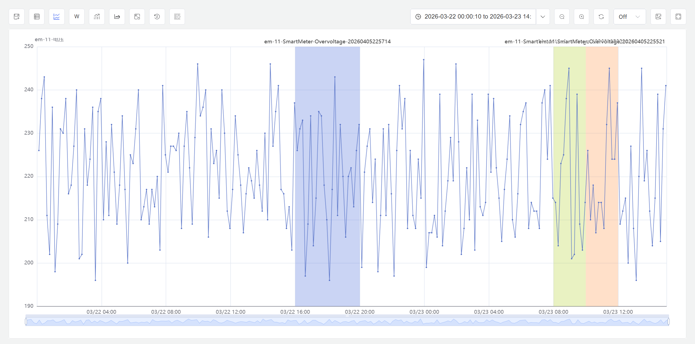
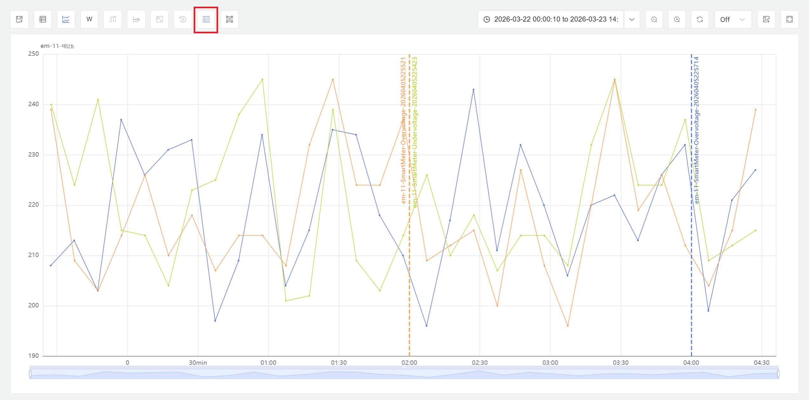
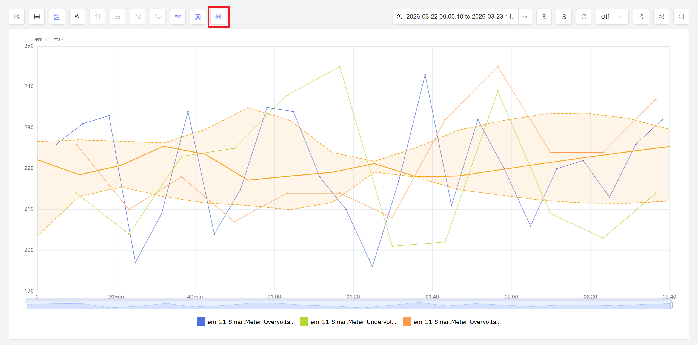

---
title: Event and Batch Analysis
sidebar_label: Event and Batch Analysis
---

# 9.6 Event and Batch Analysis

Batch analysis is a critical method for analyzing discrete production processes in industrial data science. **IDMP defines product batches as a specialized type of event** — discrete operational records with explicit start times, end times, and durations. Rather than providing a standalone batch-analysis module, IDMP treats batches as a special event type and uses its flexible event analysis capabilities to manage the full batch lifecycle and perform in-depth analysis.

Through event analysis, IDMP enables systematic comparison of full-cycle data across batch production, chemical reactions, and manufacturing processes — helping users identify the key process factors that affect product quality, discover patterns and anomalies across batches, and provide a data foundation for process optimization and quality control.

**The Analysis Chart is the primary entry point for event and batch analysis.** It is the only analysis workspace in IDMP that runs as an independent window, where users can perform window analysis, event comparison, correlation analysis, and other process-analytics workflows. The event analysis and exploration capabilities described in this section are all carried out from the Analysis Chart while in view mode.

## 9.6.1 Principles of Event and Batch Analysis

The core concept of event and batch analysis is: **treat each time-bounded production, reaction, or processing run as an independent analysis unit (i.e., an event/batch), then compare, aggregate, and trace full-cycle data across multiple events to discover patterns, identify differences, and detect anomalies.**

Unlike continuous production analysis, event/batch analysis focuses on the complete lifecycle of each batch from start to finish — including process parameter trends throughout the batch, statistical summaries of key metrics, and cross-batch comparisons. A well-executed batch typically exhibits stable process parameters, key metrics within target ranges, and curves that closely match historical successful batches. Problematic batches may show parameter drift during certain phases, anomalous spikes, or clear divergence from standard curves.

Event and batch analysis typically serves the following objectives:

- **Batch comparison:** Overlay current batches against historical batches, golden batches, or standard batches to visualize process parameter consistency and identify deviation points
- **Quality traceability:** Group and compare batches by quality outcome (pass vs. fail) to identify process parameter differences correlated with quality results and pinpoint root causes
- **Anomalous batch identification:** Screen large volumes of historical batches to identify those where process parameters deviated from normal ranges, supporting quality control and process audits
- **Trend monitoring:** Track long-term trends in key batch metrics (such as yield, cycle time, energy consumption) to detect process drift or equipment aging signals

## 9.6.2 Application Scenarios

Event and batch analysis has broad applications across discrete manufacturing and process industries:

**Pharmaceutical and Biopharmaceutical**

- Compare full-cycle data across fermentation, crystallization, and purification batches to identify key process parameters affecting yield and purity
- Archive complete process data for each batch as electronic batch records to support GMP compliance audits and deviation investigations

**Chemical and Fine Chemical**

- Aggregate and compare parameters for synthesis reactions, polymerization, and distillation batches to optimize reaction conditions and feed ratios
- Track batch-to-batch trends in yield and product quality metrics to detect impacts from raw material changes or catalyst deactivation

**Semiconductor and Electronics Manufacturing**

- Compare chamber parameters across etching, deposition, and diffusion process batches to identify key process variables affecting yield
- Monitor equipment state drift through batch-to-batch parameter consistency analysis to support preventive maintenance decisions

**Injection Molding and Forming**

- Aggregate statistics on injection temperature, hold pressure, and cooling rate across molding cycles or batches to establish process window baselines
- Compare process data from defective batches against conforming batches to quickly pinpoint parameter anomaly phases

## 9.6.3 Event Definition and Implementation

An **Event** in IDMP is a discrete operational record with an explicit start time, end time, and duration. Each event records its time boundaries and can carry custom attributes (such as batch ID, product type, operator, quality conclusion, etc.). Events are associated with elements and their time-series attributes, making it possible to extract and analyze complete process data for any batch time range.

Event time boundaries can be defined in two ways:

**Manual marking:** Operators manually create events in the event management interface after production ends, entering start and end times. This suits scenarios where production rhythm is irregular or batch boundaries require human judgment.

**Automatic generation (recommended):** Add a **batch number** field to equipment attributes — the equipment's time-series data outputs the currently active batch number. Whenever the batch number changes (i.e., a new batch starts), IDMP's **State Window** trigger automatically detects the state transition, aggregates the previous batch's statistics, and generates the corresponding batch event record. The system maintains a complete, accurate, real-time record of every batch without requiring manual operator marking.

### Event Configuration and Automatic Generation

Event automatic generation can be implemented through the State Window trigger in element analysis. Configuration steps:

1. **Prepare batch number attribute:** Ensure the equipment attributes include a **batch number** field (integer attribute), and that the batch number updates when each new batch starts.
2. **Create analysis:** Navigate to the element's **Analysis** tab, click **+** to create a new analysis, and enter an analysis name (such as "Batch Process Summary").
3. **Configure trigger:** In the **Trigger** step, select **State Window** as the trigger type and set the **State** attribute to the batch number field.
4. **Define summary metrics:** In the **Calculation** step, configure batch statistics to aggregate (such as average temperature, peak pressure, total duration, yield, etc.) and write calculation results to corresponding output attributes.
5. **Enable event generation:** In the **Event** step, enable event generation, select the **event template** corresponding to the batch, and configure naming rules and custom attributes (such as batch ID, product type, etc.).
6. **Save and run:** Click **Save** and the analysis begins continuous operation.

Once configured, whenever the batch number changes, the system automatically completes data aggregation for the previous batch and generates an event record. This automated approach ensures real-time accuracy of batch events without manual intervention.

:::note
The batch number attribute type should be integer so that the IDMP State Window trigger can recognize batch transitions. Each new batch can increment the batch number, or use other integer encoding methods to distinguish different batches.

For scenarios where batch boundaries are naturally defined by data silence gaps (such as equipment stopping data reporting after completing a batch), you can also use the **Session Window** trigger to automatically complete batch aggregation after data stream interruption.
:::

### Ad Hoc Events

Beyond system-generated or manually entered events, IDMP also allows users to create **ad hoc events** directly — no template or trigger rule required. Users can combine time ranges and attribute conditions on demand to define the events they want to analyze. On the element’s event list page, click **+** and configure the desired rule set in the **Generate Test Event Data** dialog.

Ad hoc events participate in analysis just like formal events and can be overlaid with existing system events in the same chart for comparison. This is particularly useful for:

- **Exploratory analysis:** Quickly define time periods of interest before establishing a complete batch management system
- **Supplementary comparison:** Precisely target an anomalous period and compare it side-by-side with normal or golden batches
- **Hypothesis validation:** Define post-adjustment time periods as ad hoc events and compare with pre-adjustment batches to validate improvements

## 9.6.4 Adding Events to the Analysis Chart

Once events have been generated, they need to be added to the Analysis Chart before in-depth comparison and analysis can begin. IDMP provides two methods.

### Method 1: From the Event List

IDMP provides powerful event search and filtering capabilities to help users quickly locate events and add them directly to the Analysis Chart. Batch events, as a special event type, can leverage the full suite of search capabilities.

**Search Entry**

Click **Events** in the top navigation bar, or switch to the **Events** tab on an element details page to enter the event list view. Click the search icon (magnifying glass) to open the search dialog.

**Basic Search**

Enter keywords in the search box (such as batch ID, product type, operator name, etc.), then press Enter or click **Search**. The system searches within event names, descriptions, and custom attributes, and returns a list of matching batch events.

**Advanced Filtering**

Click **Advanced** to expand additional filter criteria. You can precisely filter batch events by the following dimensions:

- **Time range:** Filter by batch start or end time to quickly locate batches within specific time periods
- **Event template:** Filter by batch event template to distinguish batches from different product lines or process types
- **Element path:** Limit search scope to batches under specific equipment or production lines
- **Custom attributes:** Filter by batch custom attributes (such as quality grade, shift, product specification, etc.)
- **Severity:** If batch events have severity configured, filter for anomalous or critical batches

**Save Filters**

For frequently used filter criteria (such as "defective batches in last 30 days," "all batches for product line A," etc.), click **Save As** to save filter conditions as a named filter. Saved filters appear in the sidebar's **Element Filters** list for quick re-execution with a click.

**Adding to the Analysis Chart**

After locating target events in the event list, you can add them to the Analysis Chart in the following ways:

- Click the **more actions** menu (⋮) at the end of an event row and select **Add to Analysis Chart**
- Select multiple events and use the batch action to add them all to the Analysis Chart at once
- Click an event to open its details page, then jump directly into the Analysis Chart from there

Through flexible search and filtering, users can quickly locate key events of interest from massive historical data and add them to the Analysis Chart for comparative analysis, quality traceability, and process optimization.

### Method 2: Ad-Hoc Window Analysis

The Analysis Chart integrates window analysis capabilities, enabling users to launch an ad-hoc window search directly from the chart to discover time segments of interest in historical data. Click the **Window Analysis** icon in the toolbar, select a window type and configure parameters, and the system scans data within the current time range, displaying matching segments as highlighted windows on the chart. For details on window analysis principles, window types, and usage, see [Window Analysis](./05-window-analysis.md).

Once events have been added to the Analysis Chart, the following display and comparison features help users quickly grasp the overall picture:

### Trend Overlay Comparison

In the Analysis Chart, overlay event time ranges onto process parameter curves to visually present how each parameter evolved during the event. After selecting multiple events, overlay their curves in the same chart for comparison, quickly identifying process differences, parameter drift, and anomalous fluctuations between events.

The figure above shows multi-event curve overlay comparison. By plotting complete process curves from different events on the same timeline, you can clearly see parameter performance during each event and identify events that deviate from the normal range.

### Event Line Display Mode

When a large number of events are loaded into the Analysis Chart, the default overlay style — which renders events as shaded regions behind the trend curves — can make the chart difficult to read. In this situation, click **Enable Event Line Mode** in the toolbar. Events then appear as colored lines above the attribute trend chart; hovering over a line reveals the key details of the corresponding event. This display mode keeps the chart legible at high event density and makes it easier to spot distribution patterns across events.

## 9.6.5 Event Analysis and Exploration

Once events have been added to the Analysis Chart, IDMP provides multiple comparison and visualization methods to help users understand differences and patterns across events from various perspectives.

### Event and Attribute List

Click the **Event and Attribute List** icon in the Analysis Chart toolbar to open a summary window that presents the event list, the attribute list, and key statistics for the current analysis scope — such as event count, duration statistics, and attribute means or extrema. This gives users a quick operational overview before moving into detailed analysis.

### Time Alignment

Time alignment aligns the start points of multiple events to the same moment (such as t=0), enabling direct comparison of process parameters at the same relative time points across different events. This eliminates the effect of actual event occurrence time differences, focusing on the internal process itself. Time alignment is particularly suited for analyzing parameter performance during relative time periods such as "first 2 hours from start" or "mid-reaction phase."

As shown, all event start points are aligned to t=0, with the horizontal axis representing relative time since event start. This enables clear comparison of parameter performance at the same relative time points across events, identifying process execution consistency.

### Time Normalization

Time normalization maps events of different durations to a unified time scale (such as 0% to 100%), enabling comparison of events with varying lengths in the same coordinate system. After normalization, the horizontal axis no longer represents absolute or relative time, but rather event completion percentage. This method is particularly suitable for comparing events with significantly different cycle times (such as 6-hour vs. 8-hour batches), focusing on relative performance at each process stage rather than absolute duration.

In this view, all event timelines are compressed or stretched to a unified 0%–100% scale, with the horizontal axis representing event completion progress. Through normalization, you can compare process parameters at relative progress points such as "first 25%," "mid 50%," or "final stage" across events of different durations, revealing differences in process execution rhythm.

### Envelope Analysis

The envelope function automatically calculates and plots parameter boundary curves (such as maximum, minimum, mean ± standard deviation) based on historical event data. The envelope defines the normal parameter fluctuation range for events, forming a "safe corridor." Comparing a new event's curve against the envelope quickly reveals whether the event operated within normal bounds or deviated from historical patterns during specific time periods.

The orange area represents the normal parameter fluctuation range derived from historical reference batches (such as mean ± 2 standard deviations), while the colored curves show the actual parameter trends of the events being evaluated. When curves exceed the envelope boundaries, it indicates anomalous parameters during that period, requiring further investigation. The envelope provides a quantitative reference baseline for batch quality assessment.

Through the combined use of these analysis methods, users can deeply understand event differences from multiple perspectives, identify key process factors affecting quality, and provide data support for process optimization and quality control.

:::note
Event template creation and management — including custom attribute definitions, naming rules, and severity configuration — is performed in **Foundation Library → Event Templates**. For the full analysis configuration reference, see the [Real-Time Intelligent Analysis and Response](../07-real-time-analysis/02-creating-analysis.md) chapter. For the complete event reference, see the [Events](../../events/) chapter.
:::

## 9.6.6 Example

**Background**

An automotive parts plant's injection molding workshop operates 8 injection molding machines producing precision plastic housings, with each batch producing approximately 1,000 parts over a 6–8 hour cycle. Injection temperature, hold pressure, and cooling time are the critical parameters affecting housing dimensional accuracy and surface quality. Recently, defect rates for certain batches have been noticeably elevated, and the process team wants to use the Analysis Chart's event comparison capabilities to pinpoint the root cause.

**Steps**

1. **Configure automatic batch generation:** The injection molding machine equipment attributes already have a `Batch Number` integer attribute configured, which the MES system automatically writes a new batch number into at the start of each production batch. In the injection molding machine element's **Analysis** tab, create an "Injection Molding Batch Summary" analysis with trigger type set to **State Window** and state attribute set to `Batch Number`. In the calculation step, configure four summary metrics: average injection temperature, average hold pressure, average cooling time, and total batch duration. In the event step, enable event generation using the "Injection Molding Batch" event template. After saving, the system automatically generates event records for all batches from the past 3 months.
2. **Event comparison to pinpoint root cause:** In the event view, filter the 40 most recent batch events, divide them into two groups by defect rate, and use the trend overlay comparison and time alignment features to overlay both groups' injection temperature curves in the same chart. Analysis confirms that high-defect batches show injection temperature consistently falling below 220°C during the second half of production (approximately hours 5–8), while low-defect batches maintain stable temperature at 225–235°C throughout.
3. **Envelope validation:** Select historical conforming batches to build an envelope, then compare recent high-defect batches against it. The temperature curve clearly deviates from the normal corridor after the 5th hour, further confirming the timing pattern of temperature decay.

**Outcome**

Investigation revealed that the root cause was aging barrel heating elements that could no longer maintain the target temperature when night shift output declined. Event comparison confirmed the direct correlation between low temperature and high defect rates, and envelope analysis precisely located the onset of temperature decay. After replacing the heating elements and adjusting process parameters, defect rates across the subsequent 15 batches dropped from an average of 4.2% to 1.1%, and injection temperature curves became consistent.
