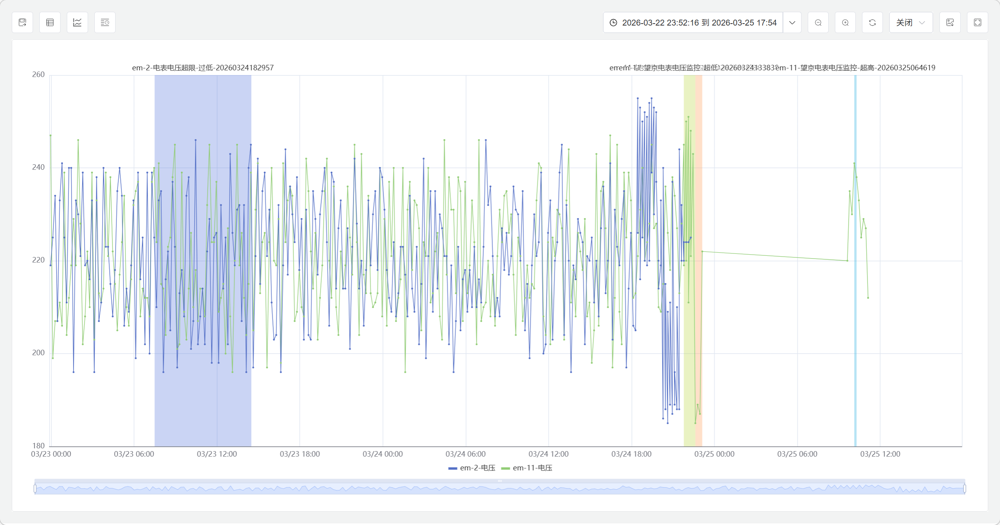
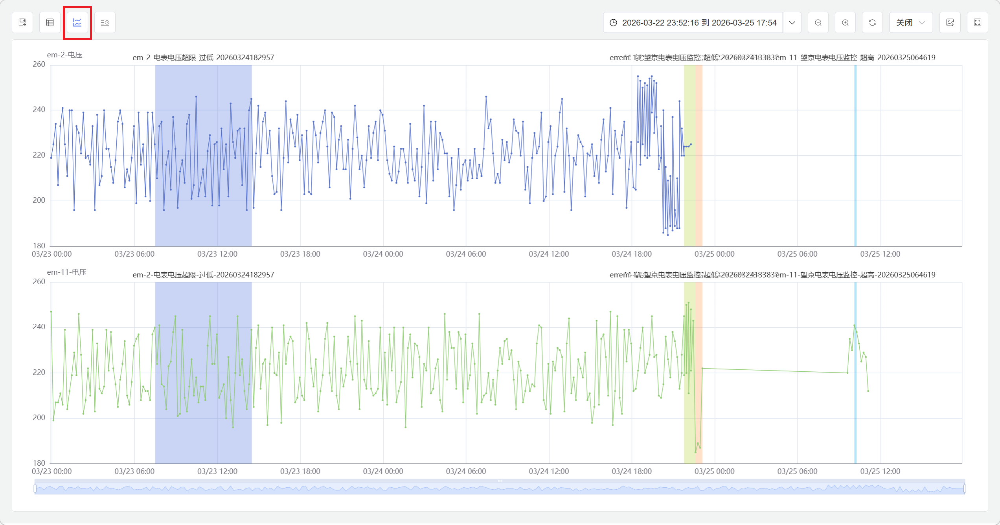
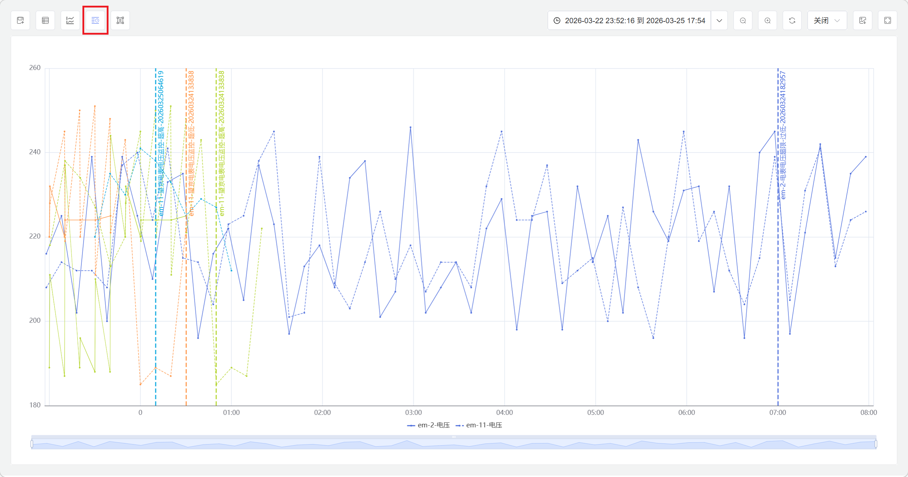
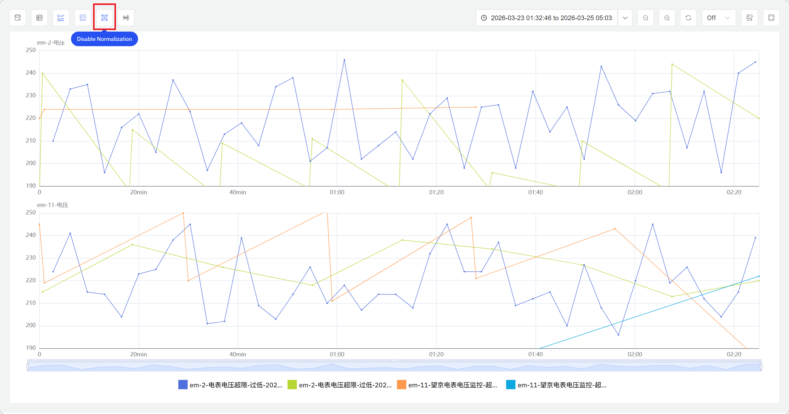
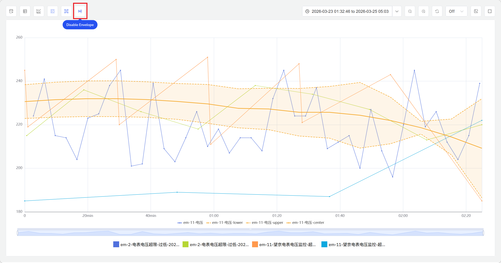

# 9.7 Batch Event Analysis

Batch analysis is the core analytical method for discrete manufacturing and process operations in industrial data science. IDMP supports systematic comparison and analysis of full-cycle data across batch production, chemical reaction, and fabrication processes — helping users identify the process factors that drive product quality, surface patterns and anomalies across batches, and build a data foundation for process optimization and quality control.

**IDMP treats product batches as a specialized type of event**, leveraging IDMP's powerful and flexible event analysis capabilities to enable batch analysis scenarios. Within the IDMP platform, there is no standalone batch analysis module. Instead, batches are modeled as a special event type, utilizing the complete event analysis framework to manage the full lifecycle and perform in-depth analysis of batches.

## How It Works

The fundamental idea behind batch analysis is: **treat each bounded production, reaction, or processing run as a self-contained unit of analysis, then compare, aggregate, and trace across multiple batches to find patterns, locate differences, and identify anomalies.**

Unlike continuous process analysis, batch analysis focuses on the complete lifecycle of each batch — from start to finish. A well-executed batch typically shows stable process parameters, key metrics within target ranges, and curves that closely match those of past successful batches. A problematic batch may exhibit parameter drift during a specific phase, anomalous spikes, or a visible divergence from the reference curve.

Batch analysis typically serves four objectives:

- **Batch comparison:** Overlay the current batch against historical batches, golden batches, or standard reference curves to visualize consistency and pinpoint deviations
- **Quality traceability:** Group batches by quality outcome, compare process parameters between passing and failing groups, and identify the root causes of quality variation
- **Anomaly batch identification:** Screen historical batches to surface those where process parameters deviated from the normal operating window, supporting quality audits and process reviews
- **Trend monitoring:** Track batch-to-batch trends in key metrics — yield, cycle time, energy consumption — to detect gradual process drift or equipment aging

## Application Scenarios

Batch analysis delivers broad practical value across discrete manufacturing and process industries:

**Pharmaceutical and Biopharmaceutical**

- Compare full-cycle data across fermentation, crystallization, and purification batches to identify the process parameters that drive yield and purity
- Archive each batch's complete process data as an electronic batch record to support GMP compliance audits and deviation investigations

**Chemical and Fine Chemical**

- Aggregate and compare batch parameters for synthesis reactions, polymerization, and distillation to optimize reaction conditions and feed ratios
- Track yield and quality trends across batches to detect the effects of raw material variation or catalyst deactivation as they develop

**Semiconductor and Electronics Manufacturing**

- Compare chamber parameters across etch, deposition, and diffusion batches to identify the process variables most strongly linked to yield
- Monitor equipment state drift through batch-to-batch parameter consistency analysis, supporting preventive maintenance decisions

**Injection Molding and Forming**

- Aggregate injection temperature, hold pressure, and cooling rate statistics across molding cycles or production lots to establish the process window baseline
- Compare defective-lot process data against conforming lots to quickly pinpoint the phase where parameters went off-spec

## Batch Definition and Implementation

In IDMP, a batch is defined as an **Event** — a discrete operational record with an explicit start time, end time, and duration. Each batch event captures the time boundaries of the batch and can carry custom attributes such as batch ID, product type, operator, and quality conclusion. Batch events are linked to the element and its time-series attributes, making it straightforward to extract and analyze the complete process data for any batch.

Batch boundaries can be defined in two ways:

**Manual entry:** An operator creates the batch event in the event management interface after the batch is complete, entering the start and end times directly. Suitable for processes where production rhythm is irregular or batch boundaries require human judgment.

**Automatic generation (recommended):** Add a **batch number** attribute to the equipment — a time-series field that carries the batch identifier currently in production. Whenever the batch number changes (signaling the start of a new batch), IDMP's **State Window** trigger detects the state transition, fires the analysis to aggregate the previous batch's data, and automatically creates the corresponding batch event record. No manual time-marking is needed; the system maintains a complete, accurate record of every batch in real time.

### Configure Automatic Batch Generation

Batch events can be automatically generated using the State Window trigger in element analysis. Configuration steps:

1. **Prepare the batch number attribute:** Ensure the equipment has a **batch number** attribute (integer type) that updates at the start of each new batch.
2. **Create the analysis:** Navigate to the element's **Analysis** tab, click **+** to create a new analysis, and enter a name such as "Batch Process Summary."
3. **Configure the trigger:** In the **Trigger** step, select **State Window** as the trigger type and set the **State** attribute to the batch number field.
4. **Define summary metrics:** In the **Calculation** step, configure the batch summary metrics to compute — such as average temperature, peak pressure, total duration, and yield — and map the results to output attributes.
5. **Enable event generation:** In the **Event** step, enable event generation, select the **event template** for batch events, and configure the naming rule and custom attributes (such as batch ID and product type).
6. **Save and run:** Click **Save**. The analysis begins running continuously.

Once configured, every time the batch number changes, the system automatically completes the previous batch summary and creates its event record. This automated approach ensures real-time accuracy without manual intervention.

:::note
The batch number attribute must be an integer type so that the IDMP State Window trigger can detect batch transitions. Batches can be tracked by auto-incrementing the batch number with each new run, or by any other integer-based encoding scheme.

For processes where batch boundaries are naturally defined by data silence gaps — for example, equipment that stops reporting data between batches — the **Session Window** trigger can be used instead, automatically completing the batch summary when the data stream resumes after a gap.
:::

## Batch Event Analysis Entry Points

Batch event viewing and analysis in IDMP is performed through the **Events** interface, while automatic batch event generation is configured through **Element Analysis**.

### Querying and Filtering Batch Events

IDMP provides powerful event search and filtering capabilities to help users quickly locate batch events for in-depth analysis. As a specialized event type, batch events can leverage IDMP's complete search functionality.

**Search Entry**

Click **Events** in the top navigation bar, or switch to the **Events** tab on an element details page to enter the event list view. Click the search icon (magnifying glass) to open the search dialog.

**Basic Search**

Enter keywords in the search box (such as batch ID, product type, or operator name), then press Enter or click **Search**. The system searches event names, descriptions, and custom attributes, returning matching batch events.

**Advanced Filtering**

Click **Advanced** to expand additional filter criteria. You can precisely filter batch events by:

- **Time range:** Filter by batch start or end time to quickly locate batches within a specific period
- **Event template:** Filter by the event template associated with batches to distinguish different product lines or process types
- **Element path:** Limit the search scope to batches under specific equipment or production lines
- **Custom attributes:** Filter by batch custom attributes (such as quality grade, shift, or product specification)
- **Severity:** If batch events have severity configured, filter for anomalous or critical batches

**Save Filters**

For frequently used filter criteria (such as "defective batches in the last 30 days" or "all batches for product line A"), click **Save As** to save the filter conditions as a named filter. Saved filters appear in the sidebar's **Element Filters** list for quick re-execution.

**From Event List to Deep Analysis**

After locating target batches in the event list, click a batch event to view its detailed information (start/end times, duration, aggregated metrics, custom attributes). From the batch details page, you can jump directly to trend chart analysis, multi-batch comparison, and other in-depth analysis scenarios.

Through flexible search and filtering, users can quickly locate relevant batch subsets from massive historical data, laying the foundation for comparative analysis, quality traceability, and process optimization.

### Batch Event Analysis and Exploration

After batch events are generated, they can be explored through the event view for in-depth analysis. IDMP provides multiple batch comparison and visualization methods to help users understand batch differences and patterns from various perspectives.

**Batch List and Details**

In the element's **Events** tab, browse the full history of batch records for the equipment, with filtering by time range, event type, and other criteria. Click a single batch event to view its complete record — start and end times, duration, aggregated summary metrics, and custom attribute values.

**Ad Hoc Events**

Beyond system-generated or manually entered batch events, IDMP also supports creating **ad hoc events** on the fly — no template or trigger configuration required. Users can flexibly combine time ranges with attribute conditions to instantly define and generate events of interest. Specifically, users can either select a time range directly on the chart, or layer on attribute rules (such as a parameter exceeding or falling below a threshold, or an attribute matching a specific state) to precisely isolate time windows that meet particular operating conditions.

Ad hoc events participate in analysis on equal footing with formal batch event records, and can be overlaid alongside existing batch data in the same chart for direct comparison. This capability is especially useful in the following situations:

- **Exploratory analysis:** Before a full batch management workflow is in place, use flexible condition combinations to quickly define time ranges of interest and start comparing them immediately
- **Supplementary comparison:** When a process anomaly is spotted, combine time range and parameter conditions to precisely lock onto that window, then place it next to nearby normal batches or a golden batch to isolate the difference
- **Hypothesis validation:** After adjusting process parameters, instantly define ad hoc events for post-change time windows and compare them against pre-change batches on the spot to validate the improvement

**Trend Chart Overlay Comparison**

In a Trend Chart panel, overlay batch time ranges on process parameter curves to visualize how each parameter evolved during the batch. Select multiple batches to overlay their curves in the same chart for side-by-side comparison, quickly identifying process differences, parameter drift, and anomalous fluctuations between batches.

The figure above shows multi-batch event curve overlay comparison. By plotting complete process curves from different batches on the same timeline, you can clearly see parameter performance across different time periods and identify batches that deviate from the normal range.

**Multi-Swimlane Analysis**

The multi-swimlane view plots each batch's curves in separate subplots, with each batch occupying its own "lane." This layout avoids visual clutter from overlapping curves and is particularly suitable for comparing large numbers of batches (10 or more) simultaneously. Users can quickly scan through each batch's complete process and identify batches that clearly deviate from the group pattern.

The figure above shows batch comparison in multi-swimlane layout. Each batch occupies a separate row, arranged vertically, making it easy to inspect each batch's process curve shape individually and quickly spot characteristic patterns of anomalous batches.

**Time Alignment**

Time alignment aligns the start points of multiple batches to the same moment (such as t=0), enabling direct comparison of process parameters at the same relative time points across different batches. This alignment eliminates differences in actual occurrence times and focuses on the internal process itself. Time alignment is particularly useful for analyzing parameter performance during relative time periods such as "first 2 hours from start" or "mid-reaction phase."

The figure above shows batch comparison after time alignment. All batch start points are aligned to t=0, with the horizontal axis representing relative time since batch start. This approach enables clear comparison of parameter performance at the same relative process stages across batches, revealing process execution consistency.

**Time Normalization**

Time normalization maps batches of different durations to the same time scale (such as 0% to 100%), enabling comparison of batches with varying lengths in the same coordinate system. After normalization, the horizontal axis no longer represents absolute or relative time, but rather batch completion percentage. This method is particularly suitable for comparing batches with significantly different cycle times (such as 6-hour vs. 8-hour batches), focusing on relative performance at each process stage rather than absolute duration.

The figure above shows batch comparison after time normalization. All batch timelines are compressed or stretched to a unified 0%-100% scale, with the horizontal axis representing batch completion progress. Through normalization, you can compare process parameters at relative progress points like "first 25%," "mid-50%," or "final stage" across batches of different durations, revealing differences in process execution rhythm.

**Envelope Analysis**

The envelope function automatically calculates and plots parameter boundary curves (such as maximum, minimum, mean ± standard deviation) based on historical batch data. The envelope defines the normal operating range for process parameters, forming a "safe corridor." Comparing a new batch's curve against the envelope quickly reveals whether the batch operated within normal bounds or deviated from historical patterns during specific time periods.

The figure above shows envelope analysis. The gray area represents the parameter fluctuation range of historical batches (such as mean ± 2 standard deviations), while the colored curve represents the actual parameters of the current batch. When the curve exceeds the envelope boundaries, it indicates that the batch's parameters were anomalous during that time period and require further investigation. The envelope provides a quantitative reference baseline for batch quality assessment.

Through the combined use of these analysis methods, users can gain deep insights into batch differences from multiple perspectives, identify key process factors affecting quality, and provide data support for process optimization and quality control.

:::note
Event template management — including custom attribute definitions, naming rules, and severity configuration — is done in **Foundation Library → Event Templates**. For the full analysis configuration reference, see the [Real-Time Intelligent Analysis and Response](../07-real-time-analysis/02-creating-analysis.md) chapter. For the full events reference, see the [Events](../06-events/) chapter.
:::

## Example

**Background**

An automotive parts plant runs eight injection molding machines producing precision plastic enclosures, with each production lot of approximately 1,000 parts running for 6–8 hours. Injection temperature, hold pressure, and cooling time are the critical parameters governing dimensional accuracy and surface quality. Recent lots have shown elevated defect rates, and the process team wants to use batch analysis to pinpoint the cause.

**Steps**

1. The injection molding machine already has a `Batch Number` integer attribute, which the MES system updates at the start of each new lot.
2. In the machine element's **Analysis** tab, create an "Injection Molding Batch Summary" analysis. Set the trigger type to **State Window** with the `Batch Number` attribute as the state. In the calculation step, configure four summary metrics: average injection temperature, average hold pressure, average cooling time, and total lot duration. In the event step, enable event generation using the "Injection Molding Batch" event template, with batch ID and operator as custom attributes.
3. After saving, the system back-calculates three months of historical data, automatically generating event records for all past lots. Going forward, each lot is summarized and recorded automatically when it ends.

**Outcome**

The process team filtered the event list to the 40 most recent lots and divided them into a high-defect group and a low-defect group. Overlaying the injection temperature curves for both groups in a Trend Chart revealed a clear pattern: high-defect lots showed injection temperature falling below the setpoint (under 220°C) consistently during the second half of the cycle (hours 5–8), while low-defect lots maintained temperature stably between 225°C and 235°C throughout.

Investigation traced the root cause to aging barrel heating elements that could no longer sustain the target temperature during lower-throughput night shifts. After replacing the heating elements and adjusting process parameters, defect rates across the following 15 lots dropped from an average of 4.2% to 1.1%, and injection temperature profiles became consistent batch to batch.
