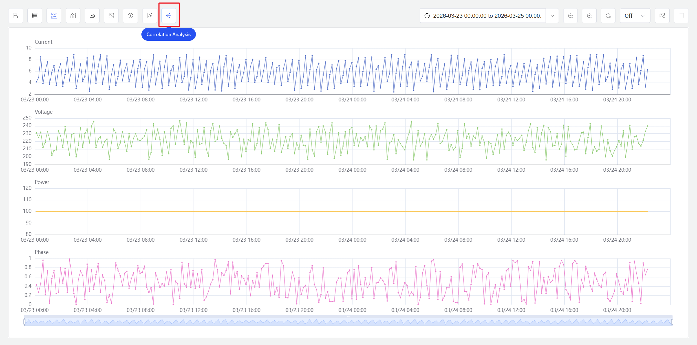
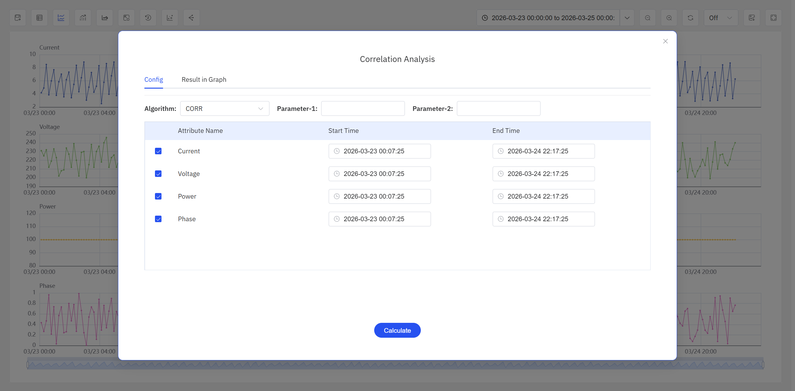

# 9.7 Correlation Analysis

Correlation analysis is a core method for quantifying statistical dependencies between variables in industrial data analysis. Powered by **TDgpt**, IDMP provides time-series correlation analysis that helps users quickly identify influencing factors, narrow the scope of investigation, validate analytical hypotheses, and provide quantitative evidence for deeper analysis.

## 9.7.1 How It Works

The central question of correlation analysis is: **when one variable changes, does another variable exhibit a co-varying trend, and if so, in which direction (positive/negative) and how strong is the association?**

Given two time-series datasets X and Y, correlation analysis uses statistical methods to compute a correlation coefficient that quantifies the degree of statistical association between them. The larger the absolute value of the coefficient, the more pronounced the co-varying trend between the two variables.

Keep the following points in mind:

- **Correlation does not imply causation.** Correlation analysis can only reveal that two variables tend to change together; it cannot prove a causal relationship between them. Data correlation may result from coincidence or confounding factors. To assess the reliability of a correlation more rigorously, IDMP performs a statistical test and computes a P-value, helping users evaluate the credibility of the conclusion.
- **Correlation does not imply similarity.** Similarity means two series share the same change pattern. Similar series are always correlated, but correlated series are not necessarily similar — for example, two series may have a linear relationship yet differ completely in overall shape.
- **Correlation analysis operates on time-series data.** It requires observations from two or more time series over a given time range; analyzing single data points has no statistical significance.

## 9.7.2 Application Scenarios

Correlation analysis has broad practical value across industrial domains. Typical scenarios include:

- **Fault root-cause analysis:** When an equipment metric behaves abnormally, quickly identify which parameters co-vary with it to narrow the troubleshooting scope
- **Process optimization:** Perform pairwise correlation analysis on process parameters to discover strong correlations and guide coordinated parameter tuning
- **Equipment health assessment:** Monitor correlation changes among multiple metrics; a decline in correlation between previously highly correlated metrics may signal a shift in equipment operating conditions
- **Energy consumption analysis:** Analyze the correlation between energy consumption and variables such as ambient temperature or production output to identify primary energy-consumption drivers
- **Quality control:** Correlate quality metrics with upstream process parameters to identify the key factors affecting yield

## 9.7.3 Supported Algorithms

The correlation analysis capability in IDMP is powered by TDgpt and currently supports three algorithms for different analytical needs:

| Algorithm                                        | Value Range | Characteristics                                                                                                                                                                                                                                                                                                           |
| ------------------------------------------------ | ----------- | ------------------------------------------------------------------------------------------------------------------------------------------------------------------------------------------------------------------------------------------------------------------------------------------------------------------------- |
| **CORR (Pearson Correlation Coefficient)** | [-1, 1]     | Measures the**linear correlation** between two series; the larger the absolute value, the stronger the correlation. Positive values indicate positive correlation; negative values indicate negative correlation. Computationally efficient, easy to interpret, and suitable for most scenarios (default algorithm) |
| **DTW (Dynamic Time Warping)**             | [0, +∞)    | Computes the**similarity** between two series through nonlinear temporal alignment; values closer to 0 indicate greater similarity. Suitable for comparing series with time shifts or rate differences, such as comparing data from different devices under the same operating conditions                           |
| **TLCC (Time-Lagged Cross-Correlation)**   | [-1, 1]     | Computes the correlation coefficient between two series at different time**lag steps** to identify whether changes in one series have a delayed impact on another, along with the direction and magnitude of that impact                                                                                            |

### Algorithm Selection Guide

- To determine whether two metrics change in sync over time, prefer **CORR** — computationally efficient with intuitive results
- To compare two curves that share a similar shape but are time-shifted, choose **DTW**
- To explore questions like "after variable A changes, how long before variable B responds," choose **TLCC**

### Significance Assessment

Users can establish significance criteria based on their analytical context and data characteristics. The following are commonly used rules based on the combination of correlation coefficient and P-value:

| Correlation Level | Correlation Coefficient | P-value |
| ----------------- | ----------------------- | ------- |
| Very Strong       | ≥ 0.6                  | < 0.05  |
| Significant       | ≥ 0.6                  | < 0.1   |
| Moderate          | [0.3, 0.6)              | < 0.1   |
| Weak              | [0.1, 0.3)              | < 0.1   |
| None              | < 0.1                   | < 0.1   |
| Unreliable        | —                      | ≥ 0.1  |

When the P-value ≥ 0.1, the conclusion is typically marked as "Unreliable," indicating that the influence of random factors cannot be ruled out.

## 9.7.4 How to Use

In an **Analysis Chart** panel in view mode, click the **Correlation Analysis** icon in the toolbar to access the correlation analysis feature. Only time-series attributes that have already been added to the Analysis Chart can participate in the analysis.

Steps:

1. Open or create an **Analysis Chart** panel and add the time-series attributes you want to analyze (at least two).
2. In the panel's **view mode**, click the **Correlation Analysis** icon in the toolbar. The system displays the correlation analysis configuration dialog.
3. In the configuration dialog, select the attributes to analyze, configure the analysis parameters (described below), and click the **Calculate** button.
4. The system performs pairwise correlation analysis on the selected attributes, and the results are displayed in the **Result in Graph** tab.

### Configuration Parameters

The configuration dialog contains the following settings:

| Parameter                       | Description                                                                                                                                                                                         |
| ------------------------------- | --------------------------------------------------------------------------------------------------------------------------------------------------------------------------------------------------- |
| **Correlation Algorithm** | Select one of the three algorithms: CORR, DTW, or TLCC                                                                                                                                              |
| **Algorithm Parameters**  | CORR requires no additional parameters; DTW allows configuring the neighborhood radius (Radius), default 1; TLCC allows configuring the lag window start/end steps (Lag Start / Lag End), default 0 |
| **Attribute List**        | Displays all attributes currently added to the Analysis Chart; users can select which attributes to include in the analysis                                                                         |
| **Time Range**            | Start time and end time; defaults to the current chart's time range, adjustable by the user                                                                                                         |

### Result Display

After the calculation completes, IDMP displays the correlation analysis results for all attribute pairs as a matrix heatmap in the **Result in Graph** tab:

- Blue areas show the correlation coefficient values; stronger correlations appear in deeper shades
- Pink areas show the sign (direction) of the correlation coefficient, with arrow direction indicating positive or negative correlation

:::note
If a correlation analysis has already been performed, clicking the **Correlation Analysis** icon again displays the previous results. Users can switch to the configuration tab to adjust parameters and recalculate.
:::

## 9.7.5 Usage Example

A chemical plant's distillation column experiences intermittent fluctuations in bottoms purity. The analysis team wants to quickly identify which production parameters are most correlated with bottoms purity.

1. Open an Analysis Chart panel and add five attributes — `Bottoms Purity`, `Reflux Ratio`, `Feed Temperature`, `Column Top Pressure`, and `Reboiler Heat Duty` — with the time range set to the past 7 days.
2. Click **Correlation Analysis**, select the **CORR** algorithm, and click **Calculate**.
3. Review the results:

| Attribute Pair                       | Correlation Coefficient | Direction | P-value | Conclusion  |
| ------------------------------------ | ----------------------- | --------- | ------- | ----------- |
| Bottoms Purity & Reflux Ratio        | 0.87                    | Positive  | 0.002   | Very Strong |
| Bottoms Purity & Reboiler Heat Duty  | 0.72                    | Positive  | 0.018   | Very Strong |
| Bottoms Purity & Feed Temperature    | -0.65                   | Negative  | 0.041   | Very Strong |
| Bottoms Purity & Column Top Pressure | 0.21                    | Positive  | 0.35    | Unreliable  |

The results show that purity has the strongest positive correlation with reflux ratio (0.87), a negative correlation with feed temperature (-0.65), and an unreliable association with column top pressure (P = 0.35). Based on these findings, the team focused their investigation and discovered that the feed temperature fluctuations were caused by a malfunction in the feedstock tank heating system. After the repair, purity returned to stable levels.
