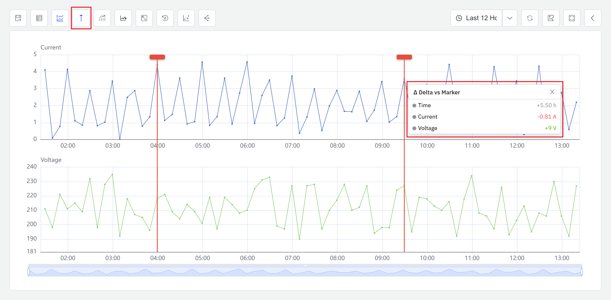

# 9.8 Marker Analysis

Marker Analysis is an interactive data comparison tool provided by the Analysis Chart. Users place two vertical marker lines (Marker Lines) that span all lanes in the Analysis Chart, then move the marker lines to any position on the chart. The system displays in real time the **time difference** and **value differences for each attribute** between the two marker line positions.

This is a standard diagnostic feature found in industrial data analysis software (Historian). During industrial troubleshooting, engineers often need to quickly compare multiple attribute values at two different points in time — for example, comparing temperature, pressure, and speed between a fault moment and a normal operating moment. Marker Analysis enables this directly on the chart, without exporting data or switching to external tools.

## 9.8.1 How It Works

The core idea behind Marker Analysis is: **fix two reference points (marker lines) on the time axis, then dynamically compare attribute differences between any two points in time by moving the marker lines.**

The workflow is as follows:

1. In the Analysis Chart view mode, click the **Enable Marker Line** button in the toolbar.
2. The system generates two vertical red marker lines at the center of the Analysis Chart, spanning all lanes.
3. The user moves the cursor to the top of either marker line, then drags the marker line to a time position of interest (e.g., an anomaly peak, the moment of an operating condition change).
4. The tooltip near the second marker line displays in real time:
   - **Time Difference (ΔT):** The time interval between the two marker line positions
   - **Value Differences (ΔValue):** For each attribute in the Analysis Chart, the difference between the values at the two marker line positions
5. Click the **Marker Line** button again to remove both marker lines and return to normal browsing mode.

Marker Analysis does not involve any data modification or write operations. It is purely an interactive visual aid that helps users quickly quantify the differences in various metrics between two points in time while browsing historical data.

## 9.8.2 Application Scenarios

Marker Analysis has broad practical value across industrial domains. Typical scenarios include:

- **Before-and-after fault comparison:** Place the marker line at the moment of a fault, move the cursor to the normal operating interval before the fault, and quickly read the change in each sensor parameter before and after the fault
- **Operating condition transition analysis:** Place the marker line at a condition change point (e.g., load change, recipe switch), move the cursor to the stable interval after the transition, and quantify the shift in each attribute before and after the change
- **Inter-batch difference comparison:** Place the marker line at a characteristic time point of one batch (e.g., the moment ramp-up completes), move the cursor to the corresponding point of another batch, and compare parameter differences at the key milestone
- **Trend slope estimation:** Place the marker line at the start of a monotonic trend, move the cursor to the end, and use ΔValue and ΔT to quickly estimate the rate of change
- **Event response time measurement:** Place the marker line at the moment an input signal changes, move the cursor to where the output signal begins to respond, and directly read the response delay

## 9.8.3 Entry Point

In the **Analysis Chart** view mode, click the **Marker Line** button in the toolbar.

### Steps

1. Open or create an **Analysis Chart** and add the time-series attributes you want to analyze.
2. Click the **Marker Line** button in the toolbar.
3. Two vertical red marker lines appear at the center of the Analysis Chart, spanning all lanes.
4. Drag either marker line to the target time position (e.g., the moment of a fault, an operating condition change point).
5. The tooltip on the second marker line displays ΔT and each attribute's ΔValue in real time.
6. When analysis is complete, click the **Marker Line** button again to remove both marker lines.

### Tooltip Information

When the marker lines are active, the tooltip displays the following information in real time:

| Field | Description |
|---|---|
| **Time Difference (ΔT)** | The time difference between the two marker lines, adaptively formatted based on the time span (e.g., "5.5h") |
| **Value Differences (ΔValue)** | The interpolated value difference for each attribute between the two marker lines; positive values in green, negative values in red |
