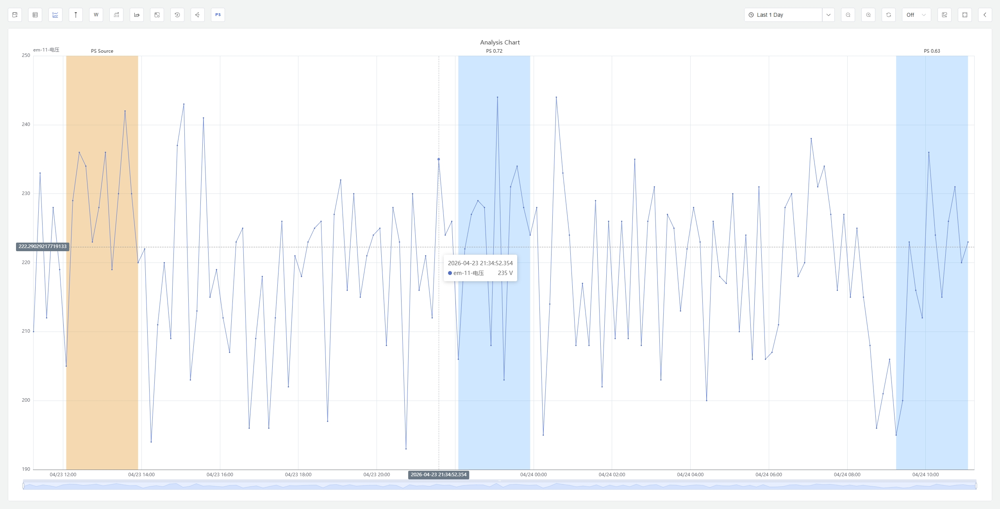
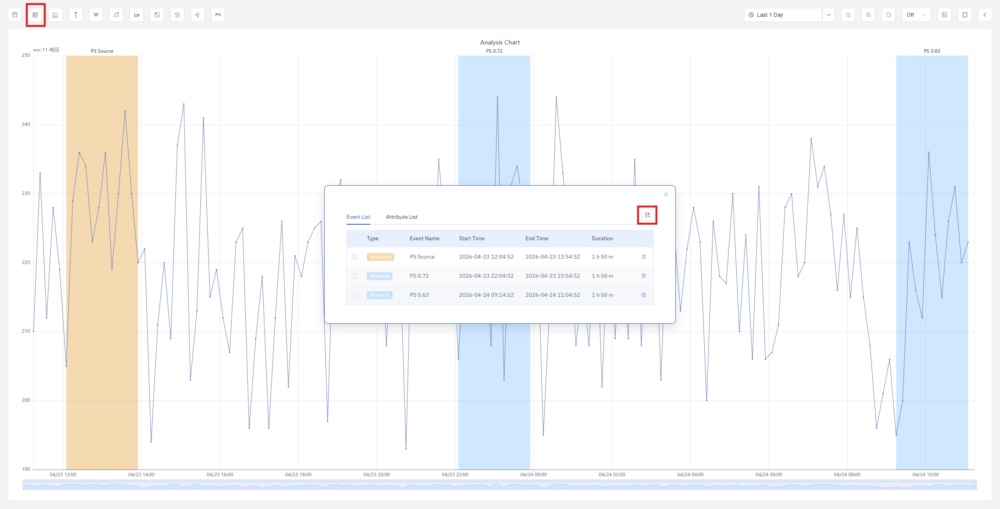

# 9.9 Profile Search

Profile Search is used to find time segments in historical time-series data that are most similar to a user-specified target waveform. Users select a time window for a specific attribute in the Analysis Chart as the reference pattern, and the system scans the entire visible time range using a sliding window, computes the similarity between each candidate segment and the reference pattern, and overlays the best-matching results as highlighted windows on the chart.

This capability addresses the common industrial need to "find similar operating conditions": after an engineer identifies an abnormal or characteristic curve, the system automatically searches historical data for all segments with a similar shape, enabling cross-comparison, frequency analysis, and root-cause investigation.

## 9.9.1 How It Works

The core approach of profile search is: **use the waveform within a user-selected time window as the reference pattern, traverse historical data with a sliding window, compute the similarity between each candidate window and the reference pattern, and filter out the closest matches.**

The workflow is as follows:

1. The user selects a time range for a specific attribute in the Analysis Chart by mouse. This selection becomes the **initial window**.
2. The system generates a series of candidate windows by sliding across the entire time range of the current Analysis Chart.
3. For the initial window and each candidate window, the data is first preprocessed according to the user-selected scaling method, and then the chosen algorithm computes the similarity.
4. Based on the user-defined threshold or Top N criteria, the system filters qualifying similar windows, highlights them on the chart, and lists them in a result table sorted by similarity.

### Data Scaling

In real industrial data, the same attribute often has different mean levels and fluctuation amplitudes across different time periods. For example, vibration signals from the same motor under different loads may have very similar waveform shapes, but differ significantly in mean level (Level) and fluctuation amplitude (Size). Computing similarity directly on raw values would let these differences interfere with the judgment, incorrectly classifying shape-similar but numerically different segments as dissimilar.

Data scaling preprocesses the data within each window before similarity computation, selectively removing the influence of mean level or fluctuation amplitude, so that the similarity calculation focuses on the features the user truly cares about.

Users can select one of the following four scaling methods in the configuration:

| Scaling Method | Description | Effect |
|---|---|---|
| **Raw Value** | No preprocessing; uses original values directly | Preserves all original information. Only segments whose value ranges and waveform shapes are both similar will be identified as matches |
| **Mean Centering** | Subtracts the window mean from each value | Removes mean level (Level) differences while preserving fluctuation amplitude (Size) differences. Suitable when you care about "whether the amplitude and shape are similar, regardless of the overall operating level" |
| **Min-Max Normalization** | Linearly scales each window's values to the [0, 1] range | Removes both mean level and fluctuation amplitude differences, preserving only waveform shape. Scaling is determined by the window's minimum and maximum values, making it sensitive to individual extreme spikes |
| **Z-Score Standardization** | Applies Z-Score standardization (subtract mean, divide by standard deviation) to each window | Removes both mean level and fluctuation amplitude differences, preserving only waveform shape. Suitable for scenarios that only focus on "whether the rising and falling rhythm of the curve is consistent" |

:::tip Difference Between Min-Max and Z-Score
Both Min-Max Normalization and Z-Score Standardization remove mean level and fluctuation amplitude differences to focus on waveform shape comparison, but they differ in their scaling basis. Min-Max is determined by the minimum and maximum values in the window — a single outlier spike can significantly alter the scaling result. Z-Score is determined by the mean and standard deviation, which are less affected by individual extreme values. If the data may contain occasional sensor spikes or glitches, Z-Score Standardization is recommended.
:::

**How to choose:** If unsure which method to use, start with **Z-Score Standardization** — it is robust to outliers and focuses solely on waveform shape, best reflecting the similarity of curve trends. If you need to match both waveform and value range (e.g., searching for "segments where temperature stays in the same range with a consistent trend"), choose **Raw Value**. If you only want to remove the mean offset while still caring about amplitude differences, choose **Mean Centering**.

## 9.9.2 Application Scenarios

Profile search has broad practical value across industrial domains. Typical scenarios include:

- **Anomaly pattern search:** After identifying an abnormal operating curve, search historical data for similar waveforms to assess the recurrence frequency and time distribution of the anomaly
- **Typical operating condition matching:** Select a waveform from an ideal operating interval and search historical data for all periods with similar operating states, enabling process optimization comparison
- **Fault precursor retrospection:** Use the sensor waveform before a device failure as a reference to search longer historical data for similar patterns, determining whether the failure has predictable precursor signals
- **Batch consistency analysis:** Select a standard batch's processing curve and search other batches for segments closest to and most deviating from the standard, supporting quality control
- **Device comparison:** Use one device's operating waveform as a reference to search similar segments in another device of the same model, analyzing performance differences

## 9.9.3 Supported Algorithms

IDMP's profile search supports two algorithms for different analytical needs:

| Algorithm | Description | Value Range |
|---|---|---|
| **Dynamic Time Warping (DTW)** | Compares the shape similarity of two waveforms, supporting sequences of different lengths. DTW finds the optimal alignment path within the warping constraint by dynamic programming; values closer to 0 indicate greater similarity. Suitable for comparing waveforms of unequal length in industrial scenarios, but computationally more expensive | [0, +∞) |
| **Cosine Similarity** | Treats each data segment as a high-dimensional vector and computes the cosine of the angle between two vectors. Absolute values closer to 1 indicate greater similarity. Computationally fast, but requires both windows to have exactly the same length and number of data points | [-1, 1] |

### Algorithm Selection Guide

- If the initial window and candidate windows have different lengths (i.e., you need to search for similar waveforms across segments of varying length), you must use **DTW**
- If window lengths are fixed and consistent, prefer **Cosine Similarity** for higher computational efficiency
- For scenarios requiring both deformation tolerance and matching precision, choose **DTW** and adjust the window constraint parameter accordingly

### Algorithm Parameters

**DTW Parameters:**

| Parameter | Description | Default |
|---|---|---|
| **Window Size (radius)** | The Sakoe-Chiba Band width, which limits the maximum number of steps the alignment path can deviate from the diagonal. When DTW searches for the optimal alignment path in the cost matrix, this parameter constrains any match point (i, j) such that \|i − j\| ≤ w. Smaller values enforce stricter alignment with faster computation but less tolerance for time shifts; larger values allow greater temporal stretching but increase computational complexity | 3 |
| **Target Window Length Range (Min / Max)** | The minimum and maximum lengths for candidate windows; DTW searches for segments of varying lengths within this range | Same as the initial window by default |
| **Variable Window Step** | Starting from the minimum-length candidate window, the length by which the window is extended each time until it reaches the maximum candidate window length | 1 minute |
| **Sliding Step** | The distance by which the candidate window slides forward along the time axis each time, used to traverse historical data in search of similar windows | 1 minute |

**Cosine Similarity Parameters:**

Cosine Similarity requires the candidate window to have exactly the same length as the initial window, so no candidate window length range needs to be configured.

Both the Cosine Similarity and DTW algorithms require specifying a **Sliding Step**. Similar to DTW, a larger sliding step speeds up data traversal and reduces computation, but may miss shorter historical segments.

## 9.9.4 Entry Point

In the **Analysis Chart** view mode, click the **Profile Search** button in the toolbar.

### Steps

1. Open or create an **Analysis Chart** and add the element attributes you want to analyze.
2. In the chart's **view mode**, click the **Profile Search** button in the toolbar.
3. Use the cursor to select a time range for the target attribute on the chart as the initial window.
4. The system opens the Profile Search **configuration** dialog, in which you can configure the parameters for profile search.
5. After clicking OK, the system traverses the candidate windows and performs similarity analysis.
6. When analysis completes, the initial window and the discovered similar windows are highlighted on the Analysis Chart.

### Configuration Parameters

Set the following parameters in the **Config** tab:

| Setting | Description |
|---|---|
| **Target Attribute** | Select the target attribute for profile search |
| **Initial Window Range** | Displays the time range selected with the cursor; can be further adjusted |
| **Similarity Algorithm** | Choose DTW or Cosine Similarity |
| **Sliding Duration** | Required for both DTW and Cosine Similarity. The time length by which the candidate window slides forward each time |
| **Target Window Length Range (Min / Max)** | DTW only. Sets the minimum and maximum length for candidate windows |
| **Window Size (Radius)** | DTW only. Controls time-shift tolerance. Default is 3 |
| **Variable Window Step** | DTW only. The length by which the minimum-length candidate window is extended each time until it reaches the maximum candidate window length |
| **Data Scaling** | Required for both DTW and Cosine Similarity. Choose Raw Value, Mean Centering, Min-Max Normalization, or Z-Score Standardization |
| **Output Criteria** | Specify a similarity threshold, or return only the Top N most similar windows |
| **Window Color** | Specify the highlight background color for the initial window and the target windows in the Analysis Chart |

After clicking **OK**, the system starts traversing windows and computing similarity. Because the calculation involves multiple iterations across sliding windows, it may take some time. The Analysis Chart cannot perform other analytical operations while the task is running. Users can cancel the task at any time during execution.

### Result Display

After the profile search completes, results are presented in two forms:

**Chart Highlights:** In the Analysis Chart, the initial window and the target windows discovered by profile search are overlaid on the chart. Both the initial window and similar windows are highlighted using the background color defined in the previous step. At this point, users can invoke the Analysis Chart's event analysis capabilities — such as event lines, start-time alignment, and normalization — to further investigate these window events.

**Result Table:** Click the **Events & Attributes List** icon in the Analysis Chart toolbar. A dialog displays the detailed information of all similar windows; similar windows are presented as a class of events and sorted by similarity from high to low. An **Export** button in the upper-right corner of the dialog allows exporting the current list to a CSV file.

On the Events & Attributes List page, users can view key information for all windows — such as start and end times, window duration, and similarity value — and can delete individual events.

:::note
In the Analysis Chart, both the initial window and the target windows discovered by profile search are treated as a type of custom event. These windows, together with other system events, can be analyzed using the Analysis Chart's event analysis capabilities, greatly facilitating the exploration process.
:::

## 9.9.5 Usage Example

**Scenario**

An injection molding machine at an automotive parts factory exhibited an abnormal injection pressure curve during production, resulting in a higher scrap rate for that batch. The process engineer wants to determine whether this abnormal pressure waveform has occurred repeatedly over the past 30 days, and understand its frequency and distribution pattern.

**Procedure**

1. Open the injection pressure trend data for the molding machine in the Analysis Chart, with the time range set to the past 30 days.
2. Click the **Profile Search** button in the toolbar, then select the known abnormal pressure curve on the chart as the initial window.
3. In the Config tab, select the **DTW** algorithm with a window size (radius) of 3, set data scaling to **Z-Score Standardization** (focusing only on waveform shape), and set the output criteria to Top 10.
4. Click **OK**. The system performs a sliding scan across the 30-day data range.

**Results**

The system found 7 time segments highly similar to the initial abnormal waveform. The engineer observed that these similar windows were concentrated in the first two batches of Monday morning shifts. Further investigation revealed that during the initial warm-up phase after weekend shutdowns, the barrel temperature had not reached stability, causing the injection pressure curve to exhibit a deviation consistent with the abnormal pattern. Based on this finding, the team adjusted the preheating wait time after Monday startups, and the subsequent batch scrap rate returned to normal levels.
