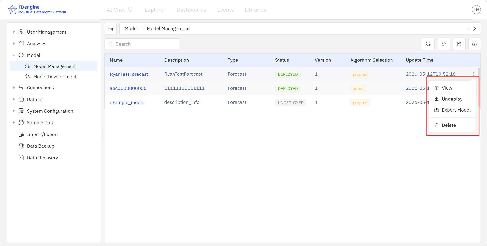
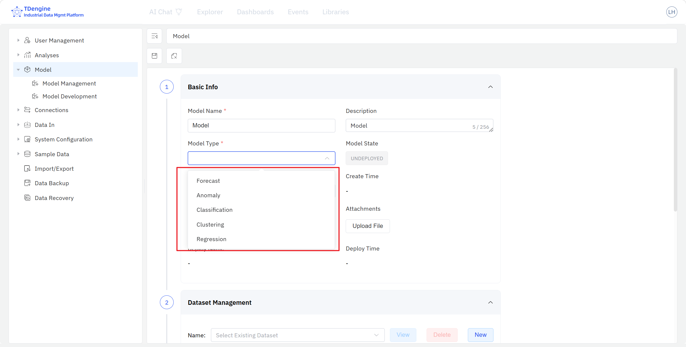
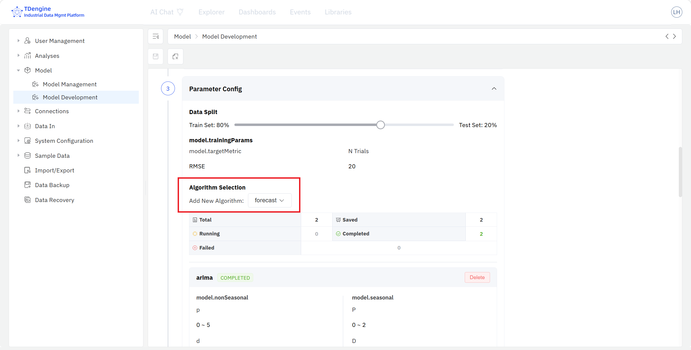
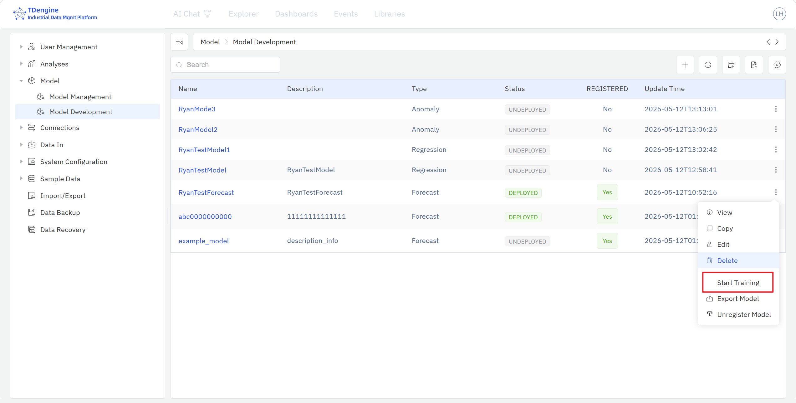
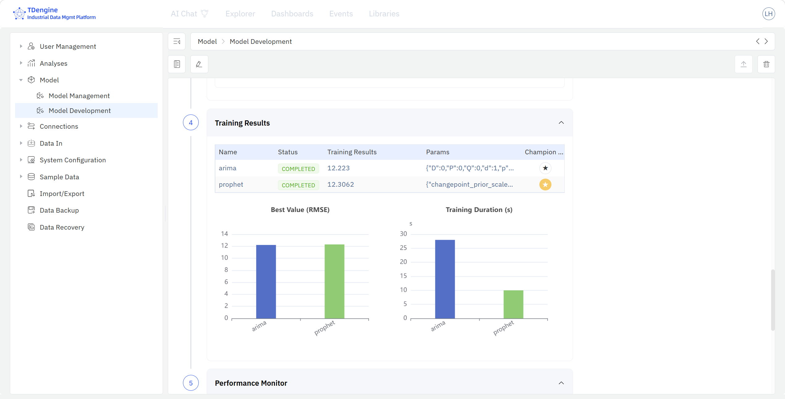

# 9.10 Model Development and Management

The Model Development and Management module is a lightweight, built-in **machine-learning modeling toolkit** in IDMP. Backed by **TDgpt**'s data analysis and modeling capabilities, it lets users perform the entire lifecycle of a machine-learning model — **training, evaluation, registration, deployment, and monitoring** — directly inside IDMP, and build a **model-asset management** system around released models.

The module is positioned as a **fast, simple, low-barrier machine-learning toolkit for industrial scenarios** — not a heavy, general-purpose ML platform. Model input data currently comes from TDengine TSDB only; model training and scoring run inside the TDgpt analytics agent; IDMP's frontend provides the training-configuration and deployment-release UI.

The biggest advantage of this module is its deep integration with the TDengine ecosystem: **a model trained in IDMP can be published to TDgpt with one click and called as a SQL function directly inside TDengine TSDB**. Visualization panels, dashboards, real-time analyses, and event / process analyses no longer need any extra ML-inference service — a single line of SQL is enough to score the model.

:::note Continuously evolving
The current version supports **forecasting** and **anomaly detection**. The remaining three modeling scenarios — **clustering, classification, and regression** — are under development and will be released in subsequent versions.
:::

## 9.10.1 How the Module Works

The core idea of the module is to **manage the entire machine-learning model lifecycle inside IDMP**, deliver **zero-code model configuration through the frontend UI**, **delegate training and scoring compute to TDgpt**, and **publish deployed models as SQL functions in TDengine TSDB**.

The model lifecycle is divided into two stages — **Model Development** and **Model Management** — each backed by its own independent model store:

| Stage                  | Model Store         | Main Workflow                                                                   | Model States                                       |
| ---------------------- | ------------------- | ------------------------------------------------------------------------------- | -------------------------------------------------- |
| **Model Development**  | Training Store      | Data interface → Variable management → Algorithm & parameters → Performance comparison | Not Trained / Training / Trained                   |
| **Model Management**   | Model Inventory     | Registration → Deployment → Monitoring → Retire / Retrain                       | Undeployed / Deployed                              |

The Training Store and the Model Inventory are **completely independent** — operations on one store do not affect the other. They communicate through two controlled channels:

- **Model Registration (Training Store → Inventory)**: a trained model whose performance has been accepted by the user is copied from the Training Store into the Model Inventory, where it comes under a stricter, enterprise-grade model-asset management system;
- **Model Send-back (Inventory → Training Store)**: when an inventory administrator is not satisfied with a registered model, the model snapshot can be sent back to the Training Store with **review comments** — for example, asking for additional documentation, new variables, updated algorithm parameters, or improved performance metrics. After the modeler iterates on the model in the Training Store, it can be registered again.

Deployment is the key integration point between this module and the TDengine ecosystem: **once a model is deployed to TDgpt, its scoring code is automatically registered as a SQL function in TDengine TSDB**. Users can then call the model directly in TSDB with ordinary SQL — for example `SELECT bottling_anomaly(pressure, valve_time, co2) FROM ...` — with no extra inference service or API gateway required. Model execution and scheduling happen entirely inside TSDB and integrate seamlessly with real-time analyses, views, stream computing, and reports.

## 9.10.2 Applicable Scenarios

The module targets machine-learning modeling scenarios that take industrial time-series data as the primary data source. Typical use cases include:

- **Key-metric forecasting**: train time-series forecasting models for KPIs such as energy consumption, output, load, and inventory, and produce multi-step forecasts to inform operational decisions
- **Equipment fault early warning**: train anomaly-detection models on historical operating data to continuously score vibration, temperature, current, and other indicators, and surface potential failures early
- **Quality anomaly detection**: train anomaly-detection models on critical process parameters of production batches to automatically flag batches drifting away from normal operating conditions
- **Operating-condition identification**: cluster equipment operating-state data to partition continuous runs into a small number of typical operating conditions, supporting process analysis
- **Defect classification and root-cause categorization**: train classification models on historical defect data and automatically assign a defect category to new product-quality samples
- **Soft-sensor regression**: use regression models to estimate hard-to-measure key metrics from several easily measured variables, enabling soft sensing (virtual measurement)

In every one of these scenarios, once the model is deployed, downstream business systems, data visualization, and real-time analyses all reach it through the same path — **a SQL function call inside TDengine TSDB**.

## 9.10.3 Supported Machine-Learning Model Types

The module covers five typical modeling scenarios for industrial use, each backed by a group of algorithms provided by TDgpt:

| Modeling Scenario    | Description                                                                | Representative Algorithms                                       |
| -------------------- | -------------------------------------------------------------------------- | --------------------------------------------------------------- |
| **Forecasting**      | Predict future values from historical time-series data                     | ARIMA, Holt-Winters, Prophet, LSTM, TDtsfm, etc.                |
| **Anomaly Detection** | Find anomalous values / anomalous curves / anomalous elements via unsupervised learning | Shesd, LOF, IQR, KSigma, Grubbs, etc.                          |
| **Clustering**       | Unsupervised partitioning of samples into clusters                          | KNN, K-Means, DBSCAN, GMM, etc.                                 |
| **Classification**   | Sample classification based on tree-family algorithms                       | Random Forest, XGBoost, GBDT, LightGBM, etc.                    |
| **Regression**       | Fit a dependent variable / output estimate from multiple independent variables | Linear regression, logistic regression, GLM, etc.               |

## 9.10.4 Entry Point

Use this module from the **Admin Console → Model** menu. It contains two sub-items:

- **Model Development**: lists the models in the Training Store and provides configuration and training capabilities for machine-learning models.
- **Model Management**: lists the models in the Model Inventory and provides deployment and monitoring capabilities for machine-learning models.

The Model Development page lists the training-store models with their name, description, category, status, registration state, and last-update time, and lets you **create, view, search, edit, delete, start training, export, and register** a model.

The Model Management page lists every model registered to the inventory, including its name, description, category, status, version, algorithm, and last-update time, and supports **view, search, edit, export, delete, deploy, retire, and send back** for any registered model.

### Workflow

On the Model Development page, click the **+** in the top-right toolbar to open a new model-edit page, or click an existing model row to open it in edit mode.

The model-edit page follows a unified multi-section configuration structure that walks you step-by-step through the configuration and training of a single machine-learning model:

1. **Basic Model Information**: fill in the model name and description, choose the **model category** (one of the five modeling scenarios), supply the necessary metadata, and upload model attachments such as documentation.

2. **Data Variable Management**: pick elements and attributes from the IDMP element catalog tree and add them to the model. A single model can pull multiple attributes from multiple elements; assign each attribute a modeling role in this model (dependent variable / independent variable / unused), and apply lightweight transformations such as **add a computed item, filter data, fill missing data**, etc.

3. **Algorithm Parameter Configuration**: split the model input dataset into training / test sets by ratio, then select algorithms from the dropdown of the current modeling scenario. A single model project can include multiple algorithms, each with its own hyper-parameters.

4. **Model Training**: click **Start Training** in the algorithm list to launch a training task for that algorithm; TDgpt runs the task in the background. You can also start all training tasks of a model project in one click from the model-development home page via the **⋮** menu.

5. **Model Performance**: once training finishes, compare the performance metrics of every trained algorithm in the training-result panel, review the evaluation scores, and pick the **champion model**.

After training, run **Register** on the model — IDMP copies the complete snapshot of the trained model into the Model Inventory, where it then appears in Model Management. If the inventory administrator finds the model unsatisfactory, the **Send back** action returns the model to the Training Store with comments; after the modeler iterates on the model in the Training Store based on the feedback, registration can be triggered again.

For models that meet the deployment criteria, click **Deploy** in the inventory: the system automatically pushes the model's scoring code to TDgpt and registers it as a SQL function in TDengine TSDB, and the model's status becomes **Deployed**. From that point on, users can call the model from TSDB with ordinary SQL; a deployed model can also be **Retired** later, which removes the corresponding SQL function from TSDB.

For deployed models, TDgpt sends back performance metrics to IDMP after every scoring run, and the model detail page exposes a **Post-deployment Monitoring** section that compares the training-stage baseline against the actual performance of recent model scoring results. Monitoring metrics include CUSUM, KS, PSI, and others.

## 9.10.5 Example

**Scenario**

A municipal wastewater-treatment plant processes about 150,000 tonnes per day. The operations team wants to train a time-series forecasting model on historical inflow data to predict the next 24 hours of inflow every morning, so they can plan blower-set scheduling and chemical dosing in advance. Inflow is influenced by daily, weekly, and holiday patterns at the same time, so the team wants to try several algorithms in parallel and pick a champion — finding the best forecasting model for future inflow.

**Steps**

1. Go to **Admin Console → Model → Model Development** and click **+** to create a new model.
2. **Basic information**: name it `Inflow 24h Forecast`, set the category to **Forecasting**. In the data-interface section, set the root path to "Wastewater Plant / Inflow System" and select three attributes: `Daily Inflow`, `Rainfall`, and `Upstream Pumping-Station Flow`. `Daily Inflow` is the forecasting target; the other two are covariates.
3. **Data and variables**: mark `Daily Inflow` as the **dependent variable**, `Rainfall` and `Upstream Pumping-Station Flow` as **independent variables**, and the timestamp as the **primary key**. Apply **Fill missing data** with linear interpolation to the 0.9% sporadic gaps on `Upstream Pumping-Station Flow`.
4. **Algorithm and parameters**: use the most recent 180 days as the training set and the most recent 14 days as the test set. From the forecasting-algorithm dropdown select both **ARIMA** and **Prophet**, configuring the period, seasonality, and holiday switch for each. For **Prophet**, also enable rainfall and upstream pumping-station flow as covariates.
5. Click **Start Training** — TDgpt trains the two algorithms in parallel in the background. After training, compare MAPE and RMSE on the performance page; **Prophet** has the lowest MAPE on the test set (3.8%), and you pick it as the **champion model**.
6. Run **Register** on the model to push it to the inventory, then click **Deploy** — TDengine TSDB now exposes the SQL function `inflow_forecast_24h()`.
7. Every night the dispatch system runs one line of SQL in TSDB — `SELECT inflow_forecast_24h(rainfall, upstream_flow) FROM …` — to get the following 24 hours of inflow forecasts, which feed visualization panels and monitoring rules directly.

**Outcome**

In the Labor-Day holiday after launch, the forecast curve indicates that inflow on the first holiday will drop by about 22% compared with normal days, while the first business day after the holiday will see a clear rebound peak. The dispatch team accordingly delays the start of two standby blowers and pre-warms backup blowers ahead of the first working day after the holiday. The realized inflow stayed within 5% of the prediction; treatment capacity transitioned smoothly, chemical consumption fell roughly 8% year-on-year, and there were no over-limit discharges.

Six weeks after deployment, the inventory monitoring page shows MAPE drifting from the training-stage 3.8% up to 6.5% and raises a monitoring alarm. The modeler triggers **Retrain** in the inventory, refreshes the model with the most recent 8 weeks of data, MAPE comes back to 4.1%, and the new version is automatically redeployed to TDgpt — the SQL invocation in the dispatch system remains unchanged.
