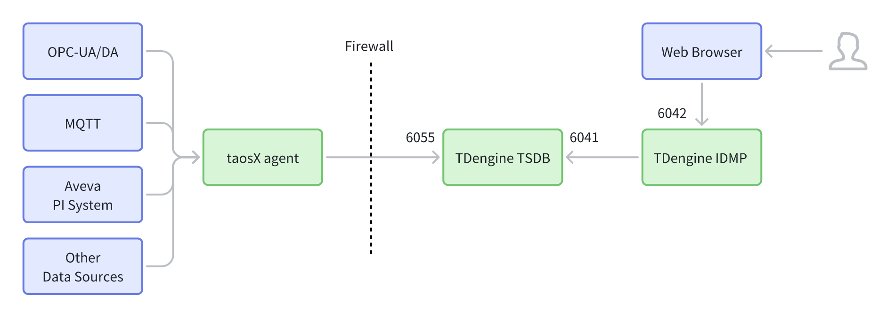

# 14.1 Deployment Architecture

TDengine IDMP supports three typical deployment topologies: **Single Instance**, **HA Minimal**, and **HA Complex**. Each topology is suited to different scale and availability requirements.

## 14.1.1 Overview

A TDengine IDMP deployment typically consists of the following layers:

- **Data collection layer:** taosX agents connect to OPC-UA/DA, MQTT, Aveva PI, and other data sources, collecting and forwarding data to TDengine TSDB.
- **Service layer:** TDengine IDMP (single or multi-instance) provides business logic; TDengine TSDB stores and serves time-series data.
- **Access and governance layer (optional):** An API Gateway serves as the unified external entry point, providing routing, authentication, and traffic management.
- **External dependencies (by scenario):** Redis, MySQL, distributed file system, and optionally Elasticsearch, Kafka, and Apollo.
- **Network boundary:** A firewall separates the data collection side from the service side. Cross-boundary communication should open the minimum required ports.

## 14.1.2 Single Instance

The single-instance topology targets rapid delivery and low operational complexity. It is suitable for PoC evaluations, demonstrations, small-scale deployments, or air-gapped environments.

TDengine IDMP runs as a single process and serves both the web UI and REST API. The taosX agent collects data and writes it to TDengine TSDB through the firewall; IDMP accesses TSDB internally for data management and queries.

**Connectivity:**

- Web Browser → **TDengine IDMP (port 6042)**
- taosX agent → (through Firewall) → **TDengine TSDB (port 6055)**
- **TDengine IDMP → TDengine TSDB (port 6041)**

**Characteristics:**

- Fewest components and shortest paths; lowest deployment and operational cost.
- Browser connects directly to IDMP — authentication, rate limiting, and auditing must be handled at the service level.
- Scaling to multiple instances typically requires adding an API Gateway or load balancer.
- Uses embedded H2 database, local file system, and internal caching instead of external MySQL, DFS, and Redis.

## 14.1.3 HA Minimal

The HA Minimal topology targets a production-ready baseline with manageable complexity. It introduces an API Gateway as the unified external entry point, so only the gateway is exposed externally. IDMP can be scaled to multiple instances behind the gateway.

**Connectivity:**

- Web Browser → **API Gateway** → **TDengine IDMP (port 6042)**
- taosX agent → (through Firewall) → **TDengine TSDB (port 6055)**
- **TDengine IDMP ↔ TDengine TSDB (port 6041)**
- IDMP dependencies: **Redis / MySQL / Distributed File System**

**Characteristics:**

- Single external entry point through the gateway; IDMP is not directly exposed.
- Includes the three most common infrastructure dependencies for a production baseline.
- Suitable for deployments that want standardized gateway governance before expanding capabilities.
- Uses internal Lucene instead of Elasticsearch; uses Redis message queue instead of Kafka; uses internal service configuration instead of Apollo.

## 14.1.4 HA Complex

The HA Complex topology targets medium-to-large production environments with enterprise integration requirements. IDMP runs as a highly available multi-instance cluster behind the API Gateway. A complete set of peripheral dependencies is introduced to support asynchronous decoupling, centralized search, dynamic configuration, and service governance.

**Connectivity:**

- Web Browser → **API Gateway** → **TDengine IDMP (multiple instances)**
- taosX agent → (through Firewall) → **TDengine TSDB (port 6055)**
- **TDengine IDMP → TDengine TSDB (port 6041)**
- IDMP dependencies: **Redis, MySQL, Distributed File System, Elasticsearch, Kafka, Apollo**

**Characteristics:**

- Multi-instance IDMP improves throughput and availability.
- Full peripheral stack supports centralized search (Elasticsearch), async messaging (Kafka), and dynamic configuration (Apollo).
- Higher deployment and operational complexity; suitable for environments with strict reliability, audit, and scalability requirements.

## 14.1.5 Key Components

### 14.1.5.1 API Gateway

The API Gateway is the unified entry point between external clients and internal services.

<table>
<colgroup><col style="width:17em"/><col/></colgroup>
<thead><tr><th>Responsibility</th><th>Description</th></tr></thead>
<tbody>
<tr><td><strong>Unified entry</strong></td><td>Exposes a single address/port externally; backend services are not directly exposed</td></tr>
<tr><td><strong>Routing and load balancing</strong></td><td>Distributes requests across IDMP and TSDB instances</td></tr>
<tr><td><strong>Security</strong></td><td>TLS termination, unified authentication (Token/SSO), IP access control</td></tr>
<tr><td><strong>Traffic governance</strong></td><td>Rate limiting, circuit breaking, retry, timeout, canary releases</td></tr>
<tr><td><strong>Observability</strong></td><td>Centralized access logs, metrics, and distributed tracing</td></tr>
</tbody>
</table>

### 14.1.5.2 External Dependencies

<table>
<colgroup><col style="width:15em"/><col/><col/></colgroup>
<thead><tr><th>Component</th><th>Role</th><th>Single-instance replacement</th></tr></thead>
<tbody>
<tr><td><strong>Redis</strong></td><td>Caching, short-lived state, distributed locks</td><td>Internal cache and lock</td></tr>
<tr><td><strong>MySQL</strong></td><td>Relational metadata (users, permissions, tasks, configuration)</td><td>Embedded H2 database</td></tr>
<tr><td><strong>Distributed File System</strong></td><td>File/object persistence (metadata, graphics, import/export files)</td><td>Local file system</td></tr>
<tr><td><strong>Elasticsearch</strong></td><td>Centralized index management and full-text search</td><td>Internal Lucene</td></tr>
<tr><td><strong>Kafka</strong></td><td>Async messaging and event bus (decoupling, task orchestration, notifications)</td><td>Internal message queue (single instance) or Redis MQ (HA Minimal)</td></tr>
<tr><td><strong>Apollo</strong></td><td>Configuration center (dynamic config, version management)</td><td>Internal service configuration</td></tr>
</tbody>
</table>

## 14.1.6 Deployment Recommendations

The following guidelines summarize best practices for selecting a topology and managing the deployment over time.

1. **Use Single Instance for PoC; use HA for production.** Start with Single Instance for quick validation; prefer HA Minimal for production and evolve to HA Complex as requirements grow.

2. **Minimize external exposure.** Expose only the gateway externally; keep internal ports (such as 6041) on the internal network only.

3. **Scale IDMP horizontally when needed.** Use multiple IDMP instances for high availability and throughput; configure session handling and load balancing at the gateway.

4. **Plan external dependencies for availability.** Configure backup and high availability for Redis, MySQL, and the distributed file system. Include Kafka, Elasticsearch, and Apollo in monitoring and capacity planning once enabled.

5. **Centralize observability.** Collect logs and metrics from the gateway, IDMP, TSDB, and key dependencies. Establish alerting and distributed tracing to simplify troubleshooting.
