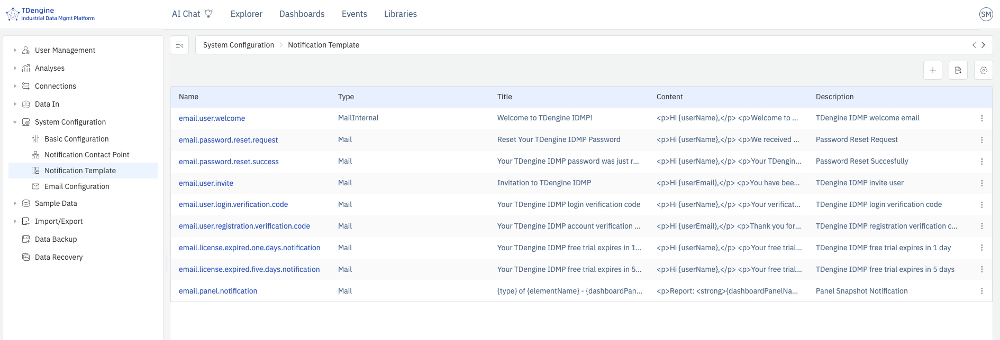

# 14.5 System Configuration

System Configuration is accessed from **Admin Console → System Configuration**. It has four sections: Basic Configuration, Notification Contact Point, Notification Template, and Email Configuration.

## 14.5.1 Basic Configuration

Basic Configuration contains system-wide settings:

| Setting | Description |
|---|---|
| **Language** | Default display language for the interface |
| **Enable User Behavior Collection** | Whether to collect anonymized usage data for product improvement |
| **Upload Crash Reports** | Whether to automatically upload crash reports |
| **Auto Refresh Elements Explorer** | Whether the asset explorer automatically refreshes when elements change |

Click the edit (pencil) icon to modify these settings.

## 14.5.2 Notification Contact Point

A **Notification Contact Point** defines a destination that IDMP sends notifications to. Multiple contact points can be configured. The first user to activate the system has their email address automatically added as a contact point.

To create a contact point, click **+** and fill in:

| Field | Description |
|---|---|
| **Name** | A unique name for this contact point |
| **Notify Type** | The delivery channel: `Email`, `Feishu`, or `Webhook` |
| **Address** | The target address — email address, Feishu webhook URL, or HTTP endpoint |
| **Description** | Optional description |

Because Webhook is supported, virtually any notification destination can be configured — including Teams, DingTalk, PagerDuty, and other systems that accept HTTP callbacks.

## 14.5.3 Notification Template

Notification Templates define the content of system-generated messages for events such as user invitations, password resets, and alert notifications.

IDMP ships with built-in templates for common notification scenarios. Click a template name to view or edit its content. Templates support variable substitution to include dynamic values such as usernames, URLs, and event details.



## 14.5.4 Email Configuration

Email Configuration defines the SMTP server that IDMP uses to send outbound email. Click the edit (pencil) icon to update the settings.

| Field | Description |
|---|---|
| **Host** | SMTP server hostname or IP address |
| **Port** | SMTP server port (e.g., 465 for TLS, 587 for STARTTLS, 25 for unencrypted) |
| **Username** | SMTP authentication username |
| **Password** | SMTP authentication password |
| **Sender** | The "From" email address used in outgoing messages |
| **Enable TLS** | Whether to use TLS encryption for the SMTP connection |
| **Enable Authentication** | Whether SMTP authentication is required |

IDMP sends email for several purposes: system activation (verification code), user invitations, password resets, and event alert notifications. By default, IDMP uses a TDengine-provided mail service.

### 14.5.4.1 Using MailHog for Air-Gapped Environments

If the IDMP server cannot reach the internet, you can deploy [MailHog](https://github.com/mailhog/MailHog) internally as a lightweight SMTP relay for development and testing:

```bash
docker run -d -p 1025:1025 -p 8025:8025 --name mailhog mailhog/mailhog:v1.0.1
```

After starting MailHog, configure Email Configuration with:

| Field | Value |
|---|---|
| Host | Host machine IP (or service name if in the same Docker Compose network) |
| Port | `1025` |
| Username / Password | Any value (MailHog disables authentication by default) |
| Enable TLS / Enable Authentication | Unchecked |
| Sender | Any valid email format (e.g., `support@example.com`) |

Access the MailHog web interface at `http://<server-ip>:8025` to view captured emails.
