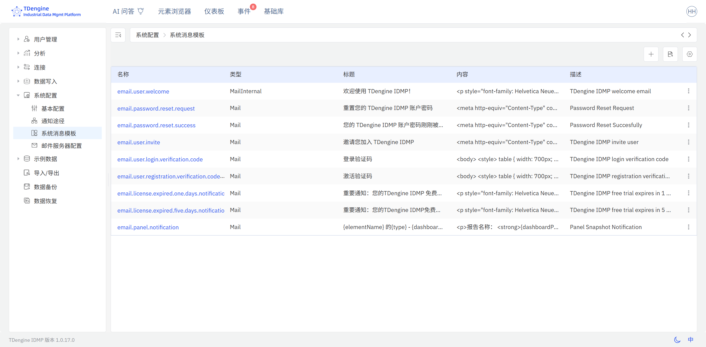
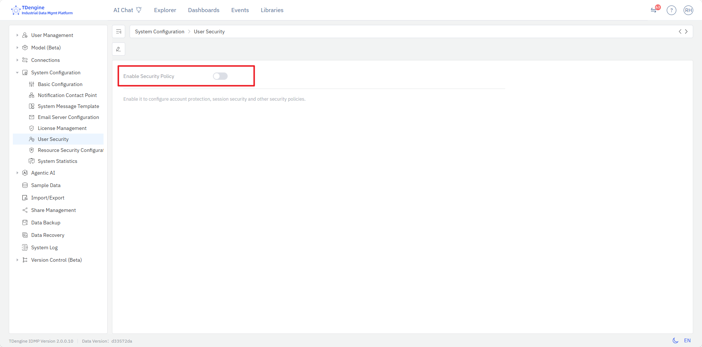

# 14.5 System Configuration

System Configuration is accessed from **Admin Console → System Configuration**. It has eight sections: Basic Configuration, Notification Channel, System Message Template, Email Server Configuration, License Management, User Security Configuration, Resource Security Configuration, and System Statistics. For License Management, please refer to [Chapter 14.12](./30-activate.md).

## 14.5.1 Basic Configuration

Basic Configuration contains system-level global settings:

| Setting  | Description        |
| --- | --- |
| **Language**   | Default display language for the interface    |
| **Enable User Behavior Collection** | Whether to collect anonymized usage data for product improvement   |
| **Upload Crash Reports**   | Whether to automatically upload crash reports                           |
| **Auto Refresh Elements Explorer**  | Whether the asset explorer automatically refreshes when elements change |
| **System Log**  | Whether to enable generation of tamper-proof system operation logs and support filtering, querying, and exporting |
| **Quality Analysis Menu** | Whether to enable a standalone Quality Analysis menu |
| **Public Access URL** | The public access URL for the current system |
| **Week Start** | Whether the first day of the week is Sunday or Monday |
| **Element Sort Rule** | The global default element sort rule: System Default, Element Name, or Creation Time |
| **System Color** | Configuration of the default system color |

### Element Sort Rule Specification

Element sort rule defines the default ordering used by the element tree and the child-element list when no explicit sort is specified. Available options:

| Option | Sort basis |
| --- | --- |
| **System Default** | Sort by the element's `element_order` field. This field is generated automatically when an element is created and is adjusted dynamically when users **move up**, **move down**, or **pin to top** an element. Therefore, "System Default" is essentially "creation order plus user-defined ordering" — new elements are ordered by creation, and users can manually adjust their relative positions on top of that. |
| **Element Name** | Sort by element name in ascending lexicographic order. |
| **Creation Time** | Sort by element creation time (newest first). |

:::info
This setting only serves as the **global default**. In the element tree, users can override it for a specific node via the **sort** button next to the element node; in the child-element list, they can also specify a sort order via the column header.
:::

Click the edit (pencil) icon to modify these settings.

## 14.5.2 Notification Channel

A **Notification Channel** defines a destination that IDMP sends notifications to. Multiple contact points can be configured. The first user to activate the system has their email address automatically added as a contact point.

To create a contact point, click **+** and fill in:

| Field                 | Description                                                               |
| --------------------- | ------------------------------------------------------------------------- |
| **Name**        | A unique name for this contact point                                      |
| **Notify Type** | The delivery channel:`Email`, `Feishu`, `WeCom`, `DingTalk`, `Slack`, `Microsoft Teams`, or `Webhook` |
| **Address**     | The target address — email address, Feishu webhook URL, or HTTP endpoint |
| **Description** | Optional description                                                      |

Because Webhook is supported, virtually any notification destination can be configured — including Teams, DingTalk, PagerDuty, and other systems that accept HTTP callbacks.

## 14.5.3 System Message Template

System Message Templates define the content of system-generated messages for events such as user invitations, password resets, and alert notifications.

IDMP ships with built-in templates for common notification scenarios. Click a template name to view or edit its content. Templates support variable substitution to include dynamic values such as usernames, URLs, and event details.



## 14.5.4 Email Server Configuration

Email Server Configuration defines the SMTP server that IDMP uses to send **event alert email** and **panel scheduled notifications**. Click the edit (pencil) icon to update the settings.

:::note
Transactional email — system activation (verification code), user invitations, password resets, and license-expiration notifications — is
delivered by the TDengine-hosted shared mail service (Capability Gateway). It does not use the settings on
this page, and no SMTP parameters need to be set in `application.yml`.
These settings affect **only** event alert email and panel scheduled notifications: while unset, those two
kinds of notification cannot be delivered, and the UI marks email-type contact points as unavailable under
"Notification Channel".
:::

| Field                           | Description                                                                |
| ------------------------------- | -------------------------------------------------------------------------- |
| **Host**                  | SMTP server hostname or IP address                                         |
| **Port**                  | SMTP server port (e.g., 465 for TLS, 587 for STARTTLS, 25 for unencrypted) |
| **Username**              | SMTP authentication username                                               |
| **Password**              | SMTP authentication password                                               |
| **Sender**                | The "From" email address used in outgoing messages                         |
| **Enable TLS**            | Whether to use TLS encryption for the SMTP connection                      |
| **Enable Authentication** | Whether SMTP authentication is required                                    |

IDMP delivers email over two separate paths:

| Email type                                                          | Delivery path                                          | Needs these settings |
| ------------------------------------------------------------------- | ------------------------------------------------------ | -------------------- |
| System activation (verification code), user invitations, password resets, license-expiration notifications | TDengine shared mail service (Capability Gateway)      | No                   |
| Event alert email, panel scheduled notifications                    | The SMTP server configured on this page                | **Yes**              |

### 14.5.4.1 Using MailHog for Air-Gapped Environments

If the IDMP server cannot reach the internet, you can deploy [MailHog](https://github.com/mailhog/MailHog) internally as a lightweight SMTP relay for development and testing:

```bash
docker run -d -p 1025:1025 -p 8025:8025 --name mailhog mailhog/mailhog:v1.0.1
```

After starting MailHog, configure Email Configuration with:

| Field                              | Value Description                                                       |
| ---------------------------------- | ----------------------------------------------------------------------- |
| Host                               | Host machine IP (or service name if in the same Docker Compose network) |
| Port                               | `1025`                                                                |
| Username / Password                | Any value (MailHog disables authentication by default)                  |
| Enable TLS / Enable Authentication | Unchecked                                                               |
| Sender                             | Any valid email format (e.g.,`support@example.com`)                   |

Access the MailHog web interface at `http://<server-ip>:8025` to view captured emails.

## 14.5.5 User Security Configuration

Click **System Configuration** → **User Security Configuration** to enter the user security configuration page. User security policies are disabled by default. Click **Enable Security Policies** to activate system-level user security policy management.



After enabling user security policy management, you can configure account protection, session security, and other settings. Changes take effect immediately upon saving.

| Security Setting | Description |
| --- | --- |
| **Login Failure Protection** | Set the maximum number of failed login attempts and the lockout duration after exceeding the limit |
| **Password Expiration** | Set the validity period (in days) for account passwords, and the number of days in advance to warn users before expiration. When enabled, users must change their passwords within the specified time range |
| **Password History Restriction** | Set the number of previous passwords that cannot be reused — the current password must differ from the specified number of previous passwords |
| **Session Security** | When enabled, a new login for the same account automatically invalidates all other online sessions, ensuring only one active session per account |


## 14.5.6 Resource Security Configuration

Click **System Configuration** → **Resource Security Configuration** to enter the resource security configuration page. Resource security configuration covers all resource types in the current system, specifically:

| Resource Type | Configurable Security Actions |
| --- | --- |
| **Elements** | Add, Edit, Delete, and Document Modification |
| **Dashboards** | Edit, Add |
| **Real-Time Analysis** | Edit, Add |
| **Events** | Edit, Delete |
| **Element Templates** | Add, Edit, Delete |
| **Event Templates** | Add, Edit, Delete |
| **Dashboard Templates** | Add, Edit, Delete |
| **Panel Templates** | Add, Edit, Delete |
| **Notification Rule Templates** | Add, Edit, Delete |

You can then configure global security management policies for all key resources in the system.


On the resource security configuration page, click the **Edit** button in the upper-right corner to enter editing mode. You can then set differentiated security policies for each resource type, including whether a change reason is required, and whether re-entering the password or performing multi-factor authentication (MFA) is required when executing change operations.


## 14.5.7 System Statistics

Click **System Configuration** → **System Statistics** to enter the system statistics page. This page provides a one-stop overview of key system statistics, including:

| Category | Statistics |
| --- | --- |
| **Assets** | Number of Elements, Attributes, Measurement Points, Events, Real-Time Analyses, Instance Scenarios, Documents, Enumeration Sets, UOMs, and Composite Metrics |
| **Templates** | Number of Element Templates, Attribute Templates, Real-Time Analysis Templates, Panel Templates, Dashboard Templates, Notification Rule Templates, and Action Templates |
| **Visualization** | Number of Panels, Dashboards, and Configurations |
| **Models** | Number of Training Library Models, Management Library Models, and Deployed Models |


